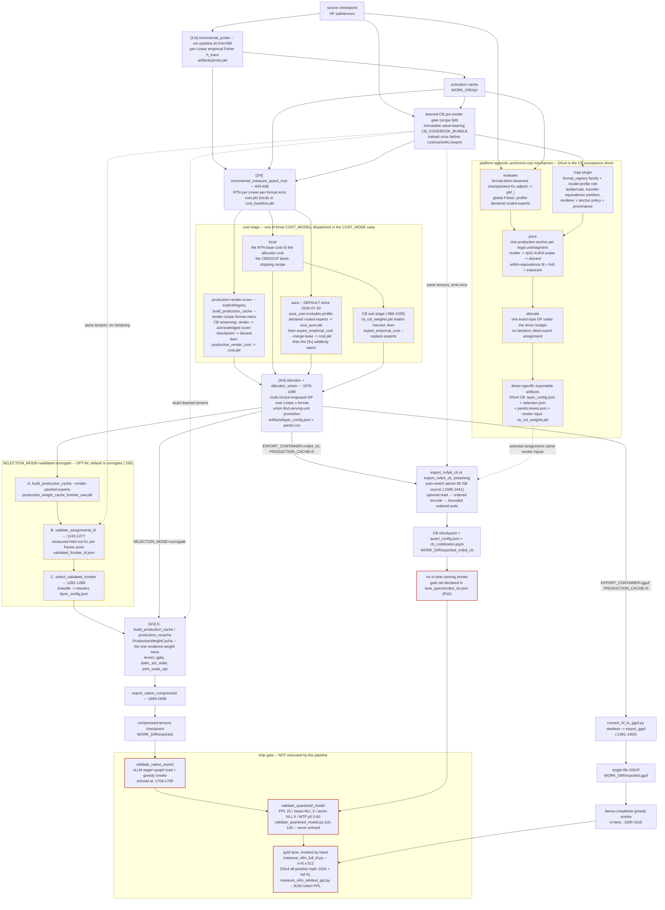
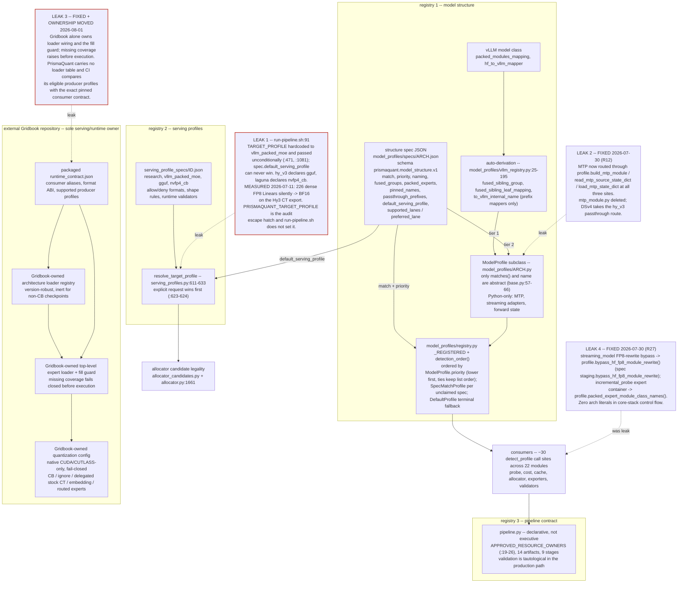
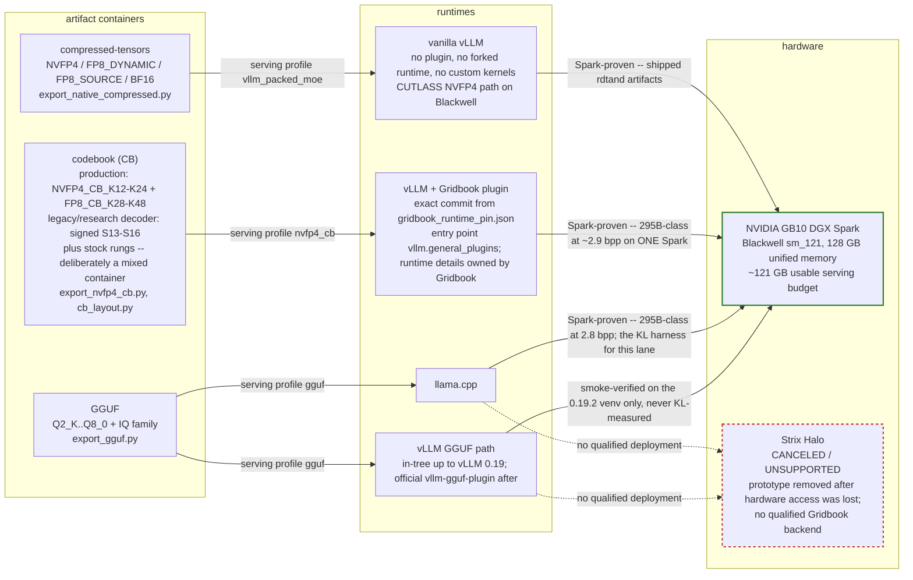

# PrismaQuant Architecture

As of: 2026-08-13 · branch `fix/gridbook-wheel-provenance-v0121` · verified against
implementation baseline commit `3c23cf0` plus the Gridbook wheel-attestation repair
described by the named schemas and symbols below. The final integration commit is
deliberately not predicted in this provenance stamp. This revision includes the Spark
BF16 AURA-anchor residency and streamed-reverse lifetime corrections, the activation-safe
AURA terminal/replay policy, the endpoint live-session and matched-budget
execution-route identity contracts, the immutable AURA producer-image and mounted-source
resume identity contract, the content-addressed campaign/release source-snapshot closure,
the exact Gridbook VCS-or-wheel installed-import-origin closure, the strict Gridbook runtime-contract-v3
feature boundary, and the bundle-authoritative
per-rung learned/lattice source-map contract, the routed-MoE learned-codebook
producer contract, the DeepSeek DSpark source-overlay contract, the streamed CB
cached-menu render/consume contract, and the profile-declared routed-expert
AURA/empirical hybrid key-space contract, the offline value-closed DSv4
WikiText gold-input contract, plus the platform-agnostic anchored-cost
mechanism, CB mapping plugin, DSv4 one-shot acceptance-driver contract, the
anchored-AURA allocator admission branch (P0, closed 2026-08-11), and the
one-purpose CPU-only W8A16 readmission plus tracked pre-export handoff gate.
The external runtime record pins Gridbook **0.8.5** at exact commit
`e992e5980c96333a48149f96392d6cff56ae9e3f`, with
`gridbook.runtime-contract.v3` and the exact required feature map
`routed_moe_per_role_codebook_lut=1` plus
`source_fp8_block128_w8a16=1`, and `version_is_release=true`. The exact
installed wheel passed its GB10/sm121 GPU gate (91 passed, 0 skipped), including
raw-source W8A16 residency, native decode/prefill dispatch, and JIT extension
identity/capability. That closes the route-existence and export gates; exact
full-artifact eager/graph generation, performance parity, and served quality
remain post-export shipcard gates. The measured command, immutable inputs, and
raw evidence paths are recorded in
`docs/results/gridbook_0p8p5_w8a16_gate_2026-08-12.md`. Gridbook 0.8.4 introduced the explicit
routed per-role LUT feature; capability
decisions now read the closed feature map rather than infer from a numeric
version. The on-law K28/K32/K36/K40/K44/K48 FP8-CB set is unchanged. This
branch also preserves the dated 2026-08-01 DeepSeek-V4-Flash-0731
92 GB study record (§9.2) as historical candidate-era evidence. It is not promotion
evidence for the current runtime: the release path is the separately gated
112.690 GB AURA artifact authorized only by the exact W8A16 handoff.

This revision retains the four 2026-07-30 architecture re-vet waves documented in
`docs/audits/architecture_re-vet_2026-07-30.md` and closes the runtime-ownership debt: the
vendored Gridbook tree and sync path are gone, producer ABI/menu/config facts have one owner,
and required CI checks the independent producer and consumer at one immutable commit. The
0.8.5 boundary carries forward the closed 29-variable measurement environment with
`GRIDBOOK_MXFP8_DENSE` now affirmatively absent, exact installed-distribution provenance,
artifact-derived native-extension requirements, and a dedicated raw-source W8A16 kernel
family. These harden evidence and admission and back the source W8A16 route for export; they do
not by themselves promote an unmeasured full artifact. The four behavioural facts a
returning reader must know are that **`COST_MODE` defaults to `aura`** (§3.3), Gridbook serving
is native CUDA/CUTLASS-only and fails closed (§9.2), and fused native-NVFP4 remains default-off
after its teacher-backed quality gate (§9.2); direct group-32 MXFP8 remains W8A8 while the
block-128 checkpoint source route is W8A16.

**Prime directive:** the code is the authority. Where this document and the tree disagree, the
document is wrong — fix it, or record the divergence in §12; never propagate it.

---

## Contents

[0 Maintenance contract](#0-maintenance-contract) ·
[1 What PrismaQuant is](#1-what-prismaquant-is) ·
[2 Methodological spine](#2-methodological-spine) ·
[3 The quantization pipeline](#3-the-quantization-pipeline) ·
[4 Cost models & allocation](#4-cost-models--allocation) ·
[5 Formats & render](#5-formats--render) ·
[6 Export & serving invariants](#6-export--serving-invariants) ·
[7 Validation & ship gates](#7-validation--ship-gates) ·
[8 Model support: the plugin architecture](#8-model-support-the-plugin-architecture) ·
[9 Serving lanes](#9-serving-lanes) ·
[10 Hardware & environment](#10-hardware--environment) ·
[11 History](#11-history--what-was-tried-and-rejected) ·
[12 Known gaps and debt register](#12-known-gaps-and-debt-register)

## 0. Maintenance contract

This file is the master document. `docs/README.md` is the index and carries a status tag
(CURRENT / HISTORICAL / ARCHIVED) per doc; everything else is a rule set this file points at,
a lane record, or history.

**The rule.** A commit that changes any of the following must update this file in the same
commit: (1) a `prismaquant/run-pipeline.sh` default, gate, or stage order (§3); (2) the format
menu, a scale rule, or a render lever (§5); (3) an export codec, a `config_groups` emission
rule, or a serving invariant (§6); (4) a ship-gate threshold or what the pipeline runs versus
echoes (§7); (5) the plugin contract — profile accessors, registry order, serving-profile
schema, gridbook per-arch wiring (§8); (6) a serving-lane default or a promoted/reverted kernel
lever (§9). If topology changed, the affected mermaid diagram changes with it. The provenance
block at the top must be re-stamped (date, commit, branch) on every substantive edit.

**Corollaries.** Handovers (`docs/handovers/`, gitignored) and dated results (`docs/results/`,
`docs/lanes/*/`) are append-only history: they record what was true on a date and never
substitute for updating this file. Every normative claim here carries a `file:line` or a commit
hash — a claim without one is a lead, not a fact. Staleness discovered in this document is a
bug: fix it, or if the fix is larger than the edit, add it to §12 with a severity. Do not
silently leave a wrong line here for the next reader.

## 1. What PrismaQuant is

Mixed-precision LLM quantization that chooses a serving format **per Linear**, selects the
assignment on **real end-to-end KL-vs-BF16**, and ships the result as an artifact a stock or
plugin-extended vLLM serves. No forked runtime on the native lane. Allocation is a
multiple-choice knapsack over a per-(Linear, format) cost (§4); the winning candidate is decided
by measurement, not by the cost model (§2).

### 1.1 The three artifact containers

| Lane | Container | Runtime | Formats | Status |
|---|---|---|---|---|
| Native | `compressed-tensors` | vanilla vLLM, Blackwell CUTLASS | NVFP4, FP8_DYNAMIC/E4M3, FP8_SOURCE, BF16 | production default |
| CB ("gridbook") | `nvfp4_cb` codebook checkpoint | vLLM + the separately versioned `gridbook` package (native CUDA/CUTLASS-only, fail-closed), installed from the exact commit in `prismaquant/gridbook_runtime/gridbook_runtime_pin.json` | FP4-CB / FP8-CB rungs plus the native menu | production only for architectures declared by Gridbook's packaged runtime contract; DSv4 is declared, while learned per-role expert LUTs remain device-validation-gated |
| GGUF | single `.gguf` | llama.cpp; vLLM via `vllm-gguf-plugin` | Q2_K…Q8_0 k-quants + IQ family + BF16 | enabled end-to-end; the only 2–3 bpw path |

Lane detail, defaults and proven results: §9. Export codecs: §6. Pipeline defaults: §3.3.

### 1.2 Shipped artifact family

bpp is over **quantizable** parameters only (excludes `lm_head`, MTP/visual sidecars, pinned
Linears) and labels are **not** comparable across accounting eras (§12). conf-KL =
confident-position KL-vs-BF16; ALL-KL = all positions. Comparative lane deltas belong to §9;
the numbers below are each artifact's own readout.

| Artifact | Lane | bpp | Quality readout | Provenance |
|---|---|---|---|---|
| Qwen3.6-27B `prismaquant-cb-5.5bit-vllm` | CB | 5.501 | ALL-KL **0.0134** / conf-KL 0.0113; PPL 9.166 vs BF16 9.123 | `docs/lanes/nvfp4-cb/prod_27b_results.md` |
| Qwen3.6-27B `PrismaAURA-5.5bit` | native | 5.5 | ALL-KL 0.0321 / conf-KL 0.0241; TEB 91 (BF16 86) | same A/B table; TEB from memory, unverified vs code |
| Qwen3.6-27B PrismaSCOUT 5.31 (DOI `10.57967/hf/8656`) | native | 5.31 (≈4.76 under current accounting) | held-out KL 0.0151, 20.17 GB | superseded by the two rows above |
| Ornith-1.0-35B (CB) | CB | 4.758 | conf-KL **0.01706** / ALL-KL 0.0278; PPL 9.542 (+1.1%) | `docs/lanes/nvfp4-cb/prod_35b_results.md` |
| Ornith-1.0-35B PrismaAURA | native | 4.748 | conf-KL 0.03625 re-measured; the older **0.0143** figure is a different protocol and is *not* comparable | `prod_35b_results.md` |
| Hy3-295B-A21B `prismaquant-cb-2.9bit-vllm` | CB | 2.902 | no quality claim possible (no 295B BF16 teacher on one box); TEB 87/100; serves on one Spark | `docs/lanes/nvfp4-cb/prod_hy3_results.md` |
| Hy3-295B-A21B `PrismaQuant-2.8bit-gguf-vllm` | GGUF | 2.799 (103.686 GB) | TEB 87/100 (IQ) vs 86 (k-quant) | `docs/lanes/gguf.md` |
| Hy3-295B-A21B `PrismaQuant-5.3bit-2xSpark-vllm` | GGUF | 5.3 (190 GB) | two-Spark target | memory, unverified vs code |
| Laguna-S-2.1 117B | CB | 6.0 (84 GB) | no BF16 teacher at 117B; serves 256k ctx | memory `laguna_s21_lane`, unverified vs code |
| Gemma4-31B-IT | native | 6.0 | −24% conf-KL vs the shipped 5.5, +5.9 pp top-1 | memory, unverified vs code |
| LFM2.5-8B-A1B | native | ~6.58 (labelled 6.5) | ToolEvalBench = BF16 parity | memory, unverified vs code |
| Qwen3.5-122B-A10B · Mistral-Medium-3.5-128B · Qwen3.6-35B-A3B | native | 4.75 | — (the 35B-A3B predates 4 allocator/export fixes; do not re-export without an orthogonal reason) | memory, unverified vs code |
| MiniMax-M2.7 | native | 3.2 | — | memory, unverified vs code |

The two CB rows carry the load-bearing result: at matched body bytes, codebook formats buy
materially more quality. The magnitudes, and the speed side of the trade, are §9.2.

Author: Robert Tand, independent researcher; public attribution uses
`robert.tand@icloud.com`. Paper: `paper/main.tex` (AURA spine; the PrismaSCOUT spine was
retired 2026-06-05 and archived at `paper/archive/prismascout_paper_2026-06-05.tex`).

## 2. Methodological spine

### 2.1 Two axes

- **Local** — *given a fixed format, how do you round this Linear best?* Well studied: GPTQ,
  AutoRound, rotations, scale rules. The render toolkit; it runs *under* whatever format is
  chosen (§5).
- **Global** — *how many bits does each Linear get, and in which hardware format?* Allocation,
  and the contribution (§4). Sensitivity is wildly unequal across a transformer's Linears, so a
  heterogeneous assignment extracts quality no single-format method structurally can.

### 2.2 Surrogates generate, real KL selects

The governing sentence: *an allocator does not need a perfect cost model if every candidate it
proposes can be cheaply re-scored end-to-end on a held-out split.* Cross-layer interaction
therefore stops being a quantity you must **model** and becomes one you **observe**.

The modelling branch of the literature (CLADO's pairwise IQP, HAWQ-V3's second-order ILP,
CoopQ's Shapley allocator) is not reproduced here: measured pairwise interaction is noise at
the bit-widths that ship (3/1180 pairs significant; pair-term ρ = −0.10), and the apparent
non-additivity is largely a bf16 KL-differencing floor — in fp32 the per-Linear unary KLs are
near-additive (`paper/main.tex` §additivity; §11).

**There is one cost level, not three.** The three-level cascade (L1 additive Fisher → L2
perturbed-X fixed point → L3 propagated end-KL) was **retired from the spine on 2026-07-30**
and its code walled at `archive/l3_propagated_2026-07-30/` (re-vet R4). What ships is *one
faithful unary cost* — **AURA by default since 2026-07-30** (re-vet R2),
`production-render-score` as the explicit/legacy spelling, plus measured empirical unit-KL for
profile-declared routed experts in either packed or per-expert-Linear form — and *real held-out KL* to select among
the candidates that cost proposes. The retiring evidence is measured, not argued: the L2
fixed point beat additive L1 by **−1.5%** while AURA beat L1 by **−38.5%** on the same
baseline (`aura_cascade_headtohead`); a better single cost was worth 25× more than another
level. Status, citations and what survives: §4.4; wall and lesson: §11.

### 2.3 Metric authority

Highest first. A claim is worth exactly the rung it was measured on.

| # | Metric | Contract | Where |
|---|---|---|---|
| 1 | Served-artifact vLLM KL-vs-BF16 at matched bpp: exact full vocabulary where feasible; DSv4Flash all-position top-1024 support plus one tail bucket | n=8 × seqlen=512 | `tools/measure_vllm_full_kl.py`; DSv4 source builder `tools/build_streamed_full_kl_teacher.py` with the offline input from `tools/prepare_dsv4_wikitext_inputs.py` — invoked **manually**, never by the pipeline |
| 2 | Direct WikiText PPL on the served artifact | pinned WikiText test revision; 8,192-token prefix in 16 non-overlapping 512-token windows; 8,176 scored positions | `tools/measure_vllm_wikitext_ppl.py` with that same offline input, contract `prismaquant.wikitext_ppl_calibration/1` — manual |
| 3 | Mean NLL alongside PPL; KL-vs-BF16 (`/home/rob/dq-runs/kl_tool.py`) for IT/BOS-sensitive models where raw PPL is meaningless | — | §7.5 |
| 4 | Downstream suite on materialized artifacts: GSM8K, IFEval, MMLU, **ToolEvalBench** (`--no-think --hardmode --parallel 1`) | — | tool-use fidelity is the deep reason KL matters: a small probability shift at a decision point flips a tool call |
| 5 | Cheap last-token "hook KL" screens | — | **triage only**; never a selection or promotion metric |

Rung 2 can veto a rung-1 win — a lower *mean* KL can hide a heavier tail. A candidate that
improves calibration KL but regresses held-out PPL/NLL or a downstream task stays
research-only unless Robert explicitly accepts the trade. (The selector has no tail term
today; §12 D1.)

**Held-out discipline.** The selection split must be disjoint from the text that generated any
cost — an audit found "validation" KL had been in-sample; the house rule and the
token-disjoint construction are documented at `validate_assignments_kl.py:513,581`. Small-scale
levers are validated on Qwen3-0.6B *and* 4B with `--calib-repeats ≥ 4`; single-seed n=8/T=512
is dangerously noisy (+10% can flip to −5.2% across repeats).

**Reproducibility is a gate.** Git commit, calibration hash, assignment hash and cache
hit/miss/RTN-fallback counts are baked into output JSON; an irreproducible number is
quarantined, not trusted. KL is bit-identical within a docker session and drifts across them —
mechanism, magnitude and the resulting A/B rule are §7.4.

### 2.4 Promotion ladder

| Stage | Bar |
|---|---|
| Research | opt-in, documented, excluded from defaults |
| Candidate | small-model GPU + vLLM smokes, plus a measurement plan on a real target |
| Production recipe | wins or preserves KL/bpp/runtime on the target stack; serving suite green; tests |
| Default-on | cleared on the target **and** one more representative model/shape |

Regression or inconclusive → demote back to Research. The numeric ship gate that guards
materialization is separate, automated and thresholded (§7.2).

### 2.5 Honest accounting

Retraction is routine and is itself a deliverable. The grouped-KL surrogate's "−3.52% PPL win"
was a local/HF screen that **inverted** on the vLLM A/B; the "17 promotions / 0.0056 KL" polish
headline and the "4× lower KL" framing were withdrawn the moment the comparisons were found
non-rigorous; the staged-render last-token-KL win regressed direct PPL; `current_only`
extrapolation won its hook screen and lost full-vocab KL; the damp sweep's "+137.5% if
disabled" was a hook screen that inverted on the gold lane. Hence the rule: **never sell a
screen as a result.** Expect most pipeline "improvements" to be <5% deltas — the cost surrogate
is itself mis-ranked against PPL at the margin (5.5 bpp beats 6.0 bpp on Qwen3-4B WikiText
PPL). Negative results are recorded with the durable lesson (§11); the paper publishes the
graveyard.

## 3. The quantization pipeline

The orchestrator is `prismaquant/run-pipeline.sh` — **not** the repo root; several older docs
imply a root-level copy and there is none. One bash script, four numbered phases (probe → cost
→ allocate → cache+export), each phase file-artifact-coupled and skip-if-exists.
`prismaquant/pipeline.py` is a *declarative* spec layer invoked once at the top; it executes
nothing (§3.6).

**DIAGRAM-1 — Pipeline dataflow:** source checkpoint to three artifact containers, with the
four `COST_MODE`s, the opt-in validated-frontier loop, and the manual (echoed-only) ship gate.



### 3.1 Pre-flight gates

In order, all failing `exit 2`: required `MODEL_PATH`/`WORK_DIR` (`43-44`); GGUF lane
consistency (`97-110`); CB lane consistency (`119-132`); GPU-or-bust — both `DEVICE` and
`EXPORT_DEVICE` must match `cuda*` and an inline `python3` asserts `torch.cuda.is_available()`
(`134-145`); the archived-lever gates of §3.5 (`233-248`, `337-340`, `387-406`); `COST_MODE`
dispatch, unknown mode rejected (`314-385`); work-dir creation (`408`); `SELECTION_MODE`
legality (`410-416`); `MSE_PROMOTION` legality — requires validated-surrogate and a production
cache (`417-429`); spec write/validate (`462-481`).

The two lane gates encode one contract, and since re-vet **R3** they say so directly (§4.7):
the GGUF and CB exporters requantize the bf16 skeleton with **imatrix-weighted** renders, so
the render that produces the allocator's cost must be imatrix-weighted too — a
**render-faithfulness assertion**, keyed off the format family, not a `COST_MODE` whitelist.
`PRODUCTION_CACHE=0` + the matching `TARGET_PROFILE` remain mandatory for their own reasons
(those exporters never read the export cache; the exporter hard-fails on out-of-profile
formats). The lanes themselves are §9.

### 3.2 Stage table (execution order)

Line refs are `run-pipeline.sh` unless stated. Artifact paths are relative to `$WORK_DIR`.
**The line numbers in this table are indicative, not a contract** — the four 2026-07-30 re-vet
waves moved them repeatedly, and §3.3 already dropped them for exactly that reason. The
non-decaying anchor is the bracketed **stage label the script echoes** (`grep '\[2d-CB\]'`),
which is what the rows touched since are keyed on.

| # | Stage | Script | Artifact(s) | Reuse guard | Mode/lane gate |
|---|---|---|---|---|---|
| **1/4** | Sensitivity probe — per-Linear empirical Fisher `h_trace`, body + MTP in one pass; tied heads materialized and excluded, KV-sharing cotangents grafted (§7.5) | `prismaquant.incremental_probe` (`544-560`) | `artifacts/probe.pkl`; activations → `act/`; shards → `work/`; `logs/probe.log` | settings-hash `probe` (`703`); reuse also re-checks stored `calibration_modality` | — |
| **2/4** | Baseline per-(Linear,format) RTN cost | `prismaquant.incremental_measure_quant_cost` (`645-658`) | `artifacts/cost.pkl` (`COST_MODE=local`) or `artifacts/cost_baseline.pkl` (`314-380`); `logs/cost.log` | settings-hash `base-cost` (`768`) + cost-mode provenance when it IS the allocator table (`769-777`) | — |
| **2a-CB** | imatrix column-weight harvest | `harvest_cb_col_weights` — ONE shell function, four call sites (`[2/4] pre-cost`, `[2b/4] cost-cache`, `[2d-CB]`, `[4/4]`) → `export_gguf.build_imatrix_from_act_cache` + `moe_imatrix.synthesize_packed_expert_col_weights` | `artifacts/cb_col_weights.pkl` | settings-hash `cb-col-weights` | CB lane; called by whichever stage needs the vector first |
| **pre-2-CBL** | Train/verify the immutable value-bearing dense learned-codebook bundle | `ensure_cb_learned_bundle` → `prismaquant.build_cb_learned_bundle` → streaming source reader + certified `learn_pool` | `artifacts/cb_learned_bundle.pqcb` | settings-hash `cb-learned-bundle` includes the col-weight file SHA-256; existing files are fully revalidated | CB lane, learned scope only; runs before the first cost/cache/KL render |
| **2b/4** | Format-menu production render for allocator cost. Materialized mode retains render shards; streamed CB mode synchronously renders each full-menu pair, checkpoints the consumer acknowledgement, then discards the tensor (§5.4) | `build_production_cache --render-scope format-menu` (`672-686`); transient lifetime is implemented by `streaming_production_cache.py` through the existing `ProductionWeightCache` | `artifacts/production_render_score_cache.pkl`; `…_weight_cache/` contains tensors only for materialized mode, while transient CB pairs retain identity/digest/consumer sidecars but no rendered-weight shard | settings-hash `render-cost-cache` (`837`) | `production-render-score`; transient mode is CB-only and must cover the complete requested menu |
| **2c/4** | Synthesize allocator cost from render scores | `prismaquant.production_render_cost` (`704-711`) | `artifacts/cost.pkl` | settings-hash `render-cost` (`858`) + cost-mode provenance (`859`) | `production-render-score` |
| **2b/4** | Format-menu render for AURA dW. A materialized cache exposes dW later; the streamed CB lifetime exposes each canonical render to the synchronous cost consumer and discards it only after that row is durably acknowledged (§5.4) | `build_production_cache … --render-scope format-menu` (`857-871`) | frontier cache under validated-surrogate, else `production_render_score_cache.pkl` (`366-378`); transient CB mode retains pair attestations rather than loser weight shards | settings-hash `aura-dw-cache` (`913`) | `aura`; `exit 2` if the menu is BF16-only; every requested candidate must be consumed |
| **2c/4** | AURA downstream-KL-adjoint cost | `prismaquant.aura_cost` (`881-900`) | `artifacts/cost_aura.pkl` | settings-hash `aura-cost` (`939`) | `aura` |
| **2d/4** | Hybrid finalize: empirical profile-declared routed-expert unit-KL + sidecar backfill | `prismaquant.expert_empirical_cost --merge-base --backfill-base` (with the shared `--col-weights` on weighted cached-menu lanes) or inline backfill (`run-pipeline.sh`, AURA `[2d]`) | `artifacts/cost.pkl` | settings-hash `aura-hybrid-cost` + cost-mode provenance | `aura` |
| **2d-CB** | CB hybrid: replace routed-expert rows with empirical unit-KL | `harvest_cb_col_weights "[2d-CB]"` → `expert_empirical_cost --replace-experts --col-weights` | `artifacts/cost_local_raw.pkl`, `artifacts/cost.pkl`, `cb_col_weights.pkl` | settings-hash `cb-hybrid-cost` + the in-payload merge probe; col-weights `cb-col-weights` | CB lane, `CB_EXPERT_EMPIRICAL=1` |
| **2b/4 cw** | Cost-cache col-weights (weighted lanes only) | `harvest_cb_col_weights "[2b/4] cost-cache"` → `build_production_cache --col-weights` | `artifacts/cb_col_weights.pkl` | settings-hash `cb-col-weights` | `COST_RENDER=cached-menu` on a CB/GGUF lane (§4.7) |
| **P0–P3** | Platform-agnostic anchored-AURA mechanism: format-blind streamed adjoint; plugin-mapped production anchors per legal `(unit,family,equivalence_class)`; within-segment shape fit; recomputed hull; one byte-budget DP (§4.3) | frozen DSv4 shim `tools/run_aura_cb_reprice.sh` → `prismaquant.dsv4_aura_cb_reprice`; generic mechanism `prismaquant.anchored_cost`; CB mapping plugin on `format_registry` + `model_profiles` | identity-bound scalar checkpoints; the driver atomically emits an exportable artifacts directory containing the AURA-stamped `layer_config.json`, matching `selection.json`, allocator `pareto.knees.json`, and the exact platform render inputs (`cb_col_weights.pkl` on CB) | qname-keyed atomic resume bound to model/menu/arm/plugin/calibration/format-plan/render-input identity | generic evaluate/price/allocate mechanism with a machine-specific map plugin; DSv4 remains the acceptance vehicle; never a full-menu render campaign |
| **3/4** | Allocator — multi-choice knapsack over per-Linear formats (§4) | `prismaquant.allocator` (`1076-1090`) | `artifacts/layer_config.json`, `artifacts/pareto.csv`, `artifacts/pareto_assignments/` (validated-surrogate only, `1056-1061`); `logs/allocator.log` | **none — always runs** | — |
| **4/4 A** | Frontier format-menu cache | `build_production_cache … --render-scope format-menu --render-packed-experts` | `artifacts/production_weight_cache_frontier_raw.pkl` + `…_frontier/` | settings-hash `frontier-cache` (`1206`) | validated-surrogate; `exit 2` if `PRODUCTION_CACHE=0` |
| **4/4 B** | Measured held-out KL per Pareto point | `prismaquant.validate_assignments_kl` (`1243-1248` per-point, `1272-1277` batched) | `artifacts/validated_frontier_kl.json` + `…_parts/*.json` (merged `1250-1269`) | settings-hash `frontier-kl-point` per point (`1294`) | validated-surrogate |
| **4/4 C** | Frontier point selection | `prismaquant.select_validated_frontier` (`1281-1288`) | overwrites `artifacts/layer_config.json`; `layer_config_validated_assignment.json`; `validated_frontier_selection.json` | none | validated-surrogate |
| **4/4 D** | Production cache build / recache for the selected assignment | `production_recache` (`1331-1346`, `1399-1414`) or `build_production_cache --recache-layer-config` (`1379-1396`, `1423-1438`) | `production_weight_cache_frontier_<digest>_recached.pkl` (`1328`), `production_weight_cache_recached.pkl` / `…_raw.pkl` (`1102-1103`) | settings-hash `production-cache-recached` (`1404`), `frontier-recache` (`1360`), `production-cache-raw` (`1452`) | `PRODUCTION_CACHE=1` |
| **3c** | AURA additivity report — `residual = measured_end_KL − Σ predicted_dloss`, stamped into `cost.pkl` `provenance["additivity"]` (§4.3) | `prismaquant.aura_additivity_gate` (+ optional `validate_assignments_kl` under `AURA_ADDITIVITY_GATE=measure`) | `artifacts/aura_additivity.json`, `aura_additivity_kl.json` (measure only); `logs/aura_additivity*.log` | none — non-blocking report, skip-if-exists on the KL half | `COST_MODE=aura`, `AURA_ADDITIVITY_GATE≠0` |
| **4/4 E-gguf** | GGUF skeleton + export + llama.cpp smoke | `convert_hf_to_gguf.py` (`1461-1464`), `prismaquant.export_gguf` (`1469-1493`), `llama-completion` (`1500-1516`) | `artifacts/skeleton.gguf`, `exported.gguf` | settings-hash `gguf-skeleton` (`1488`); export always runs | GGUF lane; **exits 0** |
| **4/4 E-cb** | CB col-weights + codebook export | `harvest_cb_col_weights "[4/4]"`, `export_nvfp4_cb[_streaming]` | `exported_nvfp4_cb/` | settings-hash `cb-col-weights`; export always runs | CB lane; no in-lane serving smoke; **exits 0** |
| **4/4 E** | compressed-tensors export (§6) | `prismaquant.export_native_compressed` (`1665-1699`) | `exported/`; `logs/export.log` | **none — always runs** | default lane |

**Nothing in the pipeline validates the artifact** — that is a physical lane boundary (`vllm`
is not importable in the build venv), not laziness. What the script now does instead of
echoing a suggested command is **print the open ship record**: the closing block runs
`python -m prismaquant.shipcard_cli show <exported>/shipcard.json` and names every slot still UNFILLED
(re-vet R13 + the deferred wave-1 item). The build lane opens the record; the serve lane must
close it. Both the numeric ship gate and the gold-lane KL/PPL contracts remain manual; §7
owns that.

### 3.3 Defaults at HEAD (+ the 2026-07-30 re-vet waves)

This table is the single source of truth for pipeline defaults; other sections reference it
rather than restate it. `tests/test_architecture_doc.py` pins the enumerable half against
`run-pipeline.sh`, so a default change that skips this table fails the suite. (Line numbers
were dropped from this block: the re-vet waves shifted them, and a stale `file:line` is worse
than none — `grep ': "${NAME:='` is exact and never decays. The heading's HEAD hash was dropped
2026-08-09 by the same argument: it had decayed to `8f14400`, a commit not in this branch's
history at all. The provenance stamp at the top of this file is the one place a commit id is
maintained.)

```
FORMATS=NVFP4,FP8_DYNAMIC,BF16   TARGET_BITS=4.75
PARETO_TARGETS=4.5,4.6,4.7,4.75,4.85,5.0,5.25,5.5,6.0,7.0,8.25
NSAMPLES=32  SEQLEN=1024  DATASET=…/calibration/diverse-v1.jsonl
EXPERT_GATE_DATASET=…/calibration/xdom-gate-v1.jsonl (cross-domain)
ACTIVATION_ROWS_LIMIT=1024 on the GGUF/CB lanes else 256
COST_MODE=aura (R2 flip 2026-07-30; = COST_RENDER=cached-menu x
                COST_OBJECTIVE=aura-adjoint) PRODUCTION_CACHE_PREFETCH=require
PRODUCTION_RENDER_COST_SCORE_FIELD=weight_mse (M6, §4.2)
TARGET_DISK_GB=<unset>  EXPORT_CONTAINER=compressed-tensors
TARGET_PROFILE=<unset, spec-resolved>  TARGET_PROFILE_DEFAULT=vllm_packed_moe
SELECTION_MODE=surrogate, or validated-surrogate under a TARGET_DISK_GB card
EXPORT_PRODUCTION_CACHE_PREFETCH=require (native lane, D8)
MTP_FORMAT=BF16  PRODUCTION_CACHE=1  PRODUCTION_RECACHE=1
PRODUCTION_CACHE_LEVERS=gptq,static_act_order,joint_scale_opt
PRODUCTION_CACHE_RENDER_SCOPE=assignment  …_CACHE_PREFETCH=require
VALIDATED_SOURCE_PREFETCH=require   VALIDATED_FRONTIER_PICK=kneedle,
                                    or `budget` under a TARGET_DISK_GB card
VALIDATED_FRONTIER_SKIP_CALIB=$NSAMPLES (held-out disjointness, ON)
CB_EXPERT_EMPIRICAL=0  CB_SCALE_CODING=two_tier  (D15: shipped values)
CB_CODEBOOK_SOURCE_SCOPE=none  (legal none|fp8|all; build-time family selector
                     for codebook training. `fp8` is the production learned-CB
                     arm; `all` is warned research-only because learned
                     NVFP4-CB is measured NO-GO)
CB_CODEBOOK_SOURCE=lattice  (legacy artifact-wide ANY scalar; derived from the
                     bundle's per-rung source map when present, otherwise from
                     the legacy scope; `learned` when any rung is learned)
CB_CODEBOOK_BUNDLE=<empty at scope none; otherwise
                     WORK_DIR/artifacts/cb_learned_bundle.pqcb>
CB_SCALE_SWEEP=1  CB_SCALE_SWEEP_SCOPE=<unset>  (legal
                     none|nvfp4|fp8|all; unset preserves the legacy bool)
CB_LADDER_INTERP=0  (`1` exports PRISMAQUANT_CB_LADDER_INTERP=1 to the cost
                     stage and gates the empirical expert stage's flag)
ACTIVATION_FAIR_PRICING=1  (exported as PRISMAQUANT_ACTIVATION_FAIR_PRICING)
PRISMAQUANT_CB_LDLQ=0  (opt-in post-fit feedback assignment)
PRISMAQUANT_CB_LDLQ_SCOPE=<unset>  (legal none|nvfp4|all; AUTHORITATIVE over the
                     legacy bool above — unset scope derives from it, `all` when
                     the bool is true and `none` otherwise; an inconsistent pair
                     refuses. `nvfp4` is the dual-basis production recipe, §6.5.1)
PRISMAQUANT_CB_LDLQ_GATE=holdout|in_sample|0  (default holdout: do-no-harm certified on rows the LDLQ fit never saw; per-Linear and per-expert fallback to raw; byte-neutral. `in_sample` is the pre-2026-08-08 legacy scoring, reproduction only)
PRISMAQUANT_CB_MINCHAIN=0  (opt-in monotone packed-expert rung chain)
AURA_ADDITIVITY_GATE=measure
PRISMAQUANT_GGUF_IMATRIX=1  DEVICE=cuda  EXPORT_DEVICE=cuda
```

**`PRISMAQUANT_CB_LDLQ_SCOPE` is the authoritative LDLQ selector**; the older boolean
`PRISMAQUANT_CB_LDLQ` survives only as its degenerate spelling. `cb_serialization_context_from_env`
(`nvfp4_cb_footprint.py:660`, scope read `:683`) validates the scope against
`{none, nvfp4, all}` (`:717-720`) and, when the scope is set, requires the legacy bool to
agree with `scope != "none"` (`:726-737`) — with exactly one back-compat exemption, legacy
`true` paired with `scope=nvfp4`, because the bool cannot express a mixed per-family scope.
With the scope unset the bool decides and the scope is *derived* from it: `all` when true,
`none` when false or absent (`:739-745`). Under `require_explicit` at least one of the two
must be present (`:691-701`) — the CB producer settings are never defaulted silently. Neither
name has a `run-pipeline.sh` shell default; the CB drivers export them directly.

**The learned-codebook selector is build-time intent; the bundle is render
authority.** `CB_CODEBOOK_SOURCE_SCOPE=none|fp8|all` chooses which family the
bundle builder may train, and `CBL_RUNG_POLICY[k]["enabled"]` decides each FP8
rung within that family. Once a value-bearing bundle is present,
`CBLearnedBundle.codebook_source_by_format` freezes its complete per-rung map
and `cb_fields_for_context` checks the exact `(qname, format)` cell before it
decides whether calling the strict `codebook_for()` is legal. The current
production map is learned K28–K46 plus lattice K47/K48 in one menu; changing
the process-global policy after context creation cannot reinterpret that
artifact (`cb_learned_bundle.py`, `nvfp4_cb_footprint.py`). `all` still warns
because learned NVFP4-CB is measured NO-GO.

**Scale search remains family-scoped producer identity.**
`CB_SCALE_SWEEP_SCOPE=none|nvfp4|fp8|all` resolves the scale-search arm through
`scale_sweep_for_format`; with the scope unset, the old `CB_SCALE_SWEEP` boolean
still means all/none (`:205-216,525-547,921-1031`). Production two-tier FP4
requires the NVFP4 family to sweep, so a mixed artifact's measured one-shot-FP8
arm is `nvfp4`, while sweep-matched CBL is `all` (or the legacy unset+true
spelling; `:265-274`). Source-bearing cost stamps enumerate the exact
`codebook_source_by_format` map, round-trip it, and compare the complete key/value
map at the cost/render gate; the compact serialized-payload context copied into
`quant_config.json` carries the complete frozen bundle map too. The legacy
scalar is always the ANY of the stamped map, learned-content digests are required
iff that map contains a learned rung, and an explicit non-`none` build scope is
retained when the scalar alone cannot represent it (including an all-lattice
K47/K48 policy menu). A missing K43 entry, learned→lattice flip, or contradictory
scalar is a refusal (`nvfp4_cb_footprint.py`;
`tests/test_per_rung_codebook_source.py`). The render stamp writes a sweep scope
only for a genuinely mixed `nvfp4|fp8` choice; homogeneous scale-search choices
retain the legacy shape. Therefore the unset/default all-lattice source and
legacy all-family sweep retain the old stamp shape and rendered bytes, pinned
against baseline `76666bd` by
`tests/test_cbl_scope_identity.py:67-128`.

`EXPORT_CONTAINER` ∈ {`compressed-tensors`, `gguf`, `nvfp4_cb`} selects the lane, and the
preflight now **refuses a lane the architecture has not declared** (`supported_lanes`,
re-vet R6) — an undeclared lane does not fail at serve time, it serves uninitialised expert
memory and generates coherent-looking garbage.

**`COST_MODE=aura` is the default since 2026-07-30 (re-vet R2).** Both flagship artifacts
(regen-27B, 35B arm-E) were produced with it and its served margin over the previous default
is −38%/−39.5% confident-KL at the 4B knee across two calibrations and −17.9% at 27B (§4.3).
`production-render-score` remains fully supported **on non-CB menus** and is the
explicit/legacy spelling — historical artifacts reproduce by setting it. It is **unlicensed on
any CB/CBL-containing menu** and fails `exit 2` there (§3.5): its score field is `weight_mse`,
and the per-unit factorization `mse(e,K) ≈ s_e·g(K)` fails in weight currency across a
codebook-basis change (CV monotone in rung, 0.088 at K28 → 0.224 at K48; 8 of 10 rung-pairs
breach the 0.10 bar, while lattice→lattice on the same planes passes at 0.067/0.056). The flip was gated on the two preconditions R2
named, both landed: the `provenance["cost_mode"]` stamp (§3.4), so a `WORK_DIR` built under
the old default **rebuilds its cost table loudly** instead of silently allocating on the other
estimator; and the wired additivity report (§4.3, stage `[3c]`), so every AURA artifact carries
its own trust-region number. The three CB/GGUF lanes resolve their own render and objective
through the render-faithfulness assertion (§4.7) rather than through this default.

**`TARGET_PROFILE` is deliberately unset** (re-vet R11 / D4). `resolve_target_profile` gives an
explicit request precedence, so a shell default silently beat every architecture's
`spec.default_serving_profile` — measured cost 2026-07-11: 226 dense FP8 Linears coerced to
BF16 on the Hy3 export. Unset, the spec wins; `TARGET_PROFILE_DEFAULT=vllm_packed_moe` is the
fallback for architectures that declare nothing (never `research`, whose menu is unbounded);
an explicit `TARGET_PROFILE` still wins, so every in-tree launch script is bit-identical. The
resolved profile is stamped into `layer_config.json`'s reserved `__prismaquant__` block and
read back by the exporter, so allocator and export cannot disagree.

**`TARGET_DISK_GB` makes the card the constraint** (re-vet R1 / D12). When set it overrides
`TARGET_BITS` (the allocator re-emits at the bpp whose exact footprint fits), narrows the
Pareto sweep to the ~3 rungs that can ship, flips `SELECTION_MODE` to `validated-surrogate`
and `VALIDATED_FRONTIER_PICK` to `budget` — min measured KL among the allocations that fit.
An explicit `SELECTION_MODE`/`VALIDATED_FRONTIER_PICK` still wins. §4.6 owns the selection
semantics; §4 owns the cost-mode semantics; §5 owns the lever semantics.

### 3.4 Reuse guards and the silent-reuse class

**The key set is `pipeline.py`'s job; the values are the shell's.** `STAGE_SETTINGS_KEYS`
(`pipeline.py`) declares, per artifact, which settings that artifact's identity depends on.
`run-pipeline.sh` passes every value once (`STAGE_SETTINGS_ENV`, `596`+), `pipeline.py
--write-stage-settings` projects them onto each declared key set and emits
`artifacts/stage_settings.json`, and `require_stage_settings <artifact> <stage> [LATE=v …]`
(`684`) reads that projection instead of re-deciding the key set at the call site. Late-computed
values (`AURA_CACHE_FORMATS`, `CACHE_FORMATS`, `ASSIGNMENT_DIGEST`) are passed as overrides;
a declared key nobody supplies is a hard stop, not a silent gap. This is re-vet **R5**, and it
closes **D6** by mechanism rather than by enumeration — the twelfth stage cannot arrive without
a guard, because adding one is a table entry, not a bespoke argument list.

Contract:

| state | outcome |
|---|---|
| artifact absent | record this stage's projection, build |
| recorded projection matches | reuse |
| recorded projection differs | **`exit 2`**, naming every differing key and the stale file |
| no record for this stage (pre-guard artifact) | **WARN**, record, guard from then on |

The manifest is `<artifact>.settings.json`, keyed by stage, so two stages can legitimately own
one path — under `COST_MODE=aura` + `validated-surrogate` the AURA dW cache and the frontier
cache **are the same file** (principle 8's one-render identity), and both key sets coexist.
Pre-R5 flat manifests are read as a `legacy` block and still guard the stage whose key set they
match, so no live `WORK_DIR` is invalidated by the upgrade.

**Coverage is now every skip-if-exists artifact** — **16 call sites over 16 declared
artifacts**: `probe`, `base-cost`, `render-cost-cache`, `render-cost`, `aura-dw-cache`,
`aura-cost`, `aura-hybrid-cost`, `cb-col-weights`, `cb-hybrid-cost`, `frontier-cache`,
`frontier-kl-point`, `frontier-recache`, `production-cache-recached`, `production-cache-raw`,
`gguf-skeleton`, and `cb-learned-bundle`. The last is keyed on the source model,
format menu, learned scope, bundle path, and the exact col-weight file digest
(`pipeline.py:158-167`; `run-pipeline.sh:1053-1081`). (Wave 3 reported 16 sites
because `cb-col-weights` was guarded at three
near-copies of the harvest; wave 4's `harvest_cb_col_weights` collapsed those into one function
with four callers, so the guard is now stated once and the artifact-to-site map is 1:1.) Render-affecting env is captured in `RENDER_ENV_SETTINGS` (`585`:
`PRISMAQUANT_NVFP4_SCALE_RULE`, `PRISMAQUANT_GPTQ_DAMP_SWEEP` default `0`,
`PRISMAQUANT_GPTQ_DAMP`, `PRISMAQUANT_ACT_CLIP_QUANTILE` default `0.999`,
`PRODUCTION_CACHE_LEVERS`, `PRODUCTION_CACHE_DISABLE_LEVERS`) and spliced into every artifact
that stores rendered weights.

**Over-keying is the risk the table is written against.** Declaring a key an artifact does not
depend on forces a spurious rebuild, and some of these are 90 GB. The rule applied: key an
artifact on the inputs that change its *bytes*, and key expensive artifacts conservatively (the
probe is keyed on model/corpus/windows/modality and **not** on `FORMATS` — it is format-blind;
`cb_col_weights.pkl` is keyed generously because it rebuilds in minutes). Historical manifest
key names (`NS`, `SL`, `SEED`) are preserved where they existed, so artifacts built before R5
compare equal instead of rebuilding.

**Cost tables get a second, orthogonal gate.** `cost.pkl` is the same path under *every*
`COST_MODE`, so a settings match is not sufficient — the file could be the previous mode's
estimator. Every producer (`incremental_measure_quant_cost`, `production_render_cost`,
`aura_cost`, `expert_empirical_cost`, and the inline sidecar-backfill finalize) now stamps
`provenance["cost_mode"]` from `--cost-mode`, and `cost_table_reusable()` (`669`) makes reuse of
the *allocator's* table conditional on it matching. A mismatch **rebuilds** with a loud line
naming both modes; an unstamped (pre-R2) table warns and is reused, never invalidated. Under
`COST_MODE=local` the baseline *is* the allocator table so it carries the same gate; under the
other modes `cost_baseline.pkl` is mode-agnostic on purpose and is shared across mode changes.
This is re-vet **R2 precondition (i)** — the prerequisite to flipping the `COST_MODE` default,
which is *not* done here.

**Sanctioned study-grade assembly (opt-in, 2026-08-03).** The production guards above and the
CB shard/serialized-payload/lattice/render-scope gates remain fail-closed. For the explicitly
user-accepted DSv4 learning experiment, `allocator --accept-research-cost-table` may assemble a
complete `layer_*.pkl` store over a production base when both `--research-cost-base` and
`--research-cost-segments-dir` are supplied. `research_cost_acceptance.py` verifies layer ids,
row keying/counts, source hashes and overlap precedence, then stamps
`cost_provenance="research_assembled_segments_user_accepted_2026-08-03"` plus its manifest.
The stamp travels into `selection.json` and the reserved layer-config metadata. A stamped table
is refused without the allocator flag; an unstamped table cannot be blessed by the flag.

### 3.5 Archived modes — the eleven `exit 2` gates

| Trigger | Lines | Archive |
|---|---|---|
| `COST_MODE=grouped-kl` | `308-312` | `archive/grouped_kl_2026-05-28` |
| `COST_MODE=production-render-staged` \| `-tail` | `318-322` | `archive/production_render_staged_2026-07-30` |
| `FISHER_WEIGHTED_GPTQ` truthy | `205-213` | `archive/fisher_2026-05-15` |
| `FISHER_OUTPUT_MSE_ALLOCATOR` truthy | `205-213` | `archive/fisher_2026-05-15` |
| `PRODUCTION_CACHE_LEVERS` ∋ `fisher_gptq` | `215-220` | `archive/fisher_2026-05-15` |
| `HADAMARD_DUQUANT` truthy | `354-360` | `archive/hdq_2026-05-14` |
| `PRODUCTION_CACHE_LEVERS` ∋ `hadamard_duquant` | `361-366` | same |
| `MULTI_SHOT_PASSES` ∉ {unset, 1} | `367-373` | `archive/multi_shot_2026-05-19` |
| `ALLOC_PROPAGATED_SENSITIVITY_REPORT` non-empty | `374-380` | `archive/l3_propagated_2026-07-30` |
| `PRODUCTION_CACHE_UNION` truthy | `381-387` | `archive/union_cache_2026-07-30` |
| `MSE_PROMOTION` truthy | `388-394` | `archive/mse_promotion_2026-07-30` |

**A twelfth `exit 2` gate that is *not* an archived mode.** `COST_MODE=production-render-score`
(or `production-render`) refuses when the run targets a CB/CBL menu — detected as
`EXPORT_CONTAINER=nvfp4_cb` **or** a `FORMATS` entry matching `*_CB_*`. The mode itself is
alive and correct off CB; what is unlicensed is the *pairing*, because the mode scores on
`weight_mse` and that currency does not survive a codebook-basis change (§4.3 wording above;
measured CV 0.088 → 0.224 across K28→K48). Activation currency holds where weight currency
does not, which is why `aura` is unaffected. The guard's predicate is executed — not merely
asserted to exist — by `tests/test_run_pipeline_defaults.py::test_cb_unlicensed_guard_actually_fires`,
which trips it on each CB signal independently and confirms both non-CB controls pass.

Four of these landed with the 2026-07-30 re-vet (R17, R4, R18 ×2). Each error string carries
**the measurement that killed the lever**, so the refusal teaches rather than merely blocks.
The archive directory names are load-bearing for the orchestrator: moving or renaming one
breaks its gate. Lessons: §11.

A twelfth refusal lives outside `run-pipeline.sh`: `export_native_compressed.main()` calls
`_refuse_archived_block_output_match()`, which `SystemExit`s if
`PRISMAQUANT_BLOCK_OUTPUT_MATCH` is set truthy (`archive/block_output_match_2026-07-30`,
re-vet R25). It is a `SystemExit` rather than a shell gate because the lever was an exporter
env var no pipeline stage ever set.

### 3.6 `pipeline.py` — what the contract layer actually is

**It has exactly one load-bearing job, and §3.4 is it.** `pipeline.py` owns
`STAGE_SETTINGS_KEYS` — the per-artifact declaration of which settings each build artifact's
identity is keyed on — and the `--check-stage-settings` guard the orchestrator calls at every
skip-if-exists site. That is the one thing the shell provably got wrong (ten artifacts with no
guard at all, six more each holding their own opinion of their key set), and it is the one
thing `pipeline.py` was already positioned to fix: it receives the settings and it is the only
place where "what does this artifact depend on?" can be reviewed as a table rather than
rediscovered per call site. Re-vet **R5**, adjudicated in favour of Lens 2's narrow promotion.

Everything else in the file remains **descriptive**: it also writes and `--validate`s a spec
JSON declaring 14 artifacts, 3 gates and 9 base stages plus render-mechanism stages generated
from `render_score.resolve_render_mechanism_order`. Nothing downstream reads that JSON back,
and its `validate()` is tautological in the production path — the spec it validates is the one
`default_production_pipeline_spec()` just generated from its own hardcoded `ResourceContract`s,
and `run-pipeline.sh` never passes `--input`. Treat the *spec* half as documentation with a
linter. Coverage stays partial in both directions by choice (re-vet: modelling the ten
executed-but-unmodelled stages would be fiction-surface without teeth): `validate.vllm_smoke` is
always stripped and `validate.kl` is stripped whenever `SELECTION_MODE=surrogate`.

`APPROVED_RESOURCE_OWNERS` is now honest (D10): `rendered_weights → ProductionWeightCache`,
`perturbed_activations → PerturbedActivationCache`, `streaming_model_weights → LayerCache`
(`layer_streaming.py`). The two placeholder names that existed nowhere in the tree
(`StreamingActivationCache`, `StreamingModelPrefetch`) are deleted, and a test asserts every
approved owner has a class behind it. `kl_measurement.QuantWeightCache`, the other candidate
owner, went to the archive wall with L3 (§4.4) and is no longer a live holder.

The one-cache rule (§5.4) is still enforced by the runtime strict-cache gates, not by this file.

### 3.7 `WORK_DIR` layout

Created at `408`:

```
artifacts/  probe.pkl, cost*.pkl, layer_config*.json, pareto.csv,
            pareto_assignments/, production_*_cache.pkl + shard dirs,
            validated_frontier_kl*.json, cb_col_weights.pkl,
            cb_learned_bundle.pqcb, skeleton.gguf,
            pipeline_spec.json, stage_settings.json, *.settings.json
act/        probe activation cache        work/  streaming layer shards
logs/       probe|cost|allocator|export   exported/  compressed-tensors ckpt
```

Plus `exported.gguf` (GGUF lane) and `exported_nvfp4_cb/` (CB lane) directly under `$WORK_DIR`.
Sizing discipline — a 27B cache is ~90 GB — is §10.

## 4. Cost models & allocation

The allocator needs one number per `(Linear, format)`: `predicted_dloss`, the estimated
end-loss damage of that rendering. Below, the machinery that produces it and spends a bit
budget against it. Paths are repo-root-relative; the orchestrator is
`prismaquant/run-pipeline.sh`. One lane exception to "one cost run, one cost table": on the CB
lane under an LDLQ scope the same run also emits a raw (no-LDLQ) render sidecar, so a second
allocator-consumable cost table falls out of it for free — §6.5.2.

### 4.1 Stages that always run

| Stage | Module | Produces |
|---|---|---|
| L1 Fisher probe | `incremental_probe.py` (`run-pipeline.sh:539-560`) | `artifacts/probe.pkl` (per-Linear `h_trace`, `n_params`, shapes) **and** `WORK_DIR/act`, the activation cache every later stage reads |
| Base RTN cost | `incremental_measure_quant_cost.py` (`:606-661`) | per-`(Linear, format)` measured RTN error; under `aura` demoted to sidecar-backfill source (`:928-952`) |

The probe is streamed shard-by-shard through `layer_streaming` — head resident, body paged,
MTP a built-in shard kind (`incremental_probe.py:2-17`); a modality guard aborts on
probe/`CALIBRATION_MODALITY` mismatch (`:562-599`).

`h_trace` is the empirical CE Fisher diagonal trace. Additive model:
`0.5 · h_trace · weight_mse · gain` (`allocator_solver.py:60-63`, derivation
`allocator.py:13-52`).

**One denominator: the global calibration token count** (PR #14, `f53945f`). Every row —
dense trunk and per-expert alike — is `h_trace_raw / (nsamples × seqlen)`
(`finalize_fisher_stats`, `sensitivity_probe.py:496-534`; the incremental backend calls the
same function, `incremental_probe.py:2644`, stamping `meta["fisher_norm_tokens"]` at `:2754`).
Both backends share it, and `h_detail` blobs use the identical count (`h_detail_version: 4`,
`sensitivity_probe.py:488`).

This **reverses** the earlier per-routed-token convention that this document and `CLAUDE.md`
previously described. Dividing an expert row by its own routed count inflates it by
(global / routed) — the same `1/p_e` overweighting audit M4 set out to remove, merely implicit,
and exactly inverted importance weighting (the least-used experts look the most sensitive).
Typical inflation is ~`n_experts/top_k` (≈32× on a 256-expert top-8 model); the degenerate
1-routed-token case reaches ~33,000× at a 32k-token calibration. `n_tokens_seen` and
`route_prob` both survive as metadata only.

**Legacy probes hard-fail.** `renormalize_probe_fisher` (`allocator.py:1066-1163`, called
`:1455`) recomputes every row from the stored raw accumulators. Per-row
`h_trace_norm_tokens` stamps win over the meta count — a merged multimodal visual pass was
finalized at its own token count, so honouring the stamp keeps the recompute idempotent. A row
that carries raw accumulators but has neither a stamp nor a usable meta count is a `SystemExit`
naming the remedy (re-probe); `--allow-legacy-fisher-norm` (`:1190-1195`) downgrades it to a
warning for reproducing historical allocations (`612fc38`). Re-solves of the shipped
Qwen3.6-27B and Qwen3.5-35B-A3B probe/cost pairs at `TARGET_BITS` were unchanged by the fix.

### 4.2 `production-render-score` — the explicit/legacy cost mode

The default until 2026-07-30, now the explicit spelling that reproduces every pre-flip
artifact (§3.3; the flip is re-vet R2). It builds a format-menu render-score cache and derives cost from the scores
the render itself recorded (`run-pipeline.sh:665-715`; staged/tail variant `:717-823`).
Contract at `production_render_cost.py:1-16`: the rendered score is the damage of the weights
export will actually ship, so rows set `output_mse_measured=False` and the allocator consumes
`predicted_dloss` directly instead of re-applying the Fisher proxy.

The streamed CB spelling changes **render lifetime only**, never menu membership or score
semantics. `streaming_production_cache.py` visits every eligible `(Linear, requested CB rung)`,
hands the cache-canonical tensor to the scalar consumer synchronously, and requires an
acknowledged pair checkpoint before releasing it. `production_render_cost.py` may consume a
score-only CB pair only through that attestation; an unattested scalar with no retained shard
is stale, not a cache hit. The complete pair count is a close condition, so disk pressure can
bound residency but can never prune the allocator's candidate set (§5.4; contrast the archived
`PRODUCTION_CACHE_UNION`, §11).

**M6 — the score field is `weight_mse`, not `h_trace × output_mse`.** The legacy product
carries activation energy `E‖x‖²` twice, since `h_trace` is already a weight-space Fisher
trace. Served A/B at matched 4.75 bpp: Qwen3-4B KL −50.8% / PPL −15.1%; Qwen3-0.6B KL −58.5% /
PPL −24.4% (`run-pipeline.sh:191-200`). 27B-class confirmation is ladder debt.

The stratified per-expert subsample (`PRISMAQUANT_EXPERT_COST_SAMPLE`) is applied on this path
too since `79964de` — `_measure_production_render_dense` had the `resolve_cost_target_name` fix
but not the subsample, so under the *default* cost mode the lever silently did nothing on
exactly the models that need it (DSv4: 256 experts × 3 projections × 43 layers). Split at
`incremental_measure_quant_cost.py:291`, extrapolated at `:421`, filled before the `render_path`
stamp so extrapolated rows still carry production provenance. Export still quantizes every
expert.

### 4.3 AURA — the default cost mode (`COST_MODE=aura`)

`aura_cost.py`. Cost is the KL-adjoint inner product with the production-rendered weight error
(`:5-14`, impl `:695-725`):

```
predicted_dloss[i,f] = 0.5 · mean_k ( <gW_i^(k), dW_{i,f}> )²
gW_i^(k) = ∂/∂W_i fisher_probe_scalar(logits; seed=k)   # KL/GN Fisher, rademacher
dW_{i,f} = Q_f(W_i) − W_i                               # production-rendered
```

The probe is `kl_fisher.fisher_probe_scalar` (`kl_fisher.py:77-131`). `dW` provenance is
recorded per row as `rendered` vs `rtn` (`aura_cost.py:195-234`) — immaterial at fp4, decisive
at fp8 (+36% served KL under RTN dW); `--require-production-cache` makes a missing rendered row
fatal and the pipeline always passes it (`run-pipeline.sh:886`). Passthroughs are zero-cost by
construction (`aura_cost.py:_ZERO_COST_FORMATS`). Every routed expert declared by the resolved
`ModelProfile` is hard-excluded, independent of whether its physical weight is a packed 3-D
Parameter or a per-expert 2-D `nn.Linear`
(`routed_experts.py:ProfileRoutedExpertClassifier`,
`aura_cost.py:_guard_packed_expert_coverage/_target_linears`). The classifier routes the
decision through `packed_expert_format_group()` after the profile's name mappings and validates
the projection vocabulary through `packed_expert_projection_names()`,
`unpacked_expert_projection_names()`, and
`vllm_fused_moe_scheme_projection_names()`; missing, malformed, conflicting, or throwing
profile answers are fatal rather than an empty success. The pipeline passes
`--allow-packed-expert-omission` and covers the omitted routed rows in `[2d]`. Three sub-stages:
`[2b]` format-menu cache for dW (`run-pipeline.sh`, AURA `[2b]` — under
`validated-surrogate` this *is* the frontier cache, per the one-cache principle), `[2c]`
`aura_cost`, `[2d]` hybrid finalize.

On the streamed CB path, `[2b]` and the scalar consumer are coupled by the synchronous
`ProductionWeightCache` consumption protocol in §5.4: AURA reduces the live canonical render
to its row before the pair can be discarded. The resulting cost table must cover the same
full format menu as a materialized run. The later assignment/export pass remains
assignment-scoped and retained; it re-renders only the selected pairs and must match each
scored pair's canonical tensor digest before the bytes are accepted.

**Empirical expert costs** (`expert_empirical_cost.py`) exist because AURA's smooth cost is
route-flip-blind on routed experts (Spearman 0.45→0.35 under faithful dW; predicted NVFP4/FP8
ratios 2–49× vs measured 1.1–1.5×, module preamble). The unit is every tensor in one
profile-declared serving-format group (vLLM FusedMoE must share one format); unit cost is
end-to-end mean-token `KL(BF16 ‖ unit-quantized)` split across allocator rows ∝ `n_params`
(`measure_expert_unit_costs`). Packed models retain their existing direct-stack renderer.
For live per-expert Linears, the empirical path validates contiguous expert/projection coverage,
virtual-packs the rows in `packed_expert_projection_names()` order, quantizes the same full
stack spelling export uses, scatters the rendered slices into the live model for KL, and restores
the originals exactly (`_unpacked_expert_units`, `_virtual_packed_module`,
`_unpacked_unit_kl`). CB col weights use the exporter's `_packed_expert_col_weights` pooling
rule; a missing member vector is fatal, and the AURA `[2d]` invocation receives the same
`--col-weights` argument as its cached-menu render. FP8 stays in the expert menu by standing
decision — no hardcoded ban; the DP plus real KL rejects it. CB families render the whole stack
in one qdq call, with opt-in holdout-gated RD-law ladder interpolation
`D(k)=C·2^(−k/4)`.

#### Platform-agnostic anchored cost; DSv4 CB acceptance driver

The dependency direction is **evaluate → price → allocate**, with a machine-specific
**map plugin** supplying the vocabulary that pricing needs. `prismaquant.anchored_cost` owns the
format-blind mechanism: scalar production anchors, identity-bound resume, shape fitting,
same-segment extrapolation, hull computation, and exposure reporting. A mapping plugin obtains
format family from `format_registry`, consumes exact source-gated payload rates from the shared
allocator legality path, obtains role/unit structure from the active `model_profile`, and declares five facts: the source-gated candidate ladder, the
shape-transfer equivalence partition, the production renderer hook and arm identity, the anchor
rung policy, and extra provenance identity fields. The core does not import or enumerate CB,
GGUF, NV, MX, or FP vocabulary.

The shape-transfer equivalence class is load-bearing. The generic segment key is
`(family,role,equivalence_class)`, and the core refuses to fit or apply one curve across two
classes declared by the plugin. CB maps the class to its bundle-authoritative codebook basis;
ordinary single-basis families can declare one trivial class, while a future platform can
declare a different partition without changing the mechanism. This turns the learned/lattice
seam defect from a campaign convention into a checked plugin contract.

`prismaquant.dsv4_aura_cb_reprice`, launched by the frozen
`tools/run_aura_cb_reprice.sh`, is the acceptance driver wiring the DSv4 profile, the CB mapping plugin,
and the **112.690 GB exact-byte budget** into that mechanism. It remains a one-shot campaign
rather than a four-phase `run-pipeline.sh` cost mode: rank the weights, solve once, and export
the resulting assignment blind. There is no contested set, certificate, or cost-driven
iteration. The only quality gate is the served artifact: all-position top-1024-plus-tail-bucket
vLLM KL-vs-BF16 plus direct WikiText PPL against `artifact-112p69-raw` at matched bpp. Qwen3.8-27B can reuse the
same generic mechanism and CB plugin while supplying its own model profile, source-gated unit
classes, budget, and acceptance driver.

On a single Spark, this driver hard-caps the streamed source `LayerCache` at one decoder layer
and disables lookahead prefetch. The worst routed layer subtracts each production anchor from
its source weight in FP32, stores the resulting `dW` in BF16, and upcasts that `dW` for the
load-bearing FP32 gradient projection (`aura_cost.run_streamed_production_anchor_aura`). The
production renderer's identity-bound transient-consumer seam hands one canonical CPU anchor at
a time directly to that subtraction; it never materializes a complete layer anchor mapping.
The complete BF16 `dW` plane remains resident for all probes. Post-accumulate hooks project and
clear each fully accumulated parameter gradient immediately instead of retaining a second
source-sized gradient plane, each probe's outgoing boundary cotangent replaces its consumed
incoming tensor in place, and dead activation boundaries and CUDA blocks are released
progressively. The normal CUDA caching allocator remains enabled inside each layer's VQ
render loop so temporary matmul buffers are reused; after the final transient anchor, the
driver synchronizes and calls `empty_cache()` before backward. The base campaign image still
carries a historical `PYTORCH_NO_CUDA_MEMORY_CACHING=1`, so the DSv4 launcher explicitly
overrides it to `0` and asserts that value inside the container rather than turning every inner-loop allocation into a driver
`cudaMalloc`. A 2026-08-12 diagnostic attempt with caching disabled produced no durable layer
after 21 minutes and averaged only about 26% GPU utilization; a privileged stack sample placed
the active thread in `nvfp4_cb_formats._vq_assign` below `cudaMalloc`. An operator override
cannot reintroduce a multi-layer source cache into this campaign.

The producer environment is also a resumable input, not a local tag convention.
`tools/run_aura_cb_reprice.sh` defaults to the immutable
`gridbook@sha256:f7dad9260fea6f4207bd894acc9ebc034d91c599a70489a89ab1938a75db9c47`
campaign image, rejects every mutable tag, resolves the reference to a full Docker image ID
once, and launches by that ID. Before the first container of a future campaign,
`tools/prismaquant_runtime_snapshot.py` uses `git archive` to materialize the exact clean,
reviewed HEAD under a commit/tree-addressed local cache. Its manifest inventories and hashes
every tracked regular file and symlink, not only the importable package. The cache publisher is
atomic and serialized; an existing entry is always re-hashed before reuse. The launcher verifies
the complete closure on the host, mounts that standalone snapshot at `/pq:ro`, and passes its
commit, tree, closure hash, and PrismaQuant package-source hash into the container. There the
snapshot helper replays the complete closure check and `tools/container_runtime_identity.py`
proves both the package hash and Python import origin, with user-site/current-directory import
fallbacks disabled, before the same shell process immediately execs the DSv4 producer. The
dense path repeats that complete boundary immediately before each of its two producers and
execs the terminal one. Thus neither a changing live worktree nor an old site-package install
can enter the multi-hour measurement window.

The existing resumable identity semantics remain unchanged:
`tools/container_runtime_identity.py` atomically binds the checkpoint tree to the image
reference and ID, reviewed PrismaQuant commit and complete package-source hash, and external
implementation-receipt hash. A nonempty legacy checkpoint tree with no identity is refused;
an existing identity must match exactly. Replay, export, and gold measurement reuse the same
content-addressed snapshot boundary. Gold leaves `PYTHONPATH` absent: the tracked
`tools/prismaquant_source_bootstrap.py` accepts the already-verified snapshot root as a
transport assertion, requires Python safe-path mode, proves that the bootstrap itself and
`prismaquant.__init__` share that exact root, and only then adds it to `sys.path`. The same
bootstrap runs the shipcard module, so neither GPU measurement nor receipt filling can fall
back to an image-installed PrismaQuant package. The already-running 2026-08-12 acceptance campaign
predates this generic identity file and remains bound by its external commit/image receipt; it
is deliberately not retroactively migrated.

The first FP32-storage launch reached 474 MiB `MemAvailable` and the host 3-GiB safety guardian
killed its container at 2026-08-12 11:44:30 EDT (`/var/log/gpu-guardian.log`); BF16 delta storage
removes about 25.8 GB from that exact live set. A subsequent no-cache launch still entered
backward with a 25.62-GiB `dW` plane, could accumulate a 12.18-GiB parameter-gradient plane,
and retained incoming cotangents while growing outgoing cotangents; it fell to 6.9 GiB available
before its controlled stop at 13:28 EDT. Immediate gradient harvest plus in-place cotangent
rollover remove about 20 GiB from that reverse peak. These changes alter storage and lifetime,
not the FP32 subtraction or gradient/`dW` dot. Gradient-harvest, cotangent-rollover, boundary-
release, and transient-consumer identities are bound into the restart journal, so an older
journal cannot silently resume under the new scheduler.

**AURA is the campaign's one cost currency.** Weight MSE and activation/output MSE are
degenerate projections of the same weight error, not parallel allocator terms: `gW` already
contains the input activation and downstream backpropagated sensitivity. Consequently the
campaign never adds `cw_m2`, imatrix dispersion, `weight_mse`, or activation MSE to
`predicted_dloss`. `cb_col_weights.pkl` still matters, but only as the production renderer's
imatrix input, part of render identity, and an input copied into the exportable artifact. A
panel may use weight-MSE *ratios* to diagnose or fit ladder shape as described below; no bare
weight-MSE value can price a unit. Likewise, `predicted_dloss` already contains the KL Fisher,
so extrapolation must not multiply by `h_trace` or any second sensitivity term.

For unit `i`, its production-rendered anchor `K_hat` supplies the measured level and the
within-segment ladder supplies only a ratio:

```
cost(i,K) = predicted_dloss(i,K_hat) * g[family,role,equivalence_class](K)
                               / g[family,role,equivalence_class](K_hat)
```

The anchor key is every legal **`(unit,family,equivalence_class)`**, while fitting, application,
and provenance use the stricter generic segment key
**`(family,role,equivalence_class)`**. In the CB plugin the equivalence-class values are the
authoritative `learned` and `lattice` basis labels. The DSv4 census is 33,325
NVFP4-lattice anchors (K12–K18 is legal for every unit), 33,325 FP8-learned anchors (experts
K28–K33; nonexperts K28–K46), and 301 FP8-lattice anchors (nonexpert K47/K48 only): **66,951
production renders before panel and validation renders**. Experts stop at K33 under the exact
source-rate ceiling and therefore have no FP8-lattice segment. Every unit retains its exact
source terminal in `UnitSpec` and render identity, but retention is not allocator admission:
only a terminal whose registered activation path is identity may receive the constructed
zero-cost row described below.

No `g` fit or application may cross a family or a plugin-declared equivalence boundary. In the
CB mapping, that means no transfer across the learned/lattice seam. In particular,
FP8-learned and FP8-lattice are separate vertical levels even though both spell `FP8_CB`; the
DP compares their separately rendered per-unit anchors. `codebook_source_by_format` in the
immutable bundle is the rendering authority for that split. A family-level segment that joins
K28–K48 is invalid, as is using a learned anchor to normalize K47/K48. This is a structural
response to measured cross-basis direction rotation, not a tolerance around it.

P0 streams the checkpointed KL-adjoint with global Fisher normalization. P1 fuses the fixed
production arm into the same one-layer reverse window: render the layer's legal anchors,
form each `dW` with FP32 subtraction and BF16 storage, reduce it with an FP32 gradient/`dW`
dot product to its FP32 AURA scalar, durably acknowledge it, and discard the tensor before the
layer unloads. RTN is not an anchor substitute. Per-unit checkpoints are
SHA-256/qname keyed, atomic, and identity-bound to the model, complete legal menu and format
plan, production arm, learned/lattice bundle map, calibration/probe contract, renderer and
`cb_col_weights` input. Resume trusts names and identities rather than list position and
refuses any mismatch. For routed learned cells, every bundle bank origin must cover exactly the
43×3×6 DSv4 `(layer,projection,K28..K33)` coordinates and carry the SHA of the supplied routed
selection; stamping an unrelated coverage-valid selection beside different bundle books is a
preflight and driver refusal.

The measured-output scope and extrapolation-input scope are distinct in provenance. The former
contains only the sparse anchor/panel/holdout cells that actually produced `dW`. The latter binds
the exact source tensors, imatrix, codebooks, and production arm for the complete legal ladder so
the allocator/exporter can reproduce whichever extrapolated rung the DP selects; it explicitly
states that those outputs were not materialized. Global renderer and transient-consumer
identity is hashed once per streamed payload and nested in the per-unit scalar journal. Because
the production-anchor consumer publishes no durable pair sidecar, it deliberately skips the
otherwise-required full canonical-tensor receipt hash; hashing a throwaway 10-GiB-class tensor
would add CPU and UMA bandwidth without creating evidence that survives the call.

The pinned DSv4 calibration has 51 projection units belonging to 17 never-routed experts.
Those units are not inferred merely from absent activation files: the driver requires exact
equality among the activation-cache misses, profile-declared routed-expert names whose probe
records have `n_tokens_seen == 0`, and the names in the imatrix provenance sidecar. The rule,
name set, and sidecar SHA are part of the production-arm identity. The existing cold-expert
renderer branch then emits the same imatrix-weighted production render used by export when no
activation rows exist; it is neither RTN nor a borrowed sibling cost level
(`dsv4_aura_cb_reprice._validated_cold_expert_provenance`;
`streaming_production_cache.StreamedProductionAnchorRenderer`).

P2 fits shape on a bounded, rank-identifiable panel independently within each
`(family,role,equivalence_class)` segment. Existing p7 weight-MSE rungs may supply lattice-only shape;
learned segments require the fresh production-arm panel. On the panel, fitting the ratios once
in weight-MSE currency and once in AURA currency is a direction-stability diagnostic, and the
disagreement is reported. A disjoint holdout renders at least two rungs inside the learned
basis and reports predicted-vs-measured AURA dex error against the 0.05 reference bar. These
reports do not gate or rewrite the allocation, and a bad result does not trigger an automatic
cross-basis substitution or full-menu fallback.

The DSv4 policy now instantiates 32 fitting units per each of seven roles at four
NV-lattice and four FP8-learned rungs: `7×32×(4+4) = 1,792` logical panel
cells. FP8-lattice has only one legal on-law rung (K48), so it is priced from
its own anchor rather than pretending a one-coordinate segment has a fit. The
disjoint learned-basis holdout remains `7×4×2 = 56` cells. Panel/anchor overlap
removes `7×32×2 = 448` duplicate physical renders, so the complete bounded
union is `66,951 + 1,792 + 56 - 448 = 68,351` production renders, versus
334,454 legal allocator cells on the source-rate-restricted on-law menu.
`dsv4_aura_cb_reprice.render_economics_report` is the numeric authority: it
scales each physical cell by exact probe `n_params` in 2048×4096 equivalents,
uses measured timing where available and explicitly labelled next-rung-up
proxies for untimed K32/K40/K44, and reports the measured-phase 32-probe P0
projection. The campaign has not completed, so no fixed GPU-hour total is
claimed here. Its output `campaign_report.json:economics` records the current
projection and limitations. The scalar-checkpoint/cost/export layout persists
no rendered weights; its disk projection charges one filesystem block per
physical scalar, legal cost cell, and source-plan unit plus one imatrix copy,
while explicitly declining to call variable pickle/JSON and Pareto payloads a
proven upper bound (`dsv4_aura_cb_reprice.render_economics_report`).

P3 recomputes each segment's lower convex hull from that run's fitted `g`; no Track-A hull is
hardcoded. Hull removal is the only authorized candidate exclusion because an interior
`(bits,g)` point cannot be optimal under the anchored positive-level factorization. Render
budgets never truncate the legal menu. The campaign then runs one exact-byte DP and emits a
**new**, atomically identity-bound directly exportable artifacts directory containing the
AURA-stamped `layer_config.json`, the same render-input `cb_col_weights.pkl`, the allocator's
`pareto.knees.json` bpp-accounting sidecar, and matching `selection.json` with at least
`feasible`, `chosen_achieved_bits`, `predicted_dloss`, and `budget_bytes`; it never overwrites
the Track-A comparison artifact. The DSv4 export driver consumes this publication, not the raw
allocator directory, and verifies all four output digests before taking the GPU lock. Its
route-pending pre-check unions the selected assignment with the exact header-discovered DSpark
construction overlay, whose fixed units do not appear in the allocator keyspace.

The completed streamed pass can be hardened without a second model load or GPU measurement.
Replay admission is not inferred from a checkpoint count or an inactive systemd unit.
`tools/wait_dsv4_aura_campaign.py wait` first re-executes from a complete
content-addressed snapshot of one clean release commit, subscribes to the already-active
`pq-aura-dsv4-streamed-cached.service`, and binds its `MainPID`, `/proc` start time, and
`InvocationID` without starting, stopping, or restarting it. It requires that same non-restarting
invocation to terminate with systemd `Result=success`, `ExecMainCode=CLD_EXITED`, and
`ExecMainStatus=0`. Only then does it audit the exact 33,325-file manifest closure, monolithic
payload scope, and exact payload-byte equality for all 775 units in each historical layer
42 through 38. A no-clobber, canonical self-hashed
`artifacts/campaign_completion_receipt.json` binds that closure to the waiter snapshot. The
receipt lives in the campaign's operator-writable artifacts directory; the root-owned,
read-only checkpoint journal remains untouched.
The activation-safe replay requires the receipt's producer commit to equal its own immutable
runtime commit. Before receipt admission, the replay module also requires Python safe-path mode
with no `PYTHONPATH` or bytecode writes, proves its own `__file__` is inside the selected
runtime-source snapshot, and re-hashes that snapshot's exact commit, tree, and full tracked-file
closure. Those three identities must also equal the completion receipt's producer snapshot; a
caller-supplied commit environment value alone is therefore not replay authority.
Replay then cross-checks its independent deep reconstruction against the receipt before the CPU
tail may run (`dsv4_campaign_completion`, `dsv4_aura_cb_reprice._release_runtime_commit`).
`--replay-streamed-payload` accepts only this work directory's completed
`artifacts/streamed_anchor_aura.pkl`, then independently reconstructs every measured scalar
from the SHA-256-bound per-unit AURA journal. It verifies the manifest and campaign identity,
complete unit/chunk scope, shapes, source-weight identities, calibration, format/purpose plan,
renderer arm, and payload/envelope digests; missing, extra, changed, or cross-campaign state
fails closed. Historical synthetic terminal-zero rows are admitted only in their exact legacy
shape and are **quarantined**, never copied into the new cost table. The CPU tail refits,
reprices, runs the one exact-byte DP, and publishes separately under
`artifacts/replay-activation-safe`, `allocator-aura-activation-safe`, and
`artifacts/exportable-aura-activation-safe`, stamping `measurement_invoked=false`, the source
payload and journal identities, quarantine counts, and `no_gpu_measurement_or_render=true`.
The original streamed payload and pre-hardening publication are not overwritten
(`dsv4_aura_cb_reprice._load_and_audit_completed_streamed_payload`,
`run_dsv4_anchor_replay`).

**Anchored-AURA allocator admission — CLOSED 2026-08-11.**
`allocator_candidates.cost_entry_is_anchored_aura_supersurrogate` identifies an anchored row by
three independent stamps — `cost_currency = aura_predicted_dloss`,
`cost_source = production_arm_render`, `fisher_application_count == 1` — in the forgery-refusing
style of `cost_entry_is_source_passthrough`, and
`AURA_SUPERSURROGATE_ALLOCATOR_SEMANTICS = True` declares the branch exists. Four behaviours:
the value is read directly (no P5a transfer), the row is kept out of the activation-calibration
sample, a measured zero is retained instead of being removed as `activation_cost_unmeasured`,
and the row is stamped `anchored_aura_extrapolation`. No epsilon floor, fabricated `output_mse`,
or rewritten probe `h_trace` was used; the zero-guard bypass is scoped to matching rows, so every
other cost table keeps it at full strength.

**The word "activation-inclusive" was wrong and has been retired here.** An earlier draft of this
section claimed anchored AURA is an activation-*inclusive* supersurrogate. It is not.
`aura_cost.py` runs its KL-adjoint on **unquantized** boundary activations and `dW` is a weight
delta, so no activation-quantization error enters the number. AURA is activation-**weighted**
(`gW` carries `X` — the alignment term its measured win lives in) and
activation-quantization-**blind**. "Supersurrogate" remains correct as a **currency** claim: one
projection replaced the two-factor magnitude score (`h_trace × output_mse`, `h_trace × cw_m2`)
that preceded it. It is not an error-model claim.

**Activation-safe terminal admission is gated.** DSv4's routed-expert terminal
`MXFP4_SOURCE` preserves both the source weight and activation contract. Gridbook 0.8.5's
dedicated `Fp8SourceW8A16LinearMethod` gives `FP8_BLOCK_UE8M0_SOURCE` the same numerical
property: its block-128 E4M3 weight plane and one-byte UE8M0 scale plane remain resident and
byte-verbatim while BF16 activations pass unchanged. The registry therefore declares
`act_bits=None`, identity activation QDQ, and the distinct
`gridbook_fp8_source_w8a16` route. The 301 source-eligible nonexpert terminals are honest
constructed-zero candidates; the approved 112.690 GB allocation selects 120. The direct
`MXFP8_UE8M0_G32` re-encode remains W8A8 (`act_bits=8`, group 32,
`GRIDBOOK_MXFP8_DENSE=1`) and is not a substitute for, or an alias of, that source route.

The numerical re-admission and the serving promotion are independent gates. The fixed
`--w8a16-readmission` path is CPU-only, fresh/no-clobber, consumes only the exact allowlisted
completed producer/receipt/journal, permits only the audited 0.8.4→0.8.5 format-plan semantic
delta, reconstructs all measured rows from unit receipts, and re-admits only the historical
block-source terminal zeros. It reruns the DP and requires full qname→format equality plus the
canonical assignment digest and exact selection metrics before atomically publishing a new
AURA-stamped directory. The allocator subprocess re-enters through the same verified source
bootstrap with `PYTHONPATH` removed, so it cannot fall through to the image's older installed
PrismaQuant; ordinary installed-wheel runs retain their normal module entrypoint. Generic replay
remains same-snapshot and activation-safe. The exact
Gridbook 0.8.5 pin plus its 91-test installed-wheel GPU gate back the source W8A16 route for
export without a route-pending acknowledgement. The tracked pre-export handoff still refuses
an unresolved/unreleased pin, any pending route, changed source/bundle/publication bytes,
changed frozen exporter code, or an existing output. Readmission does not itself imply GPU
measurement or export; full-artifact native parity remains a post-export shipcard gate
(`dsv4_aura_cb_reprice`, `dsv4_w8a16_export_handoff`).

**Residual CB-family activation blindness (reported; terminal shortcut gated).** Every rung of `nvfp4_cb` and
`fp8_cb` has `act_quant_changes_input = True`, and an anchored table carries no measured
`output_mse`, so P5a has no calibration sample and `penalty_for` already returns exactly 1.0 —
skipping it is a provenance statement, not a number change. Two facts bound the exposure. The
activation path is **constant across K within each CB family**, so the blindness cannot reorder
rungs *inside* a family; it can only shift the `nvfp4_cb`-vs-`fp8_cb` family-choice margin. And
AURA's validated wins (−38%/−39.5% @4B, −17.9% @27B on served KL) were measured **against**
`h_trace × output_mse` — a baseline that *did* carry the A side, since `measure_quant_cost`
applies `activation_quantize_dequantize(X)` — on menus already mixing W4A4 NVFP4, W8A8 FP8 and
BF16, i.e. the same family-choice margin. This is carried exactly like the route-flip limitation
below: named, reported, with the served A/B as the arbiter.

**Standing routed-expert limitation.** AURA measures smooth local weight damage but is blind
to route flips (`expert_empirical_cost.py` module contract). Routed-unit discovery/classification
is owned by the active model profile; that model-profile axis is unchanged by the mapping-plugin
refactor. On this CB lane the empirical
alternative remains default-off (`CB_EXPERT_EMPIRICAL=0` in `run-pipeline.sh`), because
empirical unit-KL was refuted at CB fidelity by the BF16 chaos floor. Anchored AURA therefore
improves the local MSE previously used for routed experts, but it does **not** model routing
discontinuities; activation weighting inside `gW` must not be presented as route-flip coverage.

**UCB — two of them, both default-off, neither set by the pipeline.** Cost-side
`PRISMAQUANT_COST_UCB_Z` adds `z·stderr` before the DP (`allocator_candidates.py:357-370`);
`z=0` is bit-identical to no-UCB and it only bites on the `predicted_dloss` branch (AURA /
expert-empirical), not `output_mse`/`weight_mse`. Selection-side `--kl-ucb-z` yields
`kl_ucb = mean + z·stderr` over calib repeats (`validate_assignments_kl.py:640-660`), consumed
by `select_validated_frontier --metric ucb`. Both are **research-only** as of R28
(`docs/design/runtime_flags.md` §1): the one measured win (`z=2`, −8.0% on the 27B old-vs-new
AURA A/B) is a thin-calibration result, and at production calibration the hedge moves 6/252
rows to served parity — hence default-off, no driver, and the standing decision to keep `z=0`.

**The additivity report — stage `[3c]`, wired 2026-07-30** (re-vet R2 precondition (ii); the
R2-vs-R19 disagreement was resolved as *wire it*, not *wall it*). AURA's one structural
assumption is that per-Linear KL contributions add. `aura_additivity_gate.py` records
`residual = measured_end_KL(assignment) − Σᵢ predicted_dlossᵢ` with an honest stderr — exact
per-probe when the rows carry `x2_per_probe` (probe-aligned raw samples, so the correlated sum
is computed rather than approximated), else the independence lower bound, and it says which.
It is a **report**: never blocking, never touching an allocation. It runs after the assignment
is final (that is why it is `[3c]` and not `[2d]` — no assignment exists at `[2d]`), and its
result is stamped into `cost.pkl`'s `provenance["additivity"]`, so every artifact derived from
that table carries the trust-region number. **`AURA_ADDITIVITY_GATE=measure` is the default
since 2026-07-30** (Robert's ruling on the R2 residue): it reports from a measured KL the run
already produced when there is one (validated-surrogate's frontier JSON, free) and otherwise
runs **one bounded KL eval** of the final assignment against the same format-menu dW cache AURA
costed on — so every AURA-default run performs the measurement and **every artifact carries a
real residual**. The wiring's one weak spot was that under `SELECTION_MODE=surrogate` an
artifact carried a prediction and no residual, leaving AURA's structural assumption a two-model
memory instead of a per-artifact number; the ruling closes it, at the price of one bounded GPU
eval per run. `auto` (the pre-ruling behaviour) stays selectable and is zero-added-GPU: it
reports only from a measurement the run already made, otherwise recording the predicted sum with
`measured_kl: null` and a status naming the reason. `0` disables. Either way it is a report —
non-blocking, never touching an allocation.

### 4.4 L2 and L3 — retired 2026-07-30 (`archive/l3_propagated_2026-07-30/`)

Both levels of the old cascade are **walled**, not merely off. Re-vet **R4**; the wall's
README carries the full lesson.

**L2 perturbed-X was never a cost stage.** No `COST_MODE` ever ran a re-measure/re-solve
loop; the accepted set is `local | production-render-score | aura` (`run-pipeline.sh`
`COST_MODE` case). `perturbed_x_cache.py` **stays live** — it is the activation-cache /
model-loading utility that `validate_assignments_kl`, `kl_measurement` and
`production_recache` depend on, and it always was.

**L3 propagated end-KL is walled.** `kl_sensitivity_probe.py` (3,678 L),
`propagated_sensitivity_costs.py`, `sensitivity_response.py`, the five
`--propagated-sensitivity-*` allocator arguments and the L3 half of `kl_measurement.py`
(97 top-level symbols, ~4.3k lines, now
`archive/l3_propagated_2026-07-30/prismaquant/kl_measurement_l3.py` — still importable
against the live tree) all moved. Setting `ALLOC_PROPAGATED_SENSITIVITY_REPORT` is `exit 2`
(§3.5).

**Why, in three measurements** — none of them an argument:

| Evidence | Result |
|---|---|
| `aura_cascade_headtohead` | L2 fixed point beats additive L1 by **−1.5%**; AURA beats L1 by **−38.5%** |
| `xlayer_sensitivity_2026_06_09` + `cross_layer_additivity_fp32` | pairwise residual **+5–12% and diffuse**, **3/1180** pairs significant; the apparent non-additivity is a **bf16 differencing artifact** — per-Linear KLs add in fp32 |
| §11 / `prismaclade_l3_non_additivity` | L3 costs measured under an L2 context do **not** sum when many flip at once, so L3's expensive measurement could not be composed anyway |

L3's only consumer (DP/coordinate-descent polish) was already archived
(`archive/polish_2026-05-15/`), and `kl_sensitivity_probe` had zero references in
`run-pipeline.sh` at wall time.

**What survives in `kl_measurement.py`** (1,206 lines, down from 5,731): whole-assignment
`measure_assignment_kl`, the per-sequence tail machinery (`sequence_token_nll`,
`summarize_per_sequence_kl`, `return_per_sequence`), `assignment_bit_total` /
`assignment_hash`, `l2_cost_value`, and the `CUDAGraphRegistry`. `validate_assignments_kl`
and `validation_harness` are unchanged.

### 4.5 Solver

`allocator_solver.py`. Multi-choice knapsack DP over average-bits-per-parameter bins,
numpy-vectorized (`solve_allocation :427-520`); the baseline per Linear is its cheapest
candidate, bins = `(target − min_bits)/bit_precision + 2`, and backtrack mirrors the forward
charge exactly. `_charged_bins` (`:409-424`) charges any strictly positive Δbits at least one
bin, so sub-half-bin upgrades are never free.

**The DP unit is the serving-atomic unit, not the Linear** (#17, `f719d93`). A packed-MoE
serving group is atomic at serve time — vLLM's FusedMoE loads every projection of every routed
expert in a layer under ONE scheme — so "upgrade one expert row" is not a real option, and
pricing it per-row while `promote_serving_units` charges the whole group is a ~1000× price
mismatch: mispriced expert rows top the per-bin ranking, feasibility tightening over-corrects,
and cheap dense rows starve. `aggregate_packed_serving_groups`
(`allocator_candidates.py:993-1174`) pre-aggregates each group into one multi-choice item whose
per-format cost and byte cost are the exact sums of its members, over the **intersection** of
member-legal formats; `expand_packed_group_assignment` (`:1176-1189`) broadcasts the decision
back for emission. Post-DP MoE promotion becomes a validated no-op. A group with no common
legal format falls back to individual rows and is then **not allocatable** — `compute_achieved`
raises rather than score the unpriced member at zero Δloss (which would make the illegal state
look cheapest to the min-Δloss ratchet). `--no-packed-aggregation` (`allocator.py:1281-1288`)
restores per-row pricing for back-compat experiments only.

**Serving-unit promotion is union-find, and legality-aware** (#28, `9b4347f`).
`promote_serving_units` (`:302-327`) unions fused-sibling and packed-MoE groups in one
order-independent pass; `_promote_group_components` (`:234-299`) chooses the component's
format via `_choose_group_format` (`:192-231`) from per-row legal sets derived from the
candidate lists (`legal_formats_from_candidates :103-116`) — the **cheapest legal-for-all**
format at or above the max rank, falling back to the highest legal-for-all only when nothing
above is common, and raising with every member's legal set when the intersection is empty
(`_serving_group_menu_error :152-189`). Before this, promotion took only `assignment`,
`format_rank` and `groups`, so it wrote the max-rank format blind to whether the rest of the
unit could carry it — members do not share a shape, and often it could not. The legality
argument is optional by design: omit it and the legacy two lines run verbatim, so hand-built
and auxiliary MTP/visual assignments cannot acquire a new failure. `promote_fused` (`:362-406`)
still hard-asserts post-promotion coherence. Non-regression: re-solving the shipped 27B and 35B
at `TARGET_BITS` changed 0 of 614 and 0 of 500 assignments.

**Termination is feasible-only, and solves are memoized** (#16, `8d3d0dc`).
`solve_with_promotion` (`:606-851`) contracts that the returned assignment is always feasible
(`achieved ≤ target + overshoot_tolerance`) and, among feasible iterates, the one with
**minimum total predicted Δloss** (ties → larger achieved bits). Δloss is the objective; density
is not a proxy for it — 5.5 bpp has beaten 6.0 bpp on served PPL. Three silent fallbacks are
gone: a `solve_allocation` returning None no longer yields the previous over-target iterate,
an arbitrarily deep undershoot is no longer accepted, and the stall exit no longer returns an
iterate above target. When no iterate is feasible within `max_iters=40` the rung is INFEASIBLE
and `(None, nan)` is returned so callers drop it from the Pareto curve. Search is damped
descent to the first feasible iterate, then bracket bisection with a min-Δloss ratchet
(promotion is a coarse step function, so `achieved(tightened)` is locally non-monotone). A
`diagnostics` dict is filled in place on every return path — `min_bits`, `evals`,
`closest_achieved_bits`, `floor_achieved_bits` — which is the only thing that makes an
INFEASIBLE verdict actionable. `PRISMAQUANT_SOLVER_TRACE` (`:37`) prints per-eval timing.
`allocator.py` memoizes the solve per target (`:1959-1982`): it is a pure function of the
target given fixed stats/candidates, and the byte-budget grid plus ratchet bisection re-visit
targets the Pareto sweep already solved. Callers get a **copy** of the assignment dict —
fused-sibling expansion mutates it — and per-target diagnostics are kept beside the memo so a
cache hit never loses them.

**Bit-exact re-encodes price at zero, but only on an identity activation path** (#20,
`5028fff`). `cost_entry_is_bit_exact` (`allocator_candidates.py:233-286`) short-circuits a
measured `weight_mse == 0.0` to `predicted_dloss = 0.0` — genuinely optimal when the format
stores the source weights verbatim (MXFP8 over an FP8 128-block source; MXFP4/6/8 over an
MXFP4-packed QAT source). But `W' == W` silences only the *weight* side: for W·A· formats the
cost pipeline quantizes activations before measuring, so a weight-lossless MXFP4 re-encode of
an MXFP4 source would price at dloss 0.0 — the unbeatable global minimum at any budget — while
serving 4-bit activations. The gate is therefore the dtype-level predicate
`FormatSpec.act_quant_changes_input` (`format_registry.py:75-106`: `act_bits` absent or ≥ 16),
not a heuristic; unregistered formats never short-circuit, and an entry declaring an explicit
`cost_source` (the production-render pipeline, whose `weight_mse` is a placeholder) is never
treated as bit-exact.

**A candidate may not be larger than the source representation it replaces.** This is a
default-on allocator legality invariant, not a cost-model preference and not an environment
toggle: for every unit with an exact shape and a source census, the integer comparison is
`candidate_payload_bytes <= source_payload_bytes` (equality is legal). The source kind resolves
through `SOURCE_PASSTHROUGH_CONTRACTS` to the registered format that owns a scaled physical
layout; ordinary FP16/FP32/etc. tensors retain their safetensors dtype and resolve through
`footprint.py`'s existing dtype-width authority. An explicit unknown, unreadable, or heterogeneous
owner is rejected rather than assigned a guessed scalar bpp (`source_footprint_owner_for_kind`,
`allocator_candidates.py`). Candidate and source bytes share `footprint.py`'s exact tensor
payload helpers, so registered formats use `memory_bytes_for_shape`, plain dtypes use their
serialized element width, and CB formats use their versioned serialization context, including
row scales/layout rather than the nominal `FormatSpec` approximation. The
per-unit comparison deliberately excludes shared/deduplicated sidecars, which remain charged
once by whole-assignment accounting. `_source_bpp_applicability`
(`allocator_candidates.py:392-469`) performs the exact-byte test before the candidate reaches
the DP; a legacy/offline call with no source census is explicitly `not_evaluated`, while a
present but unknown source kind aborts candidate construction before a unit can disappear.

Every elimination is auditable in `format_applicability.json`, not just counted in a console
line. Its `source_bpp_legality` provenance carries schema
`prismaquant.source_bpp_legality.v1`, the comparison and derivation rules, the no-census and
unknown-kind policies, an explicit evaluated/not-evaluated status, `eliminated_count`, and the complete sorted `eliminated_candidates`
records. Each `candidate_exceeds_source_bpp` record names the qname, shape, source kind/format,
candidate format, exact source/candidate payload bytes, floating bpp readouts, and their integer
bit numerators plus common parameter denominator (`allocator_candidates.py:442-467,1754-1842`;
report emission `allocator.py:2994-3033`).

**Opt-in gate_up/down role split** (#21, `237a029`). `--packed-role-split`
(`allocator.py:1289-1300`) keys each packed expert group as two per-layer serving units
(gate+up, down) by wrapping the profile view (`packed_role_split_profile`,
`allocator_candidates.py:1243+`), so DP aggregation and serving promotion stay consistent. It
**hard-errors** unless the resolved serving profile declares
`supports_per_role_expert_schemes` (`serving_profiles.py:399-405`, gate
`require_per_role_expert_scheme_support :636-674`). GGUF declares it — expert tensors are
stacked per projection, each carrying its own ggml type. vLLM's compressed-tensors packed-MoE
path does not: `CompressedTensorsMoEMethod` selects one scheme per FusedMoE layer, so a
role-split checkpoint is unloadable. Default off.

Candidate legality, passthrough integrity, cost-source precedence and fused-sibling aggregation
also live in `allocator_candidates.py`; the invariants they enforce are §6.4's.

### 4.6 Selection

`SELECTION_MODE` defaults to `surrogate` (§3.3): `layer_config.json` straight from the DP at
`--target-bits`, no real KL. The knee is the post-cliff log-error kneedle
(`allocator.py:212-220`); raw-linear and global-log knees are diagnostics.
`_rd_curve_diagnostic` (`:285-338`) fits `log10(Δloss)` vs bpp and at `R² ≥ 0.99` prints that
there is no intrinsic knee and ship bpp should come from a byte budget or measured saturation.

`SELECTION_MODE=validated-surrogate` (`run-pipeline.sh:1056-1288`, requires
`PRODUCTION_CACHE=1`) is the real-KL path: Pareto assignments → one format-menu frontier cache
→ `validate_assignments_kl` per point (`--calib-skip-first $NSAMPLES` is the held-out
mechanism; `--kl-scope full_sequence` since M26) → `select_validated_frontier` → optional
`MSE_PROMOTION` rewrite → `production_recache` re-fits activation scales for the selected
assignment.

`select_validated_frontier.py` builds an **η-dominance** envelope: rows sorted by (bpp, kl), a
point enters only if it beats the running best by more than `--kl-noise-floor`
(`_frontier_from_rows`). Picks: `kneedle` (default without a card), `budget` (**the default
under `TARGET_DISK_GB`**), `best-kl`, `lowest-bpp`, `practical-knee`, `saturation`.
Diagnostics emitted with the pick: surrogate-vs-KL Spearman, `worst_rank_inversion`,
leave-one-out kneedle stability.

**Tail veto** (D1, 2026-07-30) — **DEFAULT-ON, contract statistic `kl_max`** (ruled by Robert
2026-07-30). §2.3 rule: KL is a *screening* metric and a lower mean can hide a heavier tail —
the shipped 27B PrismaSCOUT has a worse max-prompt NLL than the artifact it beat on mean KL.
`--tail-veto {none,kl_p99,kl_max,nll_p99}` adds a second admission condition to the same single
pass: a row that improves mean KL enters only when
`row[tail] <= incumbent[tail] * (1 + --tail-eta)`, the incumbent being the last *admitted*
frontier point. Columns come from `validate_assignments_kl`'s per-sequence emission (§7.1) and
carry the gold lane's key names, so a selection row and a served row read the same.

- **The contract statistic is `kl_max`** — the worst sequence. It is the statistic that would
  have caught the broken 27B that passed on the *mean* while 80% of its prompts were bad, which
  is the same reason §7.2's ship gate guards p99 per-prompt NLL. `nll_p99` continues to be
  recorded on every row (both are free), so switching the contract later is a flag, not a
  re-measurement.
- **Default-on is safe because the failure is one-sided.** A spurious veto only makes the pick
  **more conservative** — it refuses a lower-bpp/lower-mean point and keeps a higher-bpp one
  with a smaller tail — and it is never silent: every refusal is printed and retained in the
  summary under `vetoed_rows` with its `veto_reason` (`tail_regression`, or `tail_missing` when
  a row predates the emission). The `--tail-veto` help text says exactly this.
- **`--tail-eta` defaults to `auto`: the slack is derived, not chosen** (house rule 2). `auto` =
  the incumbent row's **relative stderr of the tail statistic across calibration repeats**
  (`std/√n ÷ mean` over `<column>_repeats`, floored at 0) — i.e. how much that tail moves when
  nothing about the assignment changes, so a candidate inside its own measurement noise is
  admitted and one outside it is a real regression. `validate_assignments_kl` emits the
  per-repeat tails from the same forwards the mean already paid for. With a **single** repeat
  there is no spread: `auto` degrades to a strict `0` **and prints a warning**, because
  single-seed tails are noisy (§2.5: a +10% reading has flipped to −5.2% across repeats) — run
  validation with `--calib-repeats ≥ 4` to get a real slack. An explicit numeric `--tail-eta`
  always wins. Derivation documented at `select_validated_frontier.tail_eta_auto`.
- **A pre-R9 validation JSON carries no tail column at all.** Vetoing every row would turn a
  stale input into an empty frontier, so the veto goes **inert** with a loud warning and the
  run reproduces the mean-only envelope (`tail_veto_inert_reason`, recorded in the summary).

`--tail-veto none` restores the pre-R9 envelope byte-for-byte (pinned by a regression test).
The veto also applies inside the leave-one-out rebuild, so the stability diagnostic reflects
the same envelope the pick came from. There is **no second eval pass** — the tail was already
being computed and discarded.

**Byte budget = constraint, measured KL = objective** (re-vet **R1**, closes D12). Two disjoint
ship selectors used to exist: the allocator's `--target-disk-gb` picked by *predicted* Δloss
among the allocations that fit, and `select_validated_frontier` picked by *measured* KL but was
byte-blind (`grep -c bytes` → 0). The selector that owned the ship decision ran on the
surrogate; the one that measured could not see the card — §2.2 inverted exactly where it is
load-bearing, and the surrogate-knee failure is on record (27B: surrogate 5.857/0.056 vs
validated 5.31/0.015). They are now one stage:

* `TARGET_DISK_GB` is plumbed through `run-pipeline.sh` into the allocator. When set it
  **overrides `TARGET_BITS`** (the allocator re-emits at the chosen bpp) — the CLI semantics,
  now the pipeline's.
* The allocator prices **every Pareto candidate** with `footprint.assignment_artifact_bytes`
  — the same accounting its own byte-budget selector uses, so the two can never disagree — and
  stamps `artifact_bytes` into each Pareto assignment payload and the manifest.
* Under a card it then **narrows the Pareto set to the bracket around the byte-feasible bpp**
  (the largest fitting rung ±1, ~3 of 11), with a log line naming the largest fitting rung. A
  computed narrowing, not a hardcoded rung count; skipped loudly if any candidate is unpriced.
  This is what makes byte-budget selection ~3 KL evals rather than 11, and it is why
  `validated-surrogate` defaults **on** under a card and stays opt-in without one.
* `select_validated_frontier --mode budget --target-disk-gb` picks **min measured KL among the
  rows whose exact footprint fits**. `measured_rows` gains the `artifact_bytes` column, read
  from the row or from the allocator payload at `row["path"]`. Bytes are monotone in bpp and
  the frontier is the KL lower envelope, so the min-KL fitting frontier row is the min-KL
  fitting row overall. Unpriced rows or an infeasible card are hard errors, never a silent
  fallback to another pick.

`footprint.py` reproduces real `metadata.total_size` to 0.00% on three 27B artifacts (`GB = 1e9`);
`saturation_select.select_under_byte_budget` grids the rungs and the ratchet bisects the
memoized DP for an exact fit. Kneedle stays available and stays what `_rd_curve_diagnostic`
already calls it: a diagnostic on a log-linear RD curve.

**The floor is a per-tensor manifest, and it cannot go negative** (#15, `bb974a0`; `0a9dc00`).
The identity is `artifact_bytes = floor + Σ_reencoded memory_bytes_for_shape`, with
`floor = source_total − Σ_reencoded source_bytes`. Charging that second term at a *regime-wide*
per-param rate breaks on a mixed source — a DSv4-Flash checkpoint (I8-nibble MXFP4 experts +
E8M0 scales, F8 attention, BF16 floor) charged at the FP8_SOURCE 1 B/param layout removed more
bytes than the checkpoint holds and drove the floor to −113 GB, letting an artifact more than
twice the budget "fit". `source_tensor_bytes_manifest` (`footprint.py:229-329`) now sums each
re-encoded Linear's **actual safetensors header byte span** (weight + scale siblings), resolving
per-expert-on-disk names to the packed live names the allocator uses via the profile's
`packed_expert_parent_for_projection` — the same bridge layer-streaming uses — and keeping
tensors the live-name map declines rather than dropping them (`0a9dc00`). Three failure modes
are **hard errors raised before any selection number is consumed**
(`resolve_reencoded_source_bytes :331-423`, `check_floor_non_negative :462-495`): a re-encoded
name the manifest cannot resolve (its source bytes stay in the floor while its quantized bytes
are still added — on a packed-MoE model that is the whole expert mass, after which every rung
reads "below the floor"), two names resolving to the same source span (bytes removed twice, so
an over-budget artifact reads as fitting), and a negative floor, which is reported with a
per-tensor-class byte breakdown so the offending class is named rather than rationalized. The
byte-budget selector calls the shared `assignment_artifact_bytes` rather than an inlined copy
(`allocator.py:2309-2345`) — the inlined copy was the one path the exactness tests never
covered.

### 4.7 The two cost axes, and what the lane gates actually assert (R3)

`COST_MODE` silently decided **two independent things**: which *render* produces the
per-`(Linear, format)` error, and which *objective* maps it to `predicted_dloss`. Since
2026-07-30 they are named — `COST_RENDER ∈ {inline, cached-menu}` × `COST_OBJECTIVE ∈
{weight-recon, render-score, aura-adjoint}` — and `COST_MODE` is the documented **spelling**
over them, with its three values unchanged in meaning:

| `COST_MODE` | `COST_RENDER` | `COST_OBJECTIVE` |
|---|---|---|
| `local` | `inline` | `weight-recon` |
| `production-render-score` | `cached-menu` | `render-score` |
| `aura` (default) | `cached-menu` | `aura-adjoint` |

Setting the axes directly is equivalent; setting both spellings at once is `exit 2`, and the
two unimplemented pairs stop with the reason (`inline × aura-adjoint`: the adjoint consumes
production-rendered dW from a format-menu cache by definition).

**Why the split mattered.** The CB and GGUF lanes hard-`exit 2`'d unless `COST_MODE=local`,
justified as "production-render-score scores UNWEIGHTED registry renders" — a property of the
**render**, not of the objective, which is why an objective change was being blocked by a
render argument. The right key already existed: `measure_quant_cost._cost_render_uses_imatrix`
decides per **format family** (CB always weighted, `gguf` tracking `PRISMAQUANT_GGUF_IMATRIX`),
which is why `local` was never one thing either — under it the CB lane already measured the
exporter-faithful weighted encode while the compressed-tensors lane measured unweighted RTN.

The gates are now one **render-faithfulness assertion**: the render that produces the
allocator's cost must be the render the exporter ships. `inline` satisfies it by construction;
`cached-menu` satisfies it iff the `ProductionWeightCache` render applies the same imatrix,
which **CB Milestone C** made possible — `render_production_weight` /
`build_production_cache` take `col_weights`, applied to the weighted families only, with every
other format's bytes bit-identical (`tests/test_col_weights_render_identity.py`). The pipeline
harvests the vector once (`harvest_cb_col_weights`, one definition, four call sites) and passes
`--col-weights` to the cost cache. `PRODUCTION_CACHE=0` stays required on those lanes for the
unchanged reason: their **exporters** requantize the bf16 skeleton and never read a production
cache, so building the *export* cache burns hours on bytes that never ship.

**What this deliberately does NOT do.** The CB lane can now run `render-score` or
`aura-adjoint`; neither is its default and neither is recommended. AURA's −38%/−17.9% margins
are native-lane results, and CB's error surface (VQ quantization plus the expert route-flip
floor) is a different animal. The pipeline prints that the combination is opt-in when it is
selected. The A/B that would justify a CB default has not been run — and is **deferred by
Robert (2026-07-30)** behind the NVFP4-vs-CB-FP8@4.5 criteria work; CB stays `weight-recon`
until it runs.

**The trust-region readout that rides with the default objective.** `AURA_ADDITIVITY_GATE`
defaults to **`measure`** (ruled 2026-07-30), so every `COST_MODE=aura` run performs one
bounded end-KL eval and stamps a real `residual` into `cost.pkl`'s `provenance["additivity"]`
— stage `[3c]`, §4.3. `auto` (report only from a measurement the run already made) and `0`
remain selectable.

## 5. Formats & render

### 5.1 The menu

`format_registry.py`. For non-CB formats, `FormatSpec` byte accounting is
shape-exact rather than a nominal scalar:
`scale_count_for_shape` (`:123-155`) handles `scale_block_shape`, per-channel `group_size==0`,
and 3-D packed-expert stacks; `memory_bytes_for_shape` / `effective_bits_for_shape`
(`:157-168`) are what the DP, `footprint.py`, and the Pareto table consume for
those formats. Aliases:
`FP8`/`FP8_DYNAMIC` → `FP8_E4M3`, `MXFP8` → `MXFP8_E4M3` (`:170-188`).
`act_quant_changes_input` (`:75-106`) is the **single** predicate for "does the serving kernel
consume quantized activations" (`act_bits` absent or ≥ 16 ⇒ no): the allocator's bit-exact
short-circuit (§4.5), the KL validator's activation-quant assignment, `layer_state_cache` and
`perturbed_x_cache` all key off it, so a format's activation semantics cannot drift between
pricing and emulation. Registry-vs-callable consistency is pinned by
`tests/test_bit_exact_cost_pricing.py`.

| Format | line | w-bits / group / scale | eff. bpp (2-D) | Status |
|---|---|---|---|---|
| `NVFP4` | `:667-677` | 4 / 16 / fp8 e4m3, A4 g16 | 4.5 | Production, in the default menu (§3.3) |
| `FP8_E4M3` | `:750-762` | 8 / per-channel / fp32, A8 per-token | 8 + 32/in_f | Production (`FP8_DYNAMIC`), in the default menu |
| `BF16` | `:798-808` | 16 / — | 16 | Production, **passthrough only**, in the default menu |
| `FP8_SOURCE` | `:825-837` | 8 / block (128,128) / fp32 | 8.00195 | Production, **passthrough only**, verbatim copy |
| `MXFP8_E4M3` | `:720-728` | 8 / 32 / e8m0 | 8.25 | Registered, profile-allowed, **de-menued** |
| `NVFP4A16`, `MXFP4`, `MXFP6_E3M2/E2M3`, `MXFP8A16`, `MXFP8_E5M2`, `FP8_E5M2`, `INT8_W8A16`, `INT4_W4A16_g128` | `:678-795` | — | — | Research / registry-only |
| GGUF k-quants + IQ | `:884-902` | `_make_gguf_spec :864` | 2.0625–8.5 | GGUF lane (§9.3) |
| `NVFP4_CB_K12..K24` / `FP8_CB_K28..K48` | `:913`, `:954` | product-VQ codebook, g256 | 1.78125–3.28125 serialized body / 3.5–6.0 index stream plus row scales | one production Gridbook CB menu: FP8 K28–K46 render learned, FP8 K47/K48 render lattice by measured policy (§9.2) |
| `NVFP4_CB_S13..S16` | `:932` | signed codebook, g256 | legacy/research layout | decoder/export compatible, production-menu denied (§9.2) |

MXFP8 is de-menued rather than denied — `vllm_packed_moe` still allows `MXFP8_E4M3` — because
its E8M0 pow2 scale wastes ~√2 of a binade and exact-scale FP8 Pareto-dominates it; offered
both, the allocator never picks it.

`FP8_SOURCE`'s `quantize_dequantize` is identity (`:835`): the bf16 view *is* the lossless
dequant of the source E4M3, so cost is exactly zero. Legal on dense Linears under
`vllm_packed_moe`, **illegal on packed experts** (absent from the expert allow-list — §6.4).
CB candidates deliberately use a different byte authority: the versioned
`CBSerializationContext` in `nvfp4_cb_footprint.py` prices the exact FP4 layout,
FP8 per-row FP32 scales, and deduplicated sidecar identity. Candidate
construction, assignment accounting, reports, and exporter assertions share
that context; exact post-export inventory remains the final artifact check.

NVFP4 *weight* RTN routes through the export codec (`_nvfp4_export_aligned_rtn` `:636-663`) so
emulation and shipped bytes share one rendering; *activations* do not — per-group dynamic RTN,
because the codec's per-tensor global scale would make emulation batch-dependent while serving
uses a static `input_global_scale` (`:674-676`). The `torch.compile` RTN hot path is
MSE-identical but not bit-identical to eager (~0.036% of elements flip at codebook midpoints,
`:445-458`).

### 5.2 Scale rules and JSO

NVFP4 scale rules live in the *exporter*, not the registry
(`export_native_compressed.py:111-132`): `static_6` (default), `four_over_six_mse`,
`joint_mse`. `joint_scale_opt` / `joint_scale_optimization` / `codebook_mse` are all aliases of
`joint_mse` — three names, one rule.

- **JSO = `joint_mse` evaluated inside the GPTQ loop**, per-group levels default `(6.0, 4.0)`
  (`_parse_joint_scale_levels :292-310`). The full 7-level grid collapses to {6,4} for 99.998%
  of groups at +0.009% aggregate weight-MSE, and the trim is monotone: a genuinely hurt Linear
  can only be *promoted* to FP8/BF16, never silently degraded. Override
  `PRISMAQUANT_NVFP4_JOINT_SCALE_LEVELS`.
- `static_6` is the `PRISMAQUANT_NVFP4_SCALE_RULE` env default, governing non-JSO RTN renders
  only; `four_over_six_mse` is a separate, non-JSO rule. Do not conflate the three. Single
  selection point for RTN / GPTQ / scale-sweep / packed / export: `_select_nvfp4_group_scales`
  (`:316-349`).

### 5.3 GPTQ damp

Sweep **OFF** since 2026-06-12 (`gptq_damp_sweep_enabled` `export_native_compressed.py:2543`,
env default `"0"` at `:2555`), fixed damp **1.0** (`_resolve_gptq_fixed_damp :2558-2577`). The
sweep's evaluator was in-sample; the V1 served A/B had fixed damp winning every gold-lane
readout across calibration draws at ~4.4× less render time.
`PRISMAQUANT_GPTQ_DAMP_SWEEP=1` reproduces historical artifacts, `PRISMAQUANT_GPTQ_DAMP`
overrides the constant, per-role overrides at `:2586-2640`. The second reader that used to
default the same variable to `"1"` (`kl_sensitivity_probe.py`) was a forked copy of the lever
defaulting; it now delegates to `production_weight_cache._resolve_production_render_levers`
(`kl_sensitivity_probe.py:272-285`), so there is one default. §12 D5, FIXED 2026-07-30.

### 5.4 The single rendered-weight store

`ProductionWeightCache` (`production_weight_cache.py:137`) is the only store for rendered
weights and `render_production_weight` (`:1785`) the only producer. Not tidiness: the
surrogate, the KL validation, and the exported bytes must be the *same* rendering, or every A/B
carries a rendering confound. Levers are recorded on the cache (`:165`, `:835-858`), which is
what makes M19 (§6.1) possible.

**A streamed CB format menu is a lifetime mode of that same cache, not a second cache.**
`build_production_cache --streaming --render-scope format-menu` routes the complete requested
CB menu through `streaming_production_cache.py`; there is no disk-budget candidate filter.
For each `(Linear, rung)`, the producer canonicalizes the render exactly as a persisted cache
shard would, makes that tensor available to one synchronous consumer, and waits for the
consumer's durable acknowledgement. The pair sidecar then binds the full CB render identity,
the canonical tensor SHA-256, render-score digest, and consumer acknowledgement. Only after
that checkpoint is accepted may the rendered tensor be evicted and its weight shard omitted.
The manifest refuses to close if any eligible requested pair is missing or unacknowledged.

The transient path is **CB-only**. Its correctness rests on measured bit determinism under a
pinned render context; non-CB/GPTQ menus remain materialized until they have their own direct
repeat-render proof. The CB context remains fail-closed and includes scale coding, codebook
source (and immutable bundle/value identity when learned), scale-sweep choice, LDLQ scope,
min-chain mode/version, and encoder tier, plus the exact source-weight, imatrix/`col_weights`,
calibration, layout, and renderer identities (`production_weight_cache.py` CB pair identity
and `tests/test_col_weights_render_identity.py`). None of the allocator's incomplete-context or
`col_weights`-identity gates is relaxed.

Selected bytes are verified, not assumed. The cost-stage sidecar's canonical tensor digest is
the commitment to the render that was scored. The later assignment-scoped cache/export pass
re-renders only the winning rung, retains it as before, and compares its canonical digest with
that commitment; a mismatch is a hard failure. Thus streamed menu scoring bounds transient
disk residency while the surrogate, selected-assignment KL, and export still share one
bit-identical rendering. Assignment-scoped cache builds and materialized format-menu/frontier
builds retain their existing shard semantics.

Render mechanisms are a registry with declared ordering semantics, not a lever string parsed in
spelling order (`render_score.py:188-260`): each `RenderMechanismSpec` declares `operation`,
`scope`, `phase`, `gate_metric` and optional `before`/`after`, and
`resolve_render_mechanism_order` resolves them topologically. Built-ins (`:322-380`):
`four_over_six` (40); then `joint_scale_opt` → `static_act_order` → `gptq` — both levers sit
at phase 50 with `before=("gptq",)` and no relation to each other, and
`resolve_render_mechanism_order` resolves that to `[joint_scale_opt, static_act_order, gptq]`
(matching `pipeline.py`'s own stage list); `fisher_gptq` (50, archived); `scale_sweep` (60,
after gptq). The production lever set is §3.3.

### 5.5 Named invariants

| Name | One line | Detail |
|---|---|---|
| **M6** | Allocator cost scores `weight_mse`, not `h_trace × output_mse` | §4.2 |
| **M19** | Export re-derives NVFP4 codes under the render's *recorded* scale rule, not the export-entry `static_6`. Default ON | §6.1 |
| **M26** | Frontier KL is scored `full_sequence`, not last-token | §4.6, §7.1 |

### 5.6 `input_global_scale` is a free post-export knob

The NVFP4 activation global scale can be patched in place after export and re-measured — no
re-render. `PRISMAQUANT_NVFP4_INPUT_GSCALE_FP8_RANGE` selects the compressed-tensors
`generate_gparam` convention `FP8_MAX·FP4_MAX/amax` over the legacy `FP4_MAX/amax`
(`export_native_compressed.py:874-910`); it rescues blocks far below calibration amax from FP8
subnormals at the cost of clipping any serve block above it. Served A/Bs 2026-07-02, weights
byte-identical: 35B-A3B MoE frontier −14.1% KL (win), LFM2.5 +5.8% (loss), 27B regen dense
+37.5% (loss). Strongly artifact-dependent, so the default stays legacy (`0`) and any change
requires a per-artifact served A/B.

## 6. Export & serving invariants

`prismaquant/export_native_compressed.py` (9,130 lines) turns a `layer_config.json` recipe plus
(normally) a `ProductionWeightCache` into a `compressed-tensors` checkpoint. §5 owns the
render; this section owns the bytes and the metadata that make vLLM accept them. Bare `:N`
refs are that file.

### 6.1 Codec map

`_quantize_2d` `:4740-5225`, dispatching on `_canonical_export_format` `:676-680`.

| Format | codec | emitted tensors |
|---|---|---|
| NVFP4 | `quantize_dequantize_nvfp4` `:3147`, packer `pack_fp4_indices` `:851` | `weight_packed`, `weight_scale` (fp8 e4m3, g16), `weight_global_scale`, `input_global_scale` (`:4971`) |
| MXFP4 | `quantize_dequantize_mxfp4` `:3476` | packed fp4 + uint8 E8M0 scales (g32) |
| MXFP8_E4M3 / _E5M2 | `quantize_dequantize_mxfp8` `:3549` | fp8 weight + uint8 E8M0 scales (g32) |
| FP8_E4M3 / _E5M2 | `quantize_dequantize_fp8_dynamic` `:3696` | fp8 weight + per-row fp32 `weight_scale` |
| BF16 | `_passthrough_tensor` `:5727` | verbatim |
| FP8_SOURCE | verbatim copy (§6.3) | source `weight` + `weight_scale_inv` |
| 3-D packed experts | `_quantize_3d_packed` `:5228` + `_split_packed_expert_tensor` `:4540` | per-expert per-projection tensors |

Activation-aware passes compose inside `_quantize_2d` (`:4818-4832`): `gptq`, `scale_sweep`,
`static_act_order`, `joint_scale_opt`, the latter two forced to require `gptq`
(`:4830-4831`). `input_global_scale` follows the compressed-tensors `generate_gparam`
convention `FP8_MAX·FP4_MAX/max_abs` (`_nvfp4_input_global_scale_from_max_abs :895-910`).

**Export refuses what it cannot emit** (#27, `29f3cff`). `EXPORTABLE_FORMATS` `:7517` is
*derived* from `FORMAT_SCHEME` plus the container passthrough, never hand-listed, and the vLLM
lane spec reads its menu from that constant. A format with no emit path used to be rewritten
to BF16 behind a `print` — a Linear allocated at ~4.25 bpp shipped at 16, blowing the byte
budget it was selected under and leaving the artifact's real bpp disagreeing with its own
`layer_config.json`. It is now a hard error naming the Linear, the format and the resolved
profile (`:1548`, `:1574-1589`), with the wrong-container cases (`nvfp4_cb`, GGUF) called out
by name. The *legitimate* coercion is deliberately kept: a format the exporter can emit but
which is shape-illegal or profile-denied still falls back to BF16 and is still audited.

**Research-cost ship refusal.** Every exporter reads the reserved layer-config metadata and
refuses a selection carrying the sanctioned study-grade cost stamp unless the operator passes
the separate `--allow-research-cost-selection` acknowledgement. This is independent of the
allocator-side acceptance: allocating a learning experiment does not silently authorize
shipping it. CB artifacts record the manifest and acknowledgement in `quant_config.json`;
GGUF records it in metadata. Unstamped production selections follow the existing gates
unchanged (`research_cost_acceptance.enforce_research_export_acknowledgement`).

**M19 — export honours the render's scale rule.** `_export_match_render_scale_rule`
`:2130-2147` reads the cache's `levers["nvfp4_scale_rule"]` and re-derives NVFP4 codes under
*that* rule rather than the entry default `static_6`, making the re-quant of the cache's bf16
dequant near-idempotent; `PRISMAQUANT_NVFP4_EXPORT_MATCH_RENDER_SCALE` **defaults ON**
(`:2143`). Packed companion `_packed_expert_render_scale_rule` `:2150-2177` — without it,
joint_mse-rendered experts re-derived under `static_6` flipped 43% of packed bytes. Residual
gap: joint scale *levels* are not in the lever dict, so a non-default
`PRISMAQUANT_NVFP4_JOINT_SCALE_LEVELS` must match between cache-build and export.
`_pack_production_cached_2d` `:2180-2279` re-packs only — no re-run of GPTQ/scale-sweep, which
would measure a different artifact.

**Block-output match** (`prismaquant/block_output_match.py`), `PRISMAQUANT_BLOCK_OUTPUT_MATCH`
**default `"1"` = ON** (`:6168-6169`, `:6321`, `:6467`): for NVFP4 dense block Linears
(q/k/v/o, gate/up/down) it defers the pack, greedily refines per-Linear group scales against an
FP16 block-reference forward, then finalises (`:6555+`). Its own ~0.05–0.10 PPL estimate
predates JSO and has never been re-measured on the gold lane (§12).

### 6.2 `config_groups` / `ignore` / packed-MoE emission

`build_quantization_config` `:7589-8005` emits explicit per-name targets grouped by format,
remapped to vLLM-internal names via `profile.to_vllm_internal_name`; the catch-all default
group is the format with the most non-BF16 members (`:7951`). Schemes are hand-authored
constants — `NVFP4_SCHEME` `:7247`, `MXFP8_SCHEME` `:7264`, `MXFP4_SCHEME` `:7282`,
`FP8_SOURCE_SCHEME` `:7305`, `FP8_E4M3_SCHEME` `:7325`.

BF16 plus `bf16_passthrough` plus `extra_ignore` go to `ignore` (`:7614-7636`); BF16 **packed**
experts additionally need a per-layer regex over every (expert, projection) because vLLM
scheme-dispatches on per-expert Linear qnames (`_bf16_packed_expert_ignore_regex` `:7386-7481`,
used `:7632`). Fused siblings present in the serving model but absent from the probe (Gemma4
`k_eq_v` with no `v_proj`) are back-filled into `ignore` from `packed_modules_mapping` / the
structure spec (`:7643-7700`). `compute_extra_ignore` `:8055-8095` must *not* add per-expert
source keys when the packed parent is quantized — that marks the FusedMoE un-quantized, the
NVFP4 scale params never register, and weight-load KeyErrors follow (`:8089-8091`).
`_preflight_quantization_config` `:8008-8025` builds the entire config before any GPU render or
shard write (called `:8477`), so metadata violations fail in seconds rather than hours.

**Packed-MoE 3-D.** vLLM's `get_moe_method` probes three *synthetic* names
`<block>.experts.0.{gate_proj,up_proj,down_proj}`, not the on-disk packed qnames
(`experts.gate_up_proj`). Each packed recipe entry is therefore replaced by **one per-layer
regex pinned to that layer index** (`_constrain_per_expert_projection_regex` `:7350-7383`,
`_pin_regex_to_layer` `:7339-7347`, emission `:7779-7800`), with on-disk leaves translated
through `_vllm_moe_scheme_projection_names` `:4503-4525` so LFM2.5's `w1/w3/w2` are advertised
as `gate_proj/up_proj/down_proj` (`:7980-7994`).

**PROPOSED per-expert CB producer contract (v1; consumer reconciliation
pending).** `export_nvfp4_cb_streaming --per-expert-config <json>` consumes the
Tier-2 flat `qname -> format` allocation and emits one expert sub-stack per
`(layer, family, format)`, with `family ∈ {w13,w2}`. Within a sub-stack expert
ids are ascending. A mixed family's physical prefix is
`<legacy-prefix>.format_group_<lowercase-wire-id>`; a one-group family retains
the legacy prefix, so a single-format layer is byte-identical to an artifact
exported without the flag. `quant_config.json` then carries:

```
per_expert_format_groups = {
  "version": 1,
  "layers": {"<layer>": {
    "w13": [{"format_wire_id": str, "expert_ids": [int, ...], "tensor_prefix": str}],
    "w2":  [{"format_wire_id": str, "expert_ids": [int, ...], "tensor_prefix": str}]
  }}
}
```

The key is omitted for a single-format layer (absence keeps the legacy
uniform contract). Every family must partition the architecture's expert ids
exactly once; `artifact_completeness.py` checks gaps/duplicates, referenced and
unreferenced physical tensors, and the persisted subgroup byte sums. CB
payload accounting sums physical sub-stacks and charges each sub-stack's
codebook sidecar once. MXFP4_SOURCE groups keep the checkpoint's verbatim
per-expert element/scale slices; their entry in this declaration is the sole
routing authority, so the same expert module is deliberately absent from
`source_passthrough.units`. This path is opt-in and **PROPOSED**, not production
eligible until the independently pinned Gridbook consumer reconciles v1 and
passes load/generation plus served speed/quality gates. Implementation:
`export_nvfp4_cb_streaming.py`, `cb_export_config.py`, `footprint.py`, and
`artifact_completeness.py`; CPU contract coverage:
`tests/test_per_expert_cb_export.py`.

### 6.3 FP8_SOURCE verbatim, MTP, audits

`_build_fp8_source_map` `:5747-5854`: a tensor qualifies when `<base>.weight` has a sibling
`<base>.weight_scale_inv` in the index (the 128×128 block convention of MiniMax-M2 /
DeepSeek-V3 / NVIDIA FP8 releases). Bytes are copied unchanged; only the suffix is renamed
(`weight_scale_inv` ≡ compressed-tensors `weight_scale`). A non-FP8 source returns `{}`, which
makes FP8_SOURCE inert — the allocator's passthrough-integrity filter then drops it everywhere
(`:5766-5769`). Overlay `_fp8_source_config_overlay` `:5885-5929`.

**Passthrough integrity now uses the allocator's own vocabulary** (#29, `b6ec9cb`). The
coercion never passed `source_kind`, so `check_format_applicability` judged **every**
FP8_SOURCE Linear illegal and rewrote it to BF16. That was inert in the bytes — materialization
copies the source fp8 verbatim and the config overlay restores the scheme — but it filled every
DSv4 / Hy3 / MiniMax `runtime_coercions` with demotions that never happened, hiding any real
one, and it forced a passthrough exemption in the group-escalation path. `source_kind` now
comes from `_scan_source_dtype_manifest`, the same recipe-keyed map that gates the allocator's
passthrough candidates, scanned lazily so a BF16-source export does no extra header IO
(`:1530-1545`). Bogus rows went 4/4 → 0 on a synthetic fp8 checkpoint; the exemption is deleted,
so a genuine passthrough mismatch inside a serving unit escalates like any other illegality.
Per-expert 2-D checkpoints whose live Transformers module is packed additionally fold every
leaf's header-derived kind onto the profile-declared packed recipe parent. Qwen3-30B-A3B's
18,432 BF16 expert leaves therefore populate all 96 live w13/w2 source kinds instead of losing
BF16 fallback because only the indexed checkpoint names were present
(`allocator_candidates.py:_per_expert_packed_recipe_name`).

transformers v5 does not instantiate MTP for Qwen3.5/3.6 MoE, so `_materialize_mtp_tensors`
`:8939-9002` rebuilds a standalone MTP module under a parent named `mtp` and materialises it in
memory, keeping checkpoint-convention names. **Since 2026-07-30 (R12) it goes through the
profile**: `profile.build_mtp_module(text_config)` builds it, `profile.read_mtp_source_state_dict()`
pulls the source tensors keyed on `profile.mtp_source_prefix()` (default `"mtp."`), and
`profile.load_mtp_state_dict()` loads them, folding per-expert checkpoint keys into the packed
3D expert Parameters. `build_mtp_module`'s contract is that the returned module's names, once
wrapped in that `mtp` parent, equal the allocator's recipe names (`mtp.fc.*`, `mtp.layers.0.*`) —
which is why the recipe filter here stays `mtp.` regardless of the source prefix.
`validate_mtp_assignment_coverage` `:9195-9222` **hard-fails** when the source has tensors under
`mtp_source_prefix()`, the profile `has_mtp()`, and the recipe has no `mtp.*` entries.

**DeepSeek-V4 DSpark is a source-format metadata overlay, not a second
quantization pass.** The released Flash checkpoint already carries three complete
`mtp.{0,1,2}` stages: 2,304 routed-expert projection bases as packed MXFP4
E2M1 + E8M0 and 25 dense/shared/attention bases as block-FP8 E4M3 + E8M0.
`dspark_source_metadata.py` derives the released layout from model config and
validates all 4,705 MTP tensors from safetensors headers before it emits
anything: exact dtype and shape for all 2,329 weight/scale pairs (including
group-32 / block-128 scale grids), six 2-D BF16 router/confidence/Markov
matrices, fourteen BF16 norms, and twenty-seven F32 sink/router/hyper-connection/
head tensors. Missing or unfamiliar glue is a refusal, as are duplicate or
out-of-range `dspark_target_layer_ids`. The streaming exporter's ordinary copy
loop keeps those bytes unchanged; the overlay removes exactly the quantized
bases from `ignore`, extends the source-layout config groups under their
physical `mtp.*` names, and leaves the six unscaled 2-D Linears in `ignore`.
Norms and F32 parameters are loader glue rather than quantization targets, but
their exact presence, dtype, and shape are still part of the closed layout.

Routing uses vLLM's *construction* namespace, which is intentionally different
from both the physical checkpoint and registered module names. For a body with
`L` decoder layers the declaration names seven units at each of
`model.layers.{L,L+1,L+2}` plus `model.main_proj` (22 total); fused `wq_a/wkv`
and shared `w1/w3` pairs map to their constructed fused modules, and each routed
expert stage maps once to its whole `ffn.experts` unit. Only an artifact carrying
this fully validated declaration gets `config.json:n_mtp_layers = 3`. Existing
artifacts can receive the identical contract with
`python -m prismaquant.dspark_source_metadata ARTIFACT --output-artifact
ARTIFACT-dspark`: it hardlinks the immutable model/container files into a
hidden sibling staging tree, writes only new `config.json` and
`quant_config.json` sidecars, recomputes the self-sized artifact inventory,
validates completeness with no `mtp.` exemption, and publishes the complete
new directory with one `renameat2(RENAME_NOREPLACE)`. A launcher therefore sees
either no output path or both new sidecars, never a half-applied pair; the
source artifact remains unchanged. Provenance schema
`prismaquant.dspark_source_overlay.v1` records `tensor_bytes_rewritten: 0`;
tests additionally pin the model container's SHA-256, inode, size, and mtime.
All non-MTP config groups, ignores, and pre-existing delegated routes must remain
identical, and a route-pending source format still requires the artifact's prior
ship acknowledgement.

`_bf16_upgrade_audit` `:1965-2087` (emitted `:8622`) classifies each BF16 Linear as
passthrough/immutable, runtime-coerced, or a genuine budget choice — a manifest, not a policy;
serving-unit coercions are reported as such (`serving_group` key), because a whole FusedMoE
shipping unquantized is a different and louder fact than one Linear whose own shape was illegal.
`_coerce_runtime_legal_assignment` `:1452-1756` is the defensive legality re-check for stale or
hand-written recipes; it resolves whole serving-atomic components (§6.4).
`_unify_input_global_scales_across_fused_siblings` `:4624-4685` +
`_compute_nvfp4_joint_global` `:4688-4734` force one global scale per fused group (vLLM warns
and degrades otherwise). `_production_cache_fingerprint` `:1125-1182` /
`_production_cache_expected_keys` `:1088-1122` gate cache↔assignment coverage.

### 6.4 Hard serving invariants

Violating any of these yields a checkpoint that crashes vLLM at load or — worse — loads and
silently corrupts.

| Invariant | Enforced at | Failure mode |
|---|---|---|
| Native compressed-tensors fused siblings (q/k/v, gate/up) share **one** format; Gridbook role composites may use different storage formats | Native-lane DP aggregation over the intersection of member candidates; legality-aware union-find `promote_serving_units` `allocator_solver.py:302-327` + `_choose_group_format` `:192-231`; hard assert `promote_fused` `:362-406`; export re-check `:7896-7944`. DeepSeek-V4 intentionally declares no global dense `fused_groups`: Gridbook decodes each owned role independently to the common FP8 execution type before concatenation, so a native-only constraint must not couple its CB allocation. | On a native merged method, ≥2 schemes can crash at load and quantized + BF16 can silently corrupt (measured 4.3× worse served KL on Qwen3.x DeltaNet `in_proj_ba`, 0.106 vs 0.025). Applying that rule globally to Gridbook instead destroys legal per-role choices. |
| Packed MoE experts uniform per FusedMoE on released consumer contracts (mix across layers, never within) | pre-DP `aggregate_packed_serving_groups` (§4.5) + the same union-find pass via `profile.packed_expert_format_group`; native export raise `:7780-7792`; streaming CB legacy mode collapses uniformly | released Gridbook versions cannot consume a mixed bank; the opt-in PROPOSED per-expert v1 producer record above is the explicit exception under consumer reconciliation, not a relaxation of released serving invariants |
| PROPOSED per-expert sub-stacks partition each w13/w2 family exactly | streaming producer split planner + `artifact_completeness.py`; allocator-side bytes via `footprint.per_expert_format_group_payload_breakdown` | a missing/duplicate expert, undeclared tensor, or subgroup-byte mismatch is refused with layer/family/expert ids before the artifact can be treated as complete |
| A single-method serving unit is never left **mixed** by promotion or by export coercion | promotion picks the cheapest legal-for-all format ≥ max rank and writes **every** member unconditionally (`allocator_solver.py:192-299`); export coercion resolves whole unioned components, raising when a quantized format is legal for all and coercing the *whole* unit to BF16 only when none is (`:1452-1756`). An explicit Gridbook role composite is several role-owned methods under one vLLM module and is not a mixed single-method unit. | previously reachable via the un-aggregated solve path and, silently, via Pareto seed-JSON promotion (which `compute_achieved` never prices); the fused-coherence gate reported it only at the very END of export, and as a wrong-model-profile problem it is not |
| Incomplete fused groups → BF16 + `ignore` | `allocator.py:1482`; ignore back-fill `:7643-7700` | the fused loader expects all siblings; a missing `v_proj` breaks the merged Linear |
| Packed `config_groups` use vLLM **canonical** scheme names | `:7980-7994` | no scheme binds to FusedMoE; `w2_input_global_scale` never registers; `load_weights` KeyError |
| Multi-format menu must not resolve to `DefaultProfile` | `validate_default_profile_format_menu` `allocator.py:961-988`, called `:1550-1554` | silently produces the fused-coherence bug class above |
| Final serving promotion is a no-op | `validate_final_serving_promotion_noop` `allocator.py:1046-1063`, called `:2669` | a late promotion means the DP priced an assignment that is not the one shipped |
| Passthrough integrity (BF16/FP8_SOURCE only if the source already is) | `allocator_candidates.py:24-27`, `:112-120`; export judges it against the *same* `_scan_source_dtype_manifest` vocabulary (§6.3) | synthesising BF16 from a dequantised FP8 source burns 8 bpp for nothing |
| A candidate's exact per-unit payload never exceeds its known source-format payload | scaled owners derive from `SOURCE_PASSTHROUGH_CONTRACTS`, plain owners from their safetensors dtype; exact integer-byte gate `_source_bpp_applicability`; common byte authority in `footprint.py`; complete eliminations persisted under `format_applicability.json:source_bpp_legality` | without the gate, a quality-favoured rung can spend more bytes than the representation it replaces while still appearing in a compression frontier; an unknown source owner could hide the same error behind a guessed bpp |
| Every format in the assignment must have an emit path | `EXPORTABLE_FORMATS` `:7517`, checked `:1548`; the serving profile's `export_lane.codec_formats_from` bounds the allocator's menu by that same constant (`serving_profiles.py:252-330`) | a format with no `config_groups` scheme used to be silently rewritten to BF16 at 16 bpp, blowing the selected byte budget (#27) |
| Registry ↔ served metadata agree on bits/group | **not enforced** — `FormatSpec` (`format_registry.py:44-168`) and the export `*_SCHEME` constants (`:7247-7336`) are independent sources of truth with no reconciling test | a divergence mis-prices bpp or mis-declares the served scheme; §12 D17 |

### 6.5 Post-allocation LDLQ refinement (DSv4 A-FAST re-export, 2026-08-07)

The A-FAST burn's cost table was measured **without** LDLQ (`cbl_semantics.ldlq_in_measurement=false`
on every burn cell) but the per-tensor `cb_serialized_identity` already claimed `ldlq:true`
for the intended export bytes.  The cost and the bytes therefore disagreed, and the
`cb_render_identity` that would have made the mismatch fail-closed was absent from the
research-assembled `cost_merged` path (the Pareto writer then KeyErrored before it could
even stamp one).

The honest fix is **not** to relabel the raw cost as LDLQ and not to weaken any guard.
Instead the allocator's assignment (2.53 bpw, `c525f4025eac7061`, `predicted_dloss 619.71`)
stays on its raw cost, and the exporter applies a **byte-neutral, per-unit gated LDLQ
reassignment** on top of the already-chosen codebooks/scales:

* `nvfp4_cb_formats.ldlq_reassign_cb_fields_gated`
  (`PRISMAQUANT_CB_LDLQ_GATE=holdout`, default-on) keeps the raw indices per Linear
  (2-D) or per expert slice (3-D, mixing only the winning slices) unless LDLQ earns
  a **held-out certificate**: the decision comes from an LDLQ fitted on a
  deterministic, content-keyed half of the calibration rows and scored on the half
  it never saw, requiring strict improvement (ties keep raw). The **shipped**
  assignment remains the all-rows fit, which sees strictly more data than the arm
  that earned the certificate. Tensors with fewer than
  `LDLQ_GATE_MIN_ROWS = 16` rows are *uncertifiable* and keep raw
  (`nvfp4_cb_formats.py:2261`, enforced in `_ldlq_holdout_split` `:2309` and at the
  two decision sites `:2988`/`:3073`). The constant is the code's own evidence floor
  — at least eight fit and eight decision rows after the even split (`:2318-2319`) —
  and it is explicitly **not** a claim that sixteen rows deliver a population-level
  guarantee; the later model-level disjoint-corpus A/B remains the authority on
  whether LDLQ helps at all. This document previously said `= 2`, which was never
  the code.
  `ldlq_reassign_cb_fields` without the gate remains the verbatim assignment for
  cost-measurement parity.
* **Why held-out, not in-sample (2026-08-08).** The previous gate scored on the
  same rows that fitted the Hessian, so it could not fail. Measured across four
  support bands (L17 gate_proj, K12), its error was *anti-correlated* with the true
  benefit — 20× overstatement at 64 activation rows rising to 48.5× at 1–3 rows —
  because fewer rows are easier to fit exactly. Pricing from it would have inverted
  the allocator's ranking, not merely inflated it. Acceptance on held-out rows the
  gate never saw: degeneration **7/96 → 1/96**, and on full-support `down_proj` the
  new gate rejected exactly the one regressing expert. Evidence:
  `dq-runs/dsv4-flash-0731/ldlq-delta/{LDLQ_DIAGNOSIS,GATE_FIX}.md`. Legacy
  behaviour remains reachable as `PRISMAQUANT_CB_LDLQ_GATE=in_sample` for artifact
  reproduction only.
* `gate_info["holdout_ratio_per_expert"]` is the honest per-tensor out-of-sample
  LDLQ/raw output-MSE ratio, emitted as a by-product of the decision the gate must
  make anyway — so LDLQ pricing needs no separate measurement campaign. The ratio
  is constant in `K` (0.4692 / 0.4798 / 0.4770 at K12/K15/K18, certified across
  parity), but varies by support level and projection.
* The gate is byte-neutral by construction (fixed codebook, fixed scales, only the
  `k`-bit indices move), so `cb_tensor_payload_breakdown` and `whole_artifact_budget`
  are unchanged for the post-allocation refinement path.  Allocator optimality for
  that path is claimed only for the raw cost basis it actually optimized; LDLQ-cost
  optimality is not implied and requires the dual-basis reallocation below.
* Truthful provenance is `prismaquant.cb_ldlq_refinement.v1`
  (`cb_ldlq_refinement.py:build_refinement_provenance`): `cost_ldlq=false`,
  `export_ldlq=true`, `gate=holdout_activation_output_mse` (default since 2026-08-08;
  `activation_output_mse` remains accepted for pre-existing artifacts), `byte_neutral=true`, plus the
  creation timestamp.  The derived `layer_config.json` carries it under
  `__prismaquant__.post_allocation_refinement`, and both CB exporters copy it
  into `quant_config.json/provenance.post_allocation_refinement` after
  `validate_refinement_provenance` (invalid provenance aborts, it is never
  silently dropped).  A forged context stamp (claiming the cost was LDLQ) is
  never written.
* The **dual-basis** production recipe (scope `nvfp4`, §6.5.1) keeps the raw NVFP4
  bank as the immutable interpolation basis for FP8_CB, while the allocator-facing
  NVFP4 cost plane, the allocator itself, and the exporter all use the gated LDLQ
  NVFP4 plane.  Per-tensor identities therefore stamp `ldlq:true` for NVFP4_CB
  and `ldlq:false` for FP8_CB, and the global recipe stamps `ldlq_scope:nvfp4`.

`cb_fields_for_context` consults the gate (`_ldlq_gate_enabled`) and the scope
(`_ldlq_for_format`) so every production render — cost or export — shares the
same fixed-codebook LDLQ math under the declared scope, but only the dual-basis
reallocation makes the raw→LDLQ bridge an allocator-plane change rather than a
post-hoc polish.

#### 6.5.1 Dual-basis cost construction (scope `nvfp4`)

The production recipe keeps **three planes** in memory and on disk, never
re-labeling one as the other:

1. **NVFP4_CB raw** — immutable interpolation basis only. The burn's raw bank
   (`cbl_semantics.ldlq_in_measurement=false`) is preserved byte-for-byte for
   FP8_CB interpolation; it is never overwritten and its `cost_merged.pkl` is
   never patched in place.
2. **NVFP4_CB LDLQ** — the measured cost / allocator / export plane.  Each
   NVFP4 entry is re-measured with the fixed-codebook, fixed-scale LDLQ encoder
   (`PRISMAQUANT_CB_LDLQ_SCOPE=nvfp4`, `activation_output_mse` gate) and carries
   its own provenance (`raw_source_digest`, `ldlq_context`, `gate_metric`,
   `measured_vs_interpolated`, `output_metric`).  Direct measurement is preferred
   for the allocator-critical rungs (`K12/K15/K18` plus an independent `K16`
   holdout); if a saving law `saving(K)=mse_ldlq/mse_raw` is used to fill
   `K13/K14/K17`, it must pass a held-out composition gate
   `raw_interpolation × saving_interpolation` vs direct LDLQ at `K16` within the
   stated tolerance, otherwise all seven rungs are direct-measured.  The law is
   fit per-projection at minimum and tested for per-tensor/per-expert residuals.
3. **FP8_CB raw** — raw/interpolated plane.  All FP8_CB costs remain
   `ldlq:false` and are interpolated/projected from the **raw** NVFP4 bank
   (1), even after (2) replaces the NVFP4 cost plane.  Ordering and provenance
   are explicit: FP8 interpolation reads the raw bank, not the LDLQ bank, and
   each FP8 entry records `interpolation_source:raw`.

Gated LDLQ is used identically in cost and export for the NVFP4 plane: if a
unit falls back to raw, its allocator cost is the gated (raw) result and the
exporter makes the same deterministic decision from identical activation
evidence.  Aggregate and per-unit gate decisions are recorded durably
(`ldlq_gate_telemetry.json` plus per-tensor `gate` fields) and the final report
is based on observed counts, not a declared flag.  The raw interpolation plane
is always ungated raw by definition.

Re-allocation from the derived dual-basis table emits a fresh `layer_config`
with freshly computed, exact per-tensor identities under scope `nvfp4`
(`ldlq:true` for NVFP4_CB, `ldlq:false` for FP8_CB, global `ldlq_scope:nvfp4`);
the old identity map is preserved as the raw-cost optimum and a diff (bytes,
`predicted_dloss`, and assignment histogram) is published.  Allocator optimality
is claimed only for the cost plane actually measured — the raw plane for the
old artifact, the dual-basis LDLQ plane for the new one.

#### 6.5.2 The raw (no-LDLQ) render sidecar — one burn, two cost tables

An LDLQ-gated CB cost run already computes the exact no-LDLQ assignment internally, so
it costs nothing to keep it. Since `96bbf09` it does: the fields `cb_fields_for_context`
encodes **before** the gated reassignment ARE the identical-env raw render — same encode
tier, same codebook, same scale sweep and scale coding, same `col_weights` — and that
pre-gate assignment is captured through a caller-supplied `raw_fields_out` mapping
(`nvfp4_cb_footprint.py:1067`, populated `:1124-1129`/`:1145-1153`) and priced alongside
the primary. This is why the sidecar is sound rather than an approximation: it is not a
re-render, it is the render the gate declined to keep.

* **Row fields.** An LDLQ-covered CB row additionally carries
  `weight_mse_raw_render`, `predicted_dloss_raw_render` and — exactly where the primary
  has its per-expert vector — `weight_mse_per_expert_raw_render`
  (`measure_quant_cost.py:141-143`, emitted `:205-224`). The raw `predicted_dloss` runs
  the **same** Fisher math as the primary, including the sampled-expert `E/S` scaling, and
  `_extrapolate_expert_costs` carries the raw scalars so `PRISMAQUANT_EXPERT_COST_SAMPLE`
  groups stay extractable. Raw metrics **reconstruct**, never re-encode, and packed stacks
  are priced expert-slice-by-expert-slice through the holdout gate's chunked helper
  (`reconstruct_packed_cb_expert`) — a second full-stack fp32 residency is 16 GiB on the
  DSv4 fused `gate_up` 256×4096×4096 stack.
* **Output-side metrics are NOT re-measured for the raw arm.** The allocator prices
  `predicted_dloss`/`weight_mse`; a raw `output_mse` would require exactly the full-stack
  forward the sidecar exists to avoid. The extractor therefore stamps
  `output_mse=0.0`/`output_mse_measured=false` on every swapped row rather than inventing
  a number.
* **Provenance.** `prismaquant.cb_ldlq_raw_render_sidecar.v1`
  (`measure_quant_cost.py:139`, stamped into the payload at `:245-249`) states the
  identical-env no-LDLQ derivation.
* **Strict no-op when LDLQ is off.** `raw_fields_out` stays untouched, no sidecar keys are
  emitted, and cost pickles are byte-identical to the pre-`96bbf09` schema
  (`tests/test_cb_ldlq_raw_cost_sidecar.py` asserts the legacy row schema key-for-key).
  Nothing in the gated table's serialized identity moves either: scoring internals and
  additive sidecar fields are not part of the byte contract, and
  `packed_ldlq_artifact_stamp` / `cb_serialization_context_stamp` are untouched.
* **Ladder-rejected slices record no sidecar** — their rows mix interpolated values — and
  the extractor refuses them rather than silently averaging two bases.
* **`tools/extract_raw_cost_table.py`** turns a gated cost pickle into an
  allocator-consumable raw one: it swaps LDLQ-covered CB rows' metrics for the sidecar
  values (`cost_source="ldlq_raw_render_sidecar"`), copies rows LDLQ never touched
  (non-CB rows; the fp8 family under `scope=nvfp4`) verbatim, and re-stamps
  `cb_serialized_payload`/`cb_render_identity` as `ldlq=false, scope=none` — a model-free
  rebuild, because the col-weights and source-weights digests are LDLQ-independent. The
  source stamp is recorded under `derived_from_ldlq_gated_cost` (`:186`), and the result
  must pass `validate_cb_cost_provenance` under the no-LDLQ context before it is written
  (`:208-217`). It fail-closes on error rows, on a missing or partial sidecar, and on an
  already-raw input (`:89`, `:110`).
* **Why it exists.** It makes the LDLQ-contribution A/B — the isolate that says what LDLQ
  is actually worth on the serving metric — reachable from ONE cost run instead of a
  second multi-hour burn.
* **The never-routed hole is closed explicitly, not silently** (`cf0420e`). Declared
  never-routed experts (51 on the DSv4 capture) have no calibration activations by
  construction, so `cb_fields_for_context`'s pre-gate guard refused to render them under an
  LDLQ context and `_emit_weight_only_rows` crashed. The identity-correct row for those
  cells IS the raw render — the export-time holdout gate fail-closes them to raw
  (`raw_uncertifiable_too_few_rows`) — so the weight-only unrouted path passes an explicit
  `ldlq_missing_activation_ok` opt-in (`nvfp4_cb_footprint.py:1068`, honoured `:1115`;
  call-site `measure_quant_cost.py:60`), which returns the pre-gate raw fields and populates
  the sidecar capture with `raw == primary`, keeping the extractor's completeness check
  satisfied. **The default path still raises**, so a broken activation loader can never
  silently produce an all-raw table stamped as LDLQ.

## 7. Validation & ship gates

### 7.1 What runs where

| Stage | Tool | Run by the pipeline? | Verdict? |
|---|---|---|---|
| Candidate real-KL (selection) | `validate_assignments_kl.py` | yes, only under `SELECTION_MODE=validated-surrogate` (`run-pipeline.sh:1223-1278`) | ranks, does not gate |
| Artifact survey (PPL/MMLU/end-KL) | `validation_harness.py` | no | **no thresholds at all** |
| vLLM load + greedy smoke | `validate_native_export.py` | **echoed only** (`run-pipeline.sh:1704-1705`) | binary |
| DSv4 CB exact eager + CUDA-graph load/generation | `scripts/serve_dsv4_cb_validate.sh {eager,graph}` → `validate_cb_endpoint.py` | no — operator-run, one fresh container per arm | **binary; each arm closes its matching `native_export.*` slot; eager also runs the independently recorded numeric gate before teardown** |
| Numeric ship gate | `validate_quantized_model.py` | never by the build pipeline; the DSv4 CB eager serve driver invokes it against its already-bound live session | yes, exit 0/1; closes `ship_gate` |
| Gold lane | `tools/measure_vllm_full_kl.py`, `tools/measure_vllm_wikitext_ppl.py` | never | manual, authoritative |
| DSv4 CB matched-budget performance | `python -m prismaquant.validate_cb_performance` | no — operator-run after export | **blocking paired prefill/decode/mixed parity against the exact displaced container** |
| Ship record | `exported/shipcard.json` (opened by the exporter) → `python -m prismaquant.shipcard_cli verify` | opened by every export | **refuses** until every serve-lane slot is closed |
| **Publication** | `tools/publish_artifact.py` | no — operator-run | **BLOCKING**: refuses to upload (or even print the upload command) unless `shipcard.verify` passes |

Nothing in the pipeline blocks on a quality number — and it should not: `vllm` is not
importable in the build venv, so embedding a serve inside `run-pipeline.sh` would make the
build tool own the serving stack. The boundary is physical, so the contract is a **record**,
not CI.

**The bar is defined once, per lane** (`prismaquant/lane_specs/*.json` + `lane_spec.py`, re-vet
**R16**). Each lane declares its `{serve command/scripts, endpoint, gate set, KL evaluator}`,
and every gate names the shipcard slot its record closes — so `LaneSpec` is the *runner's*
description and the shipcard is the *refusal*. Two things this made visible rather than
assumed: the CB half was pure wiring (native and CB declare the **same** ship-gate runner on
the **same** endpoint kind, because `validate_quantized_model.py` is endpoint-agnostic), and
GGUF's missing frontier evaluator is a thin adapter over its own harness
(`gguf_kl_evaluator.py`, §9.3). **Gates stay advisory in the pipeline; the blocking point is PUBLICATION** (Robert's ruling on
R16, 2026-07-30). Nothing in `run-pipeline.sh` blocks on a quality number and nothing should —
the build/serve boundary is physical. But an artifact only becomes a claim when it goes public,
so that is where the record is enforced: `tools/publish_artifact.py <artifact_dir> --repo-id
rdtand/<name>` calls `prismaquant.shipcard.verify` as a **library call** (never a subprocess —
the ambient python may not have the package) and **refuses before it uploads anything or even
prints the command it would run**, listing every unfilled or failing slot; a refusal that still
hands over a copy-pasteable command is not a refusal. `huggingface_hub` is imported lazily, so
in the build venv the tool verifies and then prints the exact `hf upload …` line to run
elsewhere. The escape hatch is deliberately expensive: `--force-unverified` requires the
operator to **re-type the artifact directory's basename** (interactively, or `--confirm-name`
for scripts) and stamps `forced_unverified: true` plus the overridden problems into the
shipcard, so the artifact itself carries the record that it shipped ungated. Tests:
`tests/test_publish_artifact.py`.

**The ship record (`exported/shipcard.json`).** Native export and both CB exporters open a card
carrying the build-lane
facts it already holds — git commit, `assignment_hash`, `layer_config_sha`, achieved bpp *with
its provenance named* (read from the allocator's `pareto.knees.json`, never recomputed under a
different accounting convention), exact `artifact_bytes`, format histogram, the render-lever
echo (`_render_lever_provenance()`, shared with the export cache's fingerprint so the two
cannot drift), and the `PRISMAQUANT_ALLOW_KV_SHARED_FISHER` / `PRISMAQUANT_KV_COTANGENT` state
so an allocation that rode an unvalidated Fisher correction is visible on the artifact rather
than only in a probe log (D24) — plus five base **empty, required** serve-lane
slots: `native_export.eager`, `native_export.graph`, `ship_gate`, `gold.kl`,
`gold.ppl`. Gridbook CB artifacts open a sixth blocking slot,
`perf.matched_budget_parity`; the generic record importer cannot fill it.

The card reserves a fixed 256 KiB (`shipcard.SHIPCARD_RESERVED_BYTES`) and every rewrite pads
with trailing JSON whitespace. That fixed size is load-bearing for CB: `shipcard.json` is
included in `provenance.artifact_inventory` and the exact whole-artifact budget before atomic
publication, yet its verdict slots are intentionally filled later. An oversized record fails
before writing; a normal fill therefore cannot stale `file_bytes`, change
`export_directory_bytes`, or cross the already-enforced budget. Transactional exporters resolve
the displayed `model_dir` through `directory_publication_target`, so it names the final artifact
rather than the private `.tmp-*` staging root.

`python -m prismaquant.shipcard_cli verify <card>` defaults the on-disk identity check to the
card's parent directory (an explicit `--model-dir` remains available) and exits non-zero unless
every slot holds a *passing* record whose `model_sha` matches the artifact. CB identity adds
canonical `quant_config.json` with only its self-sized inventory excluded, an exporter-time
SHA-256 manifest of every final safetensors container, plus exact `.pqcb` content digests, to
the ordinary config-sha/per-shard-size identity. The production streaming exporter computes
the container digest over the exact header and tensor bytes as it writes them, binds the
in-stream byte count against the published file, and therefore does not make a second
100 GB-class NVMe pass; the resident exporter retains the one-time boundary hash fallback.
The shipcard caches size/mtime/ctime for fast
post-export mutation detection, so routine gates do not reread ~100 GB; a legitimate
cross-filesystem copy must run `shipcard_cli reattest`, which full-hashes the weights against
the immutable manifest before refreshing only that stat cache. CB native records must also
name `validate_cb_endpoint.py` and carry a canonical self-hashed endpoint
contract. Verification replays its exact closed launch options and switches,
artifact-conditional Marlin choice, the complete 29-variable Gridbook-0.8.5
environment snapshot (including affirmative absence), the endpoint preload/cache override,
current Gridbook/vLLM/image/GB10/TP=1 stack, exact imported-package origin,
affirmative absence of a server-side `PYTHONPATH`, complete
artifact plus released three-stage DSpark overlay, resident extensions,
deterministic endpoint smoke, raw serve-manifest digest, and positive
graph-log/capture evidence for the graph arm. Unknown or duplicate launch
arguments fail rather than hiding behind a required-flag subset.
Both `gold.*` records must report `spec_decode_detected: false`. `show` prints the remaining
unfilled slots. Validators fill their own structured slots via `--shipcard`; the generic `fill`
command is restricted to `gold.kl` / `gold.ppl` measurement JSONs. This turns "the numeric ship
gate was never run" (the row above)
from a silent omission into an explicit refusal. `verify` is not yet wired into
`run-pipeline.sh`'s closing echo — that is a follow-up wave.

**`validate_assignments_kl.py`** — the pipeline passes `--kl-scope full_sequence`
(`run-pipeline.sh:269`, `:1208`; option `:832`), `--n-calib-samples 32`, `--calib-seqlen 1024`,
and `--calib-skip-first $NSAMPLES` for held-out disjointness (`:1194-1219`); the CLI's own
defaults (2 × 128, `:767-925`) are not what ships. `_kl_repeat_summary` emits
`kl_mean/kl_std/kl_stderr/kl_ucb`. GPU-only via `gpu_guard.require_cuda_hot_path`.

*Key rename, 2026-07-30 (R28):* the mean is now `kl_mean` — it was `last_token_kl` under **both**
scopes, which had already misled a doc. `last_token_kl` is still emitted as a **deprecated alias
for one cycle**, and `select_validated_frontier._row_metric` resolves either, so pre-rename
result JSONs select identically.

*Per-sequence tail, 2026-07-30 (R9):* both measurement paths — `_measure_inplace_assignment_kl`
and `measure_assignment_kl(..., return_per_sequence=True)` — return `(mean, per_seq, stats)`
instead of discarding the per-sequence values they already accumulate. Each row therefore also
carries `kl_per_sample`, `kl_p95`, `kl_p99`, `kl_max` (**the same key names
`tools/measure_vllm_full_kl.py` emits**, so a selection row and a served row are comparable for
the first time; `kl_tail_domain: "sequence"` records the one honest difference — the sample unit
is a sequence, not a position) and the rung-2 term `nll_mean`/`nll_p99`, from one `gather` +
`logsumexp` over student logits already in hand (`kl_measurement.sequence_token_nll`, chunked so
the fp32 upcast stays bounded; `None` under the last-token scope, which has no next-token
label). **Zero extra forwards.** §4.6 is the consumer.

*Held-out disjointness is mechanized, 2026-07-30 (R14):* cost/probe artifacts stamp the
canonical `perturbed_x_cache.calibration_data_hash` into their output meta
(`incremental_probe` per shard, unioned as `calib_hashes` at merge; `aura_cost.provenance`;
`build_production_cache` onto `cache.metadata`, inherited by `production_render_cost`), and
`validate_assignments_kl` **hard-errors** when its own `calib_repeat_hashes` intersect the
probe's or the cost table's. Pre-R14 artifacts stamp nothing and the check stays inert on them
rather than guessing. Relatedly, `--calib-skip-first` on the wikitext branch was a **silent
no-op** (computed, never applied) and now raises — the mechanism that guarantees the held-out
split cannot quietly do nothing.

**`validation_harness.py`** — `validate_artifact` `:77-153` records `{ppl_wikitext, end_kl,
ppl_mmlu_acc, model_sha, layer_config_sha, eval_split, metric_era}` into `artifact_registry`
(`:18`); defaults 65,536 wikitext tokens, 200 MMLU questions, calib 8 × 512 on split `test`
(`:84-89`). Raises on non-finite metrics (`:156`), otherwise passes everything: measurement and
provenance, not a gate. `metric_era` matters — records lacking `eval_split` were measured on
wikitext **train** and are not face-value comparable (`:147-152`).

**`validate_native_export.py`** — does vLLM accept the checkpoint and emit tokens. Defaults
`--max-new-tokens 16`, `--gpu-memory-utilization 0.55`, `--max-model-len 2048` (`:206-209`);
eager by default, `--no-enforce-eager` `:226` is the graph-mode arm, and **`--both-arms`
`:229` runs both in one invocation** — the run-both-arms rule used to live only in the CLI
help text with nothing in code enforcing the second arm; it is now two named shipcard slots
(`_run_arm` `:112`, `_record_arm` `:174`, `--shipcard` `:234`), and each arm tears its engine
down before the next loads. A failed arm exits 1 instead of raising. Flashinfer pinned from
the profile's `runtime_package("flashinfer")` (`:30-71`); `--speculative-config` exercises MTP
(and marks the record `spec_decode_detected`).

**DSv4 CB two-arm native gate.** `scripts/serve_dsv4_cb_validate.sh` owns the exact one-Spark
load/generation proof for Gridbook CB artifacts. The launcher first requires the artifact's
`shipcard.build.git` to identify one clean full PrismaQuant commit and the bootstrap checkout to
be clean at that commit. It materializes the complete tracked tree into the existing
commit/tree-addressed runtime-source cache, re-executes the launcher from that snapshot, removes
`PYTHONPATH`, and requires safe-path mode plus exact bootstrap import origin. The complete
snapshot closure is re-hashed before Gridbook preparation, before and after host validators,
inside the serving container before evidence capture, and around the terminal deferred shipcard
mutation; `/repo` is that read-only snapshot, never the live checkout. Host and container
bootstrap interpreters additionally require active no-bytecode and disabled-user-site modes, so
validation cannot mutate the cached snapshot with `__pycache__` or import user packages. The
container's stdlib-only fingerprint writer runs through the bootstrap's explicit
`serve-fingerprint` tool allowlist from neutral `/`, with no `PYTHONPATH`, and proves its lazy
`prismaquant.shipcard` import resolves to `/repo` before inspecting or writing evidence. Each arm starts a separate ephemeral container
from image digest `sha256:7bf752…`, requires released Gridbook 0.8.5 from the tracked immutable
commit through the verified `git+file://<copied-checkout>@<pin.commit>` VCS target (never a
bare-directory install), and requires one `NVIDIA GB10`, TP=1, `--quantization gridbook`, FP8 KV, no speculative
decode, a resident reviewed Gridbook-native CUDA extension, and deterministic non-empty repeated
completions. The eager arm requires `--enforce-eager`. The graph arm instead pins
`FULL_DECODE_ONLY` with capture size 1 and refuses without the server log's positive
`Graph capturing finished …` marker after a compatible generation; merely omitting
`--enforce-eager` is not evidence. Both arms enforce the shared GPU lock, start/READY/watchdog
memory floors of 110/8/4 GiB, server-side process/extension fingerprinting, and a final 8-GiB
check. `validate_cb_endpoint` writes a deferred result first; only after the shell's final
process, watchdog, and memory checks does `commit_deferred_result` mutate the matching fixed-size
shipcard slot. The deferred commit rereads and hashes the serve manifest and graph log, so a
pre-commit file substitution invalidates the record. The launcher refuses an operator-supplied
served name and generates `dsv4-flash-gridbook-<32 lowercase hex>` from a fresh 128-bit nonce.
The endpoint receipt binds the manifest and mounted artifact to the exact process identities,
listener/socket ownership, physical GPU UUID, and serve-session fingerprint. Its `/v1/models`
identity is the stable one-model projection (`id`, `object`, `owned_by`, `root`, and
`max_model_len`); raw response bytes remain digested, but nondeterministic `created` and
`permission` fields are deliberately excluded from that projection. After manifest capture,
the smoke client re-observes `/v1/models` at the same endpoint and requires the same projection
before issuing deterministic completions, so a healthy unrelated listener cannot satisfy the
gate (`validate_cb_endpoint._validate_live_server_session`,
`validate_cb_endpoint.run_endpoint_smoke`,
`serve_fingerprint.models_endpoint_binding_identity`). The endpoint gate itself proves exact
load/capture/generation identity, not quality or speed. After that endpoint proof, the eager
driver runs `validate_quantized_model` against the same still-live nonce-bound process and
explicitly calls `shipcard.verify(required=("ship_gate",))` against the mounted artifact. It
also requires the written record's served-model nonce, base URL, and artifact path to match the
current session, so a warned-away shipcard write or stale passing record fails closed. Only then
may the driver tear down the server and commit the deferred `native_export.eager` result. The two
records remain semantically independent; the graph arm does not rerun the numeric gate, and the
two gold slots remain independent.

**DSv4 CB matched-budget performance gate.**
`prismaquant.validate_cb_performance` consumes a predeclared Cartesian matrix
of paired `gridbook.vllm-bench-serve.v2` reports and closes only
`perf.matched_budget_parity`. Candidate and baseline must use the same host
boot and physical GPU UUID and the exact released Gridbook/vLLM/image/GB10/TP=1
performance stack, closed server environment, normalized launch argv, workload,
and scheduling settings. They intentionally use distinct live server sessions
and artifact identities; one process identity may never be reused for two
artifacts. The matrix covers prefill, decode, and mixed traffic; concurrency
1/2/4/8/shipped-max; chunked prefill off/on; and plain and shipped decode modes.

Every arm of every matrix cell has a digest-bound **pre → report → post**
live attestation. The pre snapshot must be a report attachment, the post snapshot
must not predate the report, and their timestamps must satisfy
`pre.created ≤ report.started < report.finished ≤ post.created`. Apart from the
snapshot timestamp, phase, and resulting snapshot hash, every observed field must
be identical across the bracket. This pins one live serve session, exact process
identities and process-tree environment, listener/socket census and base URL,
mounted artifact identity, normalized argv, resident extensions, Gridbook/vLLM
runtime pins, host boot, and GPU throughout the measurement
(`validate_cb_performance._load_performance_serve_manifests`). Pairing then
requires the candidate and baseline stack fingerprints to match while preserving
their distinct session/artifact bindings.

Each report is unique and inventory-bound. Its concrete execution-assignment
ledger must enumerate exactly the certified DSv4 serving units and reconcile
every unit to the finalized artifact's sanctioned route and backend; CB and
delegated source/native units are distinct routes. For per-expert split stacks,
the execution-assignment ID is the complete consumer route
`<tensor_prefix>/<family>/<format_wire_id>`, not the physical tensor prefix alone.
Source-backed `w13` and `w2` routes may deliberately share that prefix, so including
family and wire id prevents their collision before the uniqueness and route-reconciliation
checks (`validate_cb_performance._derive_expected_execution_assignments`). The report-level
backend is one concrete backend when all assignments agree and `mixed` iff they differ;
its fallback summary is derived the same way, and every unit must attest no
fallback. Runtime routing is therefore replayed from the artifact and concrete
execution ledger rather than trusted from a label; an invented route or silent
fallback cannot pass. Four digest-bound
telemetry ledgers cover routing, occupancy, active experts, and the complete
grouped-MoE operator for both arms, all cells, all 43 layers, and every step; the
validator requires identical step coordinates across ledgers and recomputes
routed-token counts, expert histograms, and occupancy fractions before accepting
them (`validate_cb_performance._validate_telemetry`).

The compact shipcard persists every raw candidate/baseline block pair as
`paired_values`. `shipcard.verify` replays the ratio direction, every paired
ratio, median, conservative p05, per-cell verdict, release minimum, and matrix
digest from those values; derived summaries are not trusted. Conservative
block-level ratios must clear the predeclared phase-specific floor; tolerance is
capped at 5% and a strict release may set it to zero.

The release denominator is the exact container this artifact displaces, as
required by `AGENTS.md`, not a self-asserted synthetic optimum. Its recursive
inventory, current shipcard/endpoint eligibility, source identity, assignment
receipt, whole-artifact budget, and explicit displacement reason are bound in
the manifest and it is re-benchmarked in the same session. This does not make a
global-optimality claim. Separately,
`tools/certify_native_baseline_feasibility.py` reconstructs the complete DSv4
33,325-member/344-serving-unit body plus 22 DSpark construction units and every
legal no-CB option. The exact 112.690 GB proof currently gives a
165,024,004,576-byte lower bound (52,334,004,576 bytes over budget). That
certificate rules out an all-native comparator but never substitutes for the
served displaced-container arm.

### 7.2 `validate_quantized_model.py` — the numeric ship gate

Check order `:12-25`: serve → generation sanity → perplexity/NLL → MTP acceptance. Fixed
12-prompt PPL suite `:87-100`, 4-prompt generation suite `:105-110`. Thresholds `:116-120`,
CLI-overridable `:513-518`:

| Constant | Value | Rationale |
|---|---|---|
| `DEFAULT_MAX_PPL` | 25.0 | catastrophic-breakage bound only (BF16 ~3–5, 4-bit ~4–8) |
| `DEFAULT_MAX_P99_NLL` | 6.0 | ~2σ above BF16 mean; implemented as the **worst per-prompt** NLL guard (legacy flag name), true p99 reported separately (`:20-23`, `:65-69`, `:275-278`). Added after a broken 27B passed on the mean while 80% of prompts were broken — a mean cannot see a tail |
| `DEFAULT_MAX_MEAN_NLL` | 3.0 | mean NLL |
| `DEFAULT_MIN_GEN_LEN` | 30 chars | per completion |
| `DEFAULT_MIN_MTP_ACCEPT_P0` | 0.60 | position-0 draft acceptance |

**Spec-decode refusal.** `_spec_decode_on` `:171-189` scrapes `/metrics` for
`vllm:spec_decode`; if present the perplexity check **refuses a verdict** rather than return
draft-model NLL (`:292-302`). MTP artifacts need the two-serve workflow (`:37-54`): serve
without `--speculative-config` for the PPL verdict, re-serve with it for MTP acceptance;
ship-ready requires both. The same refusal now also guards the gold lane (§7.3) — it used to
exist only here.

`--shipcard` (`:594`) appends this run's whole verdict block (per-check pass/fail, metrics,
thresholds, `base_url`, served model name, detected spec-decode state) to the `ship_gate` slot;
`--artifact-dir` (`:598`) names the local directory the `model_sha` is computed from, since the
validator drives an HTTP endpoint and cannot otherwise know what the server loaded
(`_fill_shipcard` `:516`, `_resolve_artifact_dir` `:502`). The DSv4 CB eager serve driver passes
the fixed default thresholds explicitly, supplies its generated nonce as `--model-name`, and
replays only `ship_gate` plus the current-session bindings before server teardown. This makes the
numeric run part of the manual eager release operation without merging its evidence semantics
into `native_export.eager`.

### 7.3 The gold lane (manual)

**Served-artifact vLLM KL-vs-BF16** — `tools/measure_vllm_full_kl.py` retains the
exact-full-vocabulary path for teachers that fit its ordinary vLLM two-pass
workflow. DSv4Flash must instead use the digest-bound streamed-teacher path; its
release statistic is explicitly **all-position top-1024 support plus one tail
bucket**, not full-vocabulary KL.

The exact DSv4 serving image intentionally does not install Hugging Face
`datasets`. Before either GPU measurement,
`tools/prepare_dsv4_wikitext_inputs.py` runs in the CPU preparation environment
with `datasets==4.6.0` and emits one strict-JSON
`prismaquant.dsv4_wikitext_inputs/1` payload. The loader binds the immutable
dataset revision, producer version, train/test fingerprints and complete-corpus
digests, full tokenizer-file identity, total token counts, exact KL windows and
PPL prefix, their value digests, and a whole-payload semantic digest. Both the
streamed teacher and DSv4 PPL command require `--wikitext-inputs`; neither
imports `datasets` in the GPU container. The legacy in-process DSv4 teacher
mode is refused rather than silently recovering the corpus at runtime.

`tools/build_streamed_full_kl_teacher.py` extends the existing
`cost_streaming.build_streamed_causal_lm` layer streamer: BF16 source weights,
one source `LayerCache` slot, one prefetch worker, and zero lookahead. It reduces
logits to FP32 top-1024 log probabilities on GPU before releasing the streamed
model. The closed calibration is WikiText-2 raw **train** revision
`b08601e04326c79dfdd32d625aee71d232d685c3`, verbatim nonempty rows joined by
two newlines, tokenizer special tokens disabled, Python window seed 42,
8 samples × 512 tokens, and every next-token position: 511 per sample, exactly
4,088 positions. Student KL reconstructs the remaining teacher and student mass
as one tail bucket (`measure_vllm_full_kl._position_kl`).

The teacher payload is value-bearing evidence, not a cache hint.
`tools/full_kl_teacher_payload.py` binds the full streamed source identity and
its compact projection, tokenizer-file identity, dataset revision/fingerprint
and corpus digest, window starts and token-id digest, byte descriptors for
`calib_ids`/`topk_ids`/`topk_lps`, semantic payload digest, serialized payload
bytes, and metadata-file digest. Payload and metadata publish atomically; their
digests and semantic identities are the release evidence. Every tensor-payload load uses
`torch.load(..., weights_only=True)` through `safe_load_torch_payload`; a pickle object that
requires arbitrary reduction/code execution is rejected before semantic validation. The
serialized top-K rows are revalidated from their tensor values: ids are unique in-range
`int32`, FP32 log probabilities are finite, non-positive, and nonincreasing, and their summed
probability mass is finite and at most `1 + 1e-6`. Contract
`prismaquant.topk_tail_coverage_policy/1` additionally requires **at least 0.90 mass at every
position** (therefore at most 0.10 declared tail mass), and records recomputed mean/minimum
coverage; a caller-supplied summary is never trusted.
Student measurement must load and replay both files, carry the compact
`teacher_evidence` into its result, report exactly 4,088 positions, and require
the teacher source identity to equal the candidate artifact's source identity.
`resolved_commit: null` is an exact legitimate value for the pinned local DSv4
source and must compare equal; it is never a wildcard (`load_teacher_evidence`,
`measure_vllm_full_kl._assert_teacher_matches_candidate_source`, and
`shipcard._verify_dsv4_gridbook_gold_contract`).

**Direct WikiText PPL** — `tools/measure_vllm_wikitext_ppl.py` pins WikiText-2 raw `test` to
revision `b08601e04326c79dfdd32d625aee71d232d685c3`, keeps verbatim nonempty rows joined by
two newlines, disables tokenizer special tokens, tokenizes the complete corpus, then selects
the first 8,192 token ids. Contract `prismaquant.wikitext_ppl_calibration/1` binds dataset
fingerprint and corpus SHA-256, artifact tokenizer-file identity, selected-token canonical-JSON
digest, and the exact 16 non-overlapping 512-token windows (8,176 next-token positions,
`prompt_logprobs=1`, no detokenization). The result carries the canonical contract digest and
`shipcard.verify` replays the revision, split, construction, tokenizer identity, token-prefix
identity, and window geometry instead of trusting only `split/n_tokens/seqlen`. Promotion
authority is §2.4; KL and this PPL are its instruments.

For DSv4 both tools must activate `tools.dsv4_gridbook_contract.exact_llm_contract`
before importing Gridbook/vLLM. Its one-Spark kwargs are closed to
`trust_remote_code=true`, BF16 dtype, TP=1, GPU utilization 0.84,
`max_logprobs=248320`, `quantization=gridbook`, FP8 KV, tokenizer mode
`deepseek_v4`, generation config `vllm`, prefix caching off, max model length
8192, max sequences 1, max batched tokens 512, 1,073,741,824 KV-cache bytes,
seed 0, eager execution, and log stats disabled; speculative decoding is off.
`moe_backend=marlin` is added iff the finalized artifact's live
`source_passthrough` or `per_expert_format_groups` assignment declares
`mxfp4_e2m1_ue8m0_g32`. Menus, provenance strings, and other metadata cannot
select that backend (`prismaquant.gridbook_assignment`). The closed relevant
environment is the complete 29-name Gridbook-0.8.5 snapshot in
`prismaquant.gridbook_environment`, not a two-variable subset. Gold clears the namespace first,
sets its 12 canonical values (including `VLLM_USE_DEEP_GEMM=0` and
`PRISMAQUANT_PRELOAD_FUSED=0`), and carries all 17 required
absences as explicit nulls. In particular retired `PRISMAQUANT_CB_DECODE` is absent, never
inherited and `GRIDBOOK_MXFP8_DENSE` is absent so the direct W8A8 route cannot replace the
source W8A16 method; runtime-pin override variables are removed separately before the first runtime
import. Endpoint and performance evidence use the same map with the one numerical override
`PRISMAQUANT_PRELOAD_FUSED=1` to equalize extension residency (the endpoint additionally binds
its persistent `PRISMAQUANT_CB_EXT_DIR`). The result carries the exact kwargs/environment
receipt and shipcard verification derives the expected Marlin choice again from the on-disk
artifact.

Both tools own an in-process `LLM`; on current vLLM the measurement process is
the parent and EngineCore is a child. Two guards ride on that:

* **Spec-decode refusal** (`tools/spec_decode_guard.py`). Rung-1 authority had no spec-decode
  guard at all until R13 — the refusal existed only in §7.2. `_load_llm` now inspects the live
  engine's `speculative_config` and raises with the draft-NLL diagnostic (`--allow-spec-decode`
  overrides, and the shipcard then refuses the record). Every result dict carries
  `spec_decode_detected`; `None` means "could not inspect" and is refused too — an unverified
  negative is what the original trap looked like.
* **Parent + EngineCore live attestation** (`tools.serve_fingerprint.self_manifest`).
  DSv4 gold collection fingerprints the measurement parent and its complete
  live descendant process tree, requires an EngineCore/vLLM-engine descendant
  proven by that tree (never a host-global `pgrep`), and unions extension
  residency across their address spaces. Process identities, environment,
  listener census, artifact binding, exact Gridbook/vLLM/image/GPU stack,
  runtime pin, effective kwargs, and the resulting serve-session identity are
  replayed by `shipcard.verify`. Each result dict carries `git_commit`,
  `serve_fingerprint`, and the full `serve_manifest`; missing, unreadable, or
  unrelated engine evidence cannot close a gold slot.
* **Clean producer and installed-runtime closure.** Each gold manifest binds a full
  PrismaQuant commit, independently observed `git_dirty=false`, optional tree id, and byte
  descriptors for the exact common/tool source-file closure. It separately attests the
  installed Gridbook distribution: package/version, PEP 610 exact VCS
  requested/resolved commit or independently pinned release-wheel SHA-256,
  `direct_url.json`, `METADATA`, `RECORD`, and every installed Python/CUDA/package-data file
  checked back against its RECORD SHA-256 and size. It also requires the lazy top-level
  package's resolved `__file__`, `__spec__.origin`, and every `__path__` entry to stay within
  the selected distribution's real package root, with the imported version equal to the pin.
  The complete server-process environment projection separately proves that
  `PYTHONPATH` is absent. A same-version CWD/`PYTHONPATH` shadow, dirty producer,
  bare local install, or post-install source mutation cannot close a slot
  (`serve_fingerprint.gold_producer_identity`, `gridbook_distribution_provenance`).
* **Assignment-derived extension closure.** Gold verification parses the finalized
  `quant_config.json` rather than accepting "some Gridbook `.so`". Any CB assignment requires
  `prismaquant_cb_ext`; layout-v2 NVFP4-CB additionally requires
  `prismaquant_cb_v2_ext`; a direct group-32 MXFP8 assignment requires
  `pq_mxfp8_dense_*`; and the block-128 source W8A16 route requires both
  `pq_fp8_source_w8a16_*` and the large-M `pq_cb_bf16_grouped_*` bridge. Only the families
  actually implied by `config_groups`,
  `provenance.tensor_formats`, `source_passthrough`, and per-expert groups are demanded
  (`shipcard._gold_extension_requirements`).

### 7.4 Reproducibility contract

KL is **bit-identical within one docker session** and drifts 4–8× **across** sessions, so
provenance is baked into every KL output JSON: `_git_provenance`
`validate_assignments_kl.py:280`, `_calibration_provenance` `:307` (calib sha256),
`assignment_hash` `:1344`/`:1380`, cache `cache_hit_count` / `rtn_fallback_count` `:371-373`.
An output without these is quarantined, not compared.

**Mechanism of the cross-session drift (2026-07-19).** Loading *any* CUDA extension into the
serving process shifts allocator addresses → activations get different pointer alignments →
alignment-sensitive cuBLAS/CUTLASS heuristic selection elsewhere → ULP-level logit drift. On
the 27B this reads as two bit-reproducible states, conf-KL 0.01134 vs 0.01328 (**±17%**), keyed
purely on whether the gridbook extension `.so` was resident during the dump; ~97% of positions
drift uniformly, so it is global, not path-local.

**Rule:** A/B arms must have identical extension residency and ideally identical
pre-measurement traffic. conf-KL deltas below ~±20% across differing serving stacks are not
evidence either way and should be quoted as a range.

**Mechanized (R15).** The rule is no longer prose an author has to remember.

* **`serve_manifest.json`, written server-side.** Each `scripts/serve_*.sh`, once READY, calls
  `write_serve_manifest` (`scripts/lib/serve_manifest.sh`), which `docker exec`s
  `tools/serve_fingerprint.py write` **inside the container**: launch argv, image tag,
  `vllm`/`torch`/driver versions (`importlib.metadata` + NVML only — the writer never imports
  torch or touches CUDA, so it cannot add a context to a 121 GiB pool), GPU name,
  `enforce_eager`, `--quantization`, `PRISMAQUANT_*` env, and the resident-extension basenames
  read from the **server's** `/proc/<pid>/maps` (`gridbook|prismaquant|flashinfer|causal_conv1d|fla`,
  unioned over the API-server *and* EngineCore processes — it is the engine that holds the
  kernels). Client-side is not an option: the measuring client cannot see the server's address
  space — reading a root-owned container process's maps from the host is *denied*, and the
  denial is indistinguishable from "nothing is resident", which is exactly why the ±17% stayed
  invisible. The manifest therefore records `residency_readable` and folds it into the
  fingerprint, so an unverified scan can never match a verified empty one. Never fatal — a
  serve that came up is not torn down over a JSON.
* **Two fingerprints, two identities.** `performance_stack_fingerprint` is SHA-256 over the
  canonical performance projection: image, physical GPU/driver, package and Gridbook
  distribution/import-origin identities, resident extensions/readability, normalized server argv, closed
  process environment, and listener stack. It intentionally excludes the arm artifact and
  live-session identity, so independently served A/B arms can match. `serve_fingerprint`
  remains the full per-run artifact/session attestation; legitimate arms normally have
  different values. In-process gold-lane runs use `self_manifest` over the measurement parent
  and its proven transitive descendants; DSv4 additionally requires an EngineCore/vLLM engine
  in that exact tree and unions residency across all readable address spaces.
* **`tools/kl_ab.py A.json B.json` validates both, then compares only the performance stack.**
  It recomputes each manifest's `performance_stack_fingerprint` and `serve_fingerprint`, checks
  any top-level copies, and refuses stale, missing, or manifest-less current attestations.
  Matching performance stacks permit a delta even though the validated per-run serve
  fingerprints differ. Different performance stacks exit 3 with **no delta quoted** and name
  only the differing performance-projection keys; `--allow-cross-fingerprint` downgrades the
  output to a **range** that prints the ±20% band and says plainly whether the difference
  clears it. Two genuinely legacy bare metric JSONs still compare with a warning; mixing one
  legacy arm with one attested arm refuses.

### 7.5 Validation landmines

| Landmine | Symptom | Handling |
|---|---|---|
| Spec-decode poisons PPL | `/v1/completions` echo+logprobs returns the **draft** model's NLL under `--speculative-config` | detected and refused (§7.2); run PPL on a no-spec serve |
| Gemma / instruct BOS | raw PPL ≈ ln(vocab) garbage when BOS is dropped | use KL-vs-BF16 (`/home/rob/dq-runs/kl_tool.py`); raw PPL cannot separate quantizations of instruct models anyway |
| Activation CPU-residency | tensors from `_LazyActivationCache.get()` are CPU-resident; the matmul silently runs on CPU — no error, no speedup | `.to(device, float32)` explicitly in every batched/sweep path; recurs across export work |
| In-sample "validation" | selection KL measured on text the surrogates saw | `--calib-skip-first $NSAMPLES` (`run-pipeline.sh:1194-1219`); an audit found this had regressed once already |
| Metric-era mixing | old harness records measured on wikitext **train** | check `eval_split`/`metric_era` (`validation_harness.py:147-152`) before comparing |
| Tied embeddings (`tie_word_embeddings`) | the cost stage died on the `lm_head` shard with `NotImplementedError: Cannot copy out of meta tensor` — the checkpoint ships no `lm_head` tensor at all, so the head is a meta alias of `embed_tokens` | `prismaquant/tied_embeddings.py` (landed `d058267`). The head is **materialized** — phase-2's CE backward runs through it, so meta is never acceptable — via transformers' own `get_output_embeddings()`/`get_input_embeddings()`, and **excluded from probe/cost/DP**: a tie means one Parameter, so quantizing the head quantizes the embedding, and probe/cost measure only the head's *output* MSE while the identical perturbation enters every token embedding and thus layer 0 for the whole forward — a cost no surrogate, not even L2 perturbed-X, can observe. There is also nothing to re-encode (no `lm_head.weight` bytes), so `footprint` would either fail to resolve the name or subtract the embedding from the floor while it still ships verbatim. Detection = config declaration AND a source index with no head tensor, never a name guess; a meta head with no declared tie raises immediately. The allocator exclusion (`allocator.py:1010-1043`, called `:1465`) also covers probes built before the fix. It ignores `--allow-pinned lm_head` by design — the tie is a property of the checkpoint, not of the serving profile. Gemma4-31B completed probe → cost → allocate → export for the first time on this fix (**enablement, not a quality claim** — unserved, no KL/PPL) |
| KV-sharing layers (`num_kv_shared_layers > 0`) | phase-3 forwards each layer in isolation and handed the consumer a **detached** K/V, so the storing layer's `k_proj`/`v_proj` Fisher never saw any consumer's contribution — and phase-3 chains each layer's input gradient downward, so the truncation was inherited by every layer *below* the producer too | The KV-cotangent path (`b6ec9cb`): consumers get grad-enabled leaf clones whose `.grad` is the cotangent they contribute, accumulated per storing layer and used to seed that layer's backward alongside its own output cotangent, in one reverse pass (`sensitivity_probe.py:1269-1299`, `:3185-3222`; `incremental_probe.py:1943-2409`). Verified by **exact equivalence** on an fp64 synthetic model — h_trace bit-identical to one end-to-end autograd backward (rel err 0.00e+00) — where the pre-fix protocol under-counts `k_proj` 85.1% and `v_proj` 38.5%. Guard semantics were **inverted, not deleted**: `PRISMAQUANT_ALLOW_KV_SHARED_FISHER` no longer gates KV-sharing models generally; the probe hard-errors only when the path is turned *off* (`PRISMAQUANT_KV_COTANGENT=0`) on a model that needs it, and `PRISMAQUANT_ALLOW_KV_SHARED_FISHER=1` still reproduces a pre-fix probe (`incremental_probe.py:1035-1060`). Models without KV sharing are bit-for-bit unaffected either way. **Honest limit:** no real `num_kv_shared_layers > 0` checkpoint has been probed; those percentages are a toy correctness demonstration, not a quality claim |

## 8. Model support: the plugin architecture

Adding an architecture is a registration exercise, not a fork. Three registries hold everything
a model needs; the allocator, solver, caches, exporter and `pipeline.py` contain zero
architecture conditionals. Re-verified 2026-07-30 by AST scan: string literals naming an
architecture that reach **control flow** (a comparison, `startswith`/`endswith`, a dict lookup)
anywhere under `prismaquant/` outside `model_profiles/` and `vendored/` numbered exactly
**three** — the MiniMax hardcodes of §8.5 L4 — and are now **zero**: R27 routed both through
profile accessors (`bypass_hf_fp8_module_rewrite()`,
`packed_expert_module_class_names()`), declared in `specs/minimax_m2.json`.
Gridbook is a separate repository and therefore outside this AST scan. Its supported producer
profiles and serving aliases are imported as data from the installed package's
`runtime_contract.json`; PrismaQuant carries no copy of those tables. An earlier, laxer count
("5 and 2") could not be reproduced and is withdrawn; the
remaining arch-named literals in the core stack are argparse help, log/error text, and
`vendored/`'s registration machinery, which is arch-specific by design — the cosmetic list at
the end of §8.5 is the audited set.

**DIAGRAM-3 — Plugin registries:** the three registries plus the gridbook per-arch loader
chain, what auto-derives from the vLLM class, and the four places production bypasses a
declared extension point.



### 8.1 The three registries

| Registry | Where | Holds |
|---|---|---|
| Model structure | `model_profiles/<arch>.py` (`ModelProfile` subclass) + `model_profiles/specs/<name>.json` (`ModelStructureSpec`, schema `prismaquant.model_structure.v1`, `structure.py:20`) | detection (`match`, `priority`), naming across five name spaces, routed-expert packed/unpacked layout and format groups, pinned/passthrough names, staging, shard regexes, probe skips, `default_serving_profile`, `supported_lanes`/`preferred_lane` |
| Serving constraints | `serving_profiles.py` + `serving_profile_specs/<id>.json` (schema `prismaquant.serving_profile.v1`) | per-format allow/deny rules with name conditions, shape rules, runtime shape validators, runtime package requirements; `extends` composition (`serving_profiles.py:557-609`) |
| Pipeline contract | `pipeline.py` | almost nothing — `target_profile` as a kwarg (`:644`), run metadata (`:688`), CLI passthrough (`:1115`, `:1151`), one `model.structure_graph` stage spec (`:877-884`). Zero architecture names, which is correct: the contract layer should not know models (§3.6) |

Detection is **priority-ordered, not list-ordered** (R8, 2026-07-30). Subset profiles must
still precede supersets — `Qwen3_5DenseProfile` before `Qwen3_5Profile` — but that used to be
encoded in `_REGISTERED`'s literal order plus comments. Original Qwen3 dense and routed-MoE
now share the contract-aligned `Qwen3Profile`. Priority is a class `int` (**lower is consulted first**, like a sort
rank), declared both on the Python class and in its spec, so the ordering survives the Python
body being deleted. Built-ins take 100–190 in the historical order; `ModelProfile.priority`
defaults to **0**, which is what keeps `register_profile`'s documented insert-at-front override
true for third parties. `detect_profile` keys on `config.json` `model_type` + `architectures`
and dispatches through `_resolve`, which walks `detection_order()`; unmatched models fall to
`DefaultProfile(architectures=archs)`. `tests/test_spec_match_profile.py` asserts that priority
order still reproduces the list literal exactly.

`detection_order()` folds in a second kind of candidate: a **`SpecMatchProfile`**
(`model_profiles/spec_profile.py`) per `specs/<id>.json` whose `id` no registered Python
profile claims, matched by its declarative `match` block. All nine shipped specs are claimed by
a Python profile, so today the live order contains none — landing the reader changed detection
for exactly zero shipped models, which is the point (see §8.3 Tier A).

`_resolve` also **refuses to hand back a profile whose vendored-modelling override is known
dead** (`_refuse_dead_vendored_override`, added by #19 / `29f3cff`). Its `except Exception:
pass` around `register_vendored_modeling()` is right for keeping *detection* alive, but the old
comment assumed "the eventual model load error" would surface a failure — true only for a
failure that raises. The failure it actually hid is the opposite: `register_qwen3()` returned
cleanly on transformers ≥ 5.13.0 and did nothing, after which the probe ran **upstream** Qwen3
modelling code — on the family behind most shipped artifacts — with no exception anywhere. Root
cause is upstream: `_LazyAutoMapping.register` returns early when the config key's `__module__`
starts with `transformers.`, so no override of a natively-supported `model_type` can land that
way. The fix registers a PrismaQuant-owned subclass of the native config through
`AutoConfig.register` (public API, no internals patched), engages only when the direct route is
verified dead, and verifies every registration by a config-only resolution before setting the
"done" flag. Boundary measured, not assumed: healthy through 5.12.1, broken from 5.13.0.

The `DefaultProfile` fallback is *guarded, not silent*: `allocator.py:1550-1554` calls
`validate_default_profile_format_menu(...)` (`:961-988`), which refuses a multi-format menu
under `DefaultProfile` unless `--allow-default-profile`, on the grounds that fused-sibling
coherence and packed-expert uniformity (§6.4) cannot be enforced without arch knowledge.

### 8.2 Resolution precedence and vLLM auto-derivation

Every `ModelProfile` accessor resolves in one fixed order:

```
vLLM class metadata  →  declarative JSON spec  →  generic hardcoded default
```

Only `matches()` (`base.py:57-61`) and `name` (`:63-66`) are abstract — and `matches()` is now
also spec-expressible, via `SpecMatchProfile` (§8.1). The `match` vocabulary is deliberately
tiny, because all nine in-tree predicates are expressible as `(model_type ∈ set, architecture
glob)` tests:

| key | form | why it exists |
|---|---|---|
| `model_type` | exact strings | the common case |
| `architectures` | `fnmatch` globs (a bare class name is a valid exact glob) | exact Qwen3 dense/MoE entrypoints and Qwen3.5/3.6 family prefixes |
| `architectures_exclude` | globs; any hit **vetoes** the whole match | `qwen3_5_dense`'s `not any("Moe" in arch)` |
| `priority` (top level) | int, lower first | replaces the comment-encoded `_REGISTERED` order |

Unknown keys raise at parse time. That matters: `match` was declared in all nine spec files and
parsed since day one with **no reader**, and `qwen3_5_dense.json` had silently drifted out of
agreement with its Python (it was missing the Moe exclusion) — dead config decays.
`tests/test_spec_match_profile.py` is the standing gate: for every registered profile, on every
representative config in the family, the spec verdict must equal the Python verdict. Only after
that is green for a release does a `matches()` body get deleted, one architecture at a time.

What `base.py` reads off the vLLM class named by `vllm_architecture_class()` (`:68-74`, resolved
lazily at `:76-84`, `None` permitted):

| Derived | vLLM attribute | base.py | Spec fallback |
|---|---|---|---|
| `fused_sibling_group()` | `packed_modules_mapping` | `:89-118` | `spec.fused_groups` `:110-115` |
| `fused_sibling_leaf_mapping()` | `packed_modules_mapping` | `:120-164` | same |
| `to_vllm_internal_name()` | `hf_to_vllm_mapper.orig_to_new_prefix` | `:290-319` | `spec.recipe_to_vllm` rules take **precedence** `:314-318` |

The adapter is `model_profiles/vllm_registry.py`: `vllm_class_for_architecture` (`:25-102`)
tries four registry APIs plus internal-table fallbacks and degrades to `None` when vLLM is
absent. It consumes **prefix-substitution mappers only** (`:123-125`) — regex/substring mappers
are skipped, which is why LFM2.5 (`lfm2_moe.py:115-141`), MiniMax (`minimax_m2.py:110-131`) and
HyV3 (`hy_v3.py:75-89`) still hand-override `to_vllm_internal_name`. Spec `regex` rewrite rules
can now express those; `lfm2_moe.json` already does.

Roughly 25 further accessors are pure spec reads (packed-expert names/classes, pinned names,
unpacked expert projection names, per-expert regexes, source/recipe/live name mapping, format groups, passthrough prefixes,
staging, layer prefixes, lm_head, probe skips, export-lane eligibility,
`bypass_hf_fp8_module_rewrite`), `base.py:169-820`. Deliberately Python-only,
because they are forward-pass *behaviour* rather than naming: MTP (`:248-272`),
streaming-probe adapters (`:823-947` — `checkpoint_to_live_name`, `fp8_scale_pairs`,
`head_resident_extra_prefixes`, `init_rotaries`, `expand_hidden_for_layers`,
`extra_layer_kwargs`, …), cross-layer forward state for Gemma4 KV sharing (`:949+`, which the
KV-cotangent path now grafts through — §7.5), `register_vendored_modeling()` (`:974-979`).
`vllm_fused_moe_scheme_projection_names` (`:443-468`) is intentionally hardcoded to vLLM's
canonical names — §6.2.

Routed-expert classification for the AURA hybrid is also a profile boundary, not a shape
heuristic. `routed_experts.py` treats `packed_expert_format_group(qname)` as the membership
answer, validates it against the packed/unpacked/vLLM projection accessors, and maps live,
recipe, and vLLM names before deciding. `deepseek_v4.json` therefore declares live unpacked
`gate_proj` / `up_proj` / `down_proj` explicitly; its vendored probe topology is per-expert
Linears even though Gridbook serves their profile-declared virtual packed parents. Core cost
code contains no DSv4 architecture literal or rank-based expert predicate.

**Two plugin-contract additions landed on this branch.**

`ModelProfile.probe_linear_exclude_extra()` (`base.py:208`, default `""`) makes the probe's
Linear-exclusion regex **profile-owned**. `incremental_probe.resolve_linear_exclude()`
(`:423-437`) ORs the profile's fragment into the router baseline and replaced four literal
regex sites, so hook installs and the shard-reuse meta stamp (`:830`) can no longer disagree —
a mismatch there silently invalidates shard reuse. `DeepseekV4Profile` overrides it
(`deepseek_v4.py:115`) to exclude `self_attn.{compressor,indexer}`. The reason is a contract
fact, not a preference: the faithful vendored forward (`87ca027`) instantiates and loads the
compressor and indexer, so their `nn.Linear` leaves became visible to the probe's enumeration,
but they sit **outside the gridbook D0.1 serving contract's quantizable set** — served
source-format, charged to the immutable floor — and on this FP8-source checkpoint BF16 is
masked model-wide. An inventory row for them therefore carries **zero legal candidates** and
trips the allocator's coverage refusal *after* the cost run has already been paid for. The
override restores the 33,325-selectable-Linear inventory the DSv4 byte accounting assumes
(`deepseek_v4.py:6`, `:127`; commit `d62bace`; `tests/test_probe_linear_exclude.py`).

`ModelProfile.init_rotaries` gained an optional `base_model` kwarg (`base.py:1092`, commit
`9cee20d`) — a profile-plugin **signature** change, so the in-tree overrides moved in step
(`gemma4.py:60`, `deepseek_v4.py:339`). It exists because the DSv4 faithful forward gives every
compressor and indexer its **own** `rotary_emb`, and a meta-built skeleton leaves those nested
`inv_freq` buffers on meta — "Cannot copy out of meta tensor" at the first CSA forward. The
DSV4 override now walks the skeleton from `base_model` and materializes every nested rotary,
not just the model-level one; the caller passes it at `streaming_model.py:217`.

`structure.py`'s `build_model_graph` (five parallel name spaces per tensor) is a declared
contract, not an executor — `base.py:999-1008`, "intentionally not called from hot paths yet";
production reads the accessors.

### 8.3 Adding a model, end-to-end, as it stands today

**Tier A — pure JSON.** Now *possible*, still never done. The obstacle was `matches()` being
abstract; `SpecMatchProfile` (§8.1–§8.2) removes it, so a spec file with a `match` block, a
`priority`, and declared `fused_groups`/`naming` resolves on its own with no Python. Tier A does
**not** get vLLM tier-1 auto-derivation — that is keyed on a Python
`vllm_architecture_class()` — so a spec-only architecture must declare its fused groups
outright. Every one of the nine shipped specs is still claimed by a Python profile, which is
deliberate: the R8 mitigation lands the reader alongside the Python and deletes `matches()`
bodies one architecture at a time, only after a release of green equivalence.

**Tier B — the realistic minimum (5 items).** (1) `model_profiles/<arch>.py` — subclass with
`matches()`, `name`, `vllm_architecture_class()` (may return `None`); 34–172 LoC in practice.
(2) `model_profiles/specs/<name>.json` — the declarative contract (§8.1). (3)
`registry.py:46-57` — import + one line, **in the right order**. (4) Serving profile — reuse
`vllm_packed_moe`, or add `serving_profile_specs/<id>.json` (`extends` supported). (5)
`TARGET_PROFILE=<id>` on the run invocation — leak L1 means the spec field alone does not take
effect.

**Tier C — commonly also needed.** MTP (today: edit `mtp_module.py` itself, see L2; or the
hy_v3 route — `has_mtp → False` plus `passthrough_prefixes` and out-of-band CB encoding
scripts); streaming overrides (`checkpoint_to_live_name` for flat naming, `init_rotaries` for
multi-layer-type rope, `head_resident_extra_prefixes`); cross-layer forward state; vendored
modeling. Then run the conformance validator (§8.6), which nothing else does.

**Tier D — the gridbook CB lane (§9.2) adds per-arch work.** (6) `default_serving_profile:
"nvfp4_cb"` in the spec **and** `TARGET_PROFILE=nvfp4_cb` (gated `run-pipeline.sh:124-125`),
plus `"nvfp4_cb"` in the spec's `supported_lanes` — the lane declaration is what
`require_lane_supported` (`serving_profiles.py`) checks, and it must be added *with* the loader
wiring of (7), never ahead of it.
(7) **Read the architecture's vLLM `load_weights`** and implement any required
top-level expert-loader hook in the external Gridbook repository. Gridbook owns
that registry and its fail-closed fill guard; its packaged consumer contract is
the only architecture-capability list PrismaQuant checks. Do not copy module
paths here. (8) A CB-quantized MTP/drafter needs corresponding Gridbook loader
coverage and a contract update before the PrismaQuant lane declaration lands.

Serving-side registry keys are owned by the pinned Gridbook consumer contract:
canonical `"gridbook"`, with `"prismaquant"` retained only as a read alias for
artifacts exported before the rename.

### 8.4 Conformance matrix

| Arch | profile | prio | structure spec | `default_serving_profile` | `supported_lanes` (preferred) | gridbook opt-in | MTP |
|---|---|---|---|---|---|---|---|
| qwen3 (dense + routed MoE; smoke: Qwen3-30B-A3B) | `qwen3.py` | 120 | ✅ | `vllm_packed_moe` | CT, **nvfp4_cb** (CT) | producer id `qwen3` declared by pinned Gridbook contract; `Qwen3MoeForCausalLM` uses the generic per-layer FusedMoE loader | none |
| qwen3_5 / 3.6 MoE | `qwen3_5.py` | 110 | ✅ | `vllm_packed_moe` | CT, **nvfp4_cb** (CT) | declared by pinned Gridbook contract | `build_mtp_module` → `MtpModule` (live; R12) |
| qwen3_5_dense | `qwen3_5_dense.py` | 100 | ✅ | `vllm_packed_moe` | CT, **nvfp4_cb** (CT) | no expert-loader hook | inherits `Qwen3_5Profile.build_mtp_module` (dead copy removed, R12) |
| gemma4 | `gemma4.py` | 140 | ✅ | `vllm_packed_moe` | CT | ⚠ none | none |
| lfm2_moe (LFM2.5) | `lfm2_moe.py` | 150 | ✅ | `vllm_packed_moe` | CT | ⚠ none | `has_mtp → False` |
| minimax_m2 | `minimax_m2.py` | 160 | ✅ **added R22** — all 8 overrides declared | `vllm_packed_moe` **(added R22)** | CT | ⚠ none | `has_mtp → False` |
| deepseek_v4 | `deepseek_v4.py` | 170 | ✅ | `vllm_packed_moe` **(added R22)** | CT, **nvfp4_cb** (CT) | declared by exact Gridbook 0.8.5 v3 commit `e992e59`; streaming CB export, W8A16 source passthrough, top-level loader, and routed per-role LUT ABI are wired and the installed-wheel GPU route gate passed; full-artifact served parity remains a post-export gate | `has_mtp → False`; three source-quantized DSpark stages are declared by the header-validated physical→construction overlay (§6.3), with no tensor rewrite |
| hy_v3 | `hy_v3.py` | 180 | ✅ | `gguf` (overridden, L1) | CT, nvfp4_cb, **gguf** (gguf) | declared by pinned Gridbook contract | `has_mtp → False`; MTP passthrough + out-of-band CB scripts |
| laguna (poolside S/XS 2.x) | `laguna.py` | 190 | ✅ | `nvfp4_cb` (overridden, L1) | CT, **nvfp4_cb** (nvfp4_cb) | declared by pinned Gridbook contract; drafter still separate | `has_mtp → False` |
| default | `default.py` | — (terminal) | n/a by design | — | CT (default) | n/a | none |

`prio` = detection priority, lower first (§8.1); the same number is declared on the Python class
and in the spec, and a test asserts they agree. **CT** = `compressed-tensors`. The lane column is
the *declared* set (R6, spec `supported_lanes`/`preferred_lane`), and required CI compares the
six CB producer profiles with Gridbook's packaged contract; GGUF has one. Over-declaring is the exact
failure the field exists to prevent: an undeclared lane does not fail loudly, it serves
uninitialised expert memory. `require_lane_supported(profile, EXPORT_CONTAINER)`
(`serving_profiles.py`) runs in `run-pipeline.sh` before profile resolution and export.

Gaps beyond the four leaks. **minimax_m2's missing spec is closed** (R22, 2026-07-30): all
eight overrides (`:69,:86,:91,:101,:104,:110,:133,:137`) are now declared in
`specs/minimax_m2.json` — `fused_groups`, `packed_experts` (+`projection_splits`,
`format_groups`), `moe.per_expert_regex`, and three `naming.recipe_to_vllm` regex rules for the
`block_sparse_moe.experts.N.w{1,2,3}` → `mlp.experts.N.{gate,down,up}_proj` rename. The Python
overrides stay for now; `tests/test_minimax_m2_spec.py` compares a spec-only profile against
the pre-spec Python behaviour accessor by accessor, and that gate must hold for a release
before the Python comes out. It closed a latent bug on the way: without a spec,
`packed_expert_format_group` fell through to the legacy fallback, whose first group is
`(gate_up_proj, down_proj)`, so MiniMax's `down_proj` got a *different* coupling key than its
`gate_proj`/`up_proj` — one expert bank in two format groups, which violates §6.4 and would
have been unservable. **`deepseek_v4.json` now declares `default_serving_profile:
vllm_packed_moe`** (R22) — the conservative, provably-tighter choice for both its native and
Gridbook lanes; `research` carries no format allow-list at all. Its dense
`fused_groups` remain empty deliberately: Gridbook's constructed merged Linear
owns independent role decoders and can consume a different codebook format or
physical activation scalar per role before the common FP8 execution path. A
compressed-tensors-only uniformity rule must therefore live in that lane rather
than globally coupling the producer assignment. The
spec did gain `_verified_source_layout` (`2b5b937`, closing #26): the real
DeepSeek-V4-Flash-Base headers say routed experts are I8 nibble-packed MXFP4 with F8_E8M0
scales while **shared experts are block-FP8 E4M3, not fp4** — settled against the checkpoint
and the authors' `convert.py`, not inferred. **`serving_profile_specs/vllm_qwen3_5_packed_moe.json`
is an empty `extends: [vllm_packed_moe]` alias whose own description says not to use it** — but it
is NOT unreferenced: `.github/scripts/check_installed.py`, `tests/test_allocator_packed_group_units.py`,
and `tests/test_serving_profiles.py` all name it, so deletion means retiring those references and
checking shipped artifact metadata first.
**Mistral-Medium-3.5-128B is in the shipped family table (§1.2) with no profile** — no Mistral
profile class or spec exists (the sole textual mention is a comment at
`model_profiles/default.py:6`), so it ran under
`DefaultProfile`; the `allocator.py:1550-1554` gate would refuse that menu today. Finally, the
never-declared `unpacked_expert_projection_names` (`base.py:470-495`) **is now declared** — by
`specs/minimax_m2.json` (R27), which also required adding it as a real
`ModelStructureSpec` field; `base.py` had been reading it off the spec with `getattr`, so no
declaration could ever have taken effect. Other architectures still ride the `('w1','w2','w3')`
default, which is correct for them.

### 8.5 Known contract leaks

These four are the canonical statement; §12 references them rather than restating them. **All four are now FIXED** (L1/R11, L2/R12, L3/R10, L4/R27, all 2026-07-30) and are kept in the table with their fix, so each leak and its resolution stay in one place.

| # | Leak | Severity |
|---|---|---|
| L1 | **FIXED 2026-07-30 (R11).** Was: `run-pipeline.sh` hardcoded `TARGET_PROFILE:=vllm_packed_moe` and passed it unconditionally, and `resolve_target_profile` gives an explicit request precedence (`serving_profiles.py`), so `spec.default_serving_profile` was **never consulted through the production orchestrator** — `hy_v3.json` (`gguf`) and `laguna.json` (`nvfp4_cb`) silently overridden. **The leak had a measured cost:** because export re-resolved the profile it judges legality under, on 2026-07-11 **226 dense FP8 Linears were silently demoted to BF16** on the Hy3 compressed-tensors export. **Mechanism of the fix:** (i) the shell default is now empty and `--target-profile` is passed to the allocator **only when non-empty**, with a new `--target-profile-default vllm_packed_moe` supplying the fallback for architectures that declare nothing — never `research`, whose menu is unbounded. (ii) The allocator stamps its **resolved** profile into `layer_config.json`'s reserved `__prismaquant__` metadata block (`layer_config.LAYER_CONFIG_META_KEY`, skipped by every assignment parser and by the schema), and `export_native_compressed._allocator_target_profile_for_audit` reads it, with `PRISMAQUANT_TARGET_PROFILE` kept as the operator override for direct exporter invocations. `select_validated_frontier` carries the block forward when it overwrites the layer config, so the validated path keeps it too. Allocator and export can no longer disagree, and the channel travels **with** the artifact. **Non-regression:** re-solving the shipped 27B and 35B from their stored probe/cost artifacts changed **0 of 614** and **0 of 500** assignments vs the same code without the change (the 35B differs from its *shipped* config by 32/500 for an unrelated, pre-existing reason — the Fisher renormalization fix that landed after that artifact shipped). Every in-tree launch script sets `TARGET_PROFILE` explicitly, so all eight are bit-identical. | ~~high~~ FIXED |
| L2 | **FIXED 2026-07-30 (R12).** MTP construction bypassed the profile: `prismaquant/mtp_module.py` was Qwen3.5-specific yet imported **directly** by `incremental_probe.py`, `incremental_measure_quant_cost.py` and `export_native_compressed.py`, gated only on the arch-agnostic `profile.has_mtp()`, so `deepseek_v4` (`has_mtp → True`, `build_mtp_module → None`) would have been handed a Qwen3.5 decoder layer. **Mechanism of the fix:** a fourth accessor `ModelProfile.mtp_source_prefix()` (`base.py:255-272`, spec-expressible as `shard_regexes.mtp_source_prefix`, default `"mtp."`) plus a generic `read_mtp_source_state_dict()` (`:290-326`) and a packed-expert-aware `load_mtp_state_dict()` (`:329-396`, absorbed from the deleted `_load_into_mtp`); `build_mtp_module`'s docstring now states the naming contract (names under an `mtp` parent must equal the recipe names). The Qwen body moved verbatim into `model_profiles/qwen3_5.py:124` (`MtpModule`) and the dead near-copies in `qwen3_5.py` and `qwen3_5_dense.py` were reconciled into it; all three call sites now go through the profile and hard-fail with a named error if `has_mtp()` and `build_mtp_module()` disagree. `prismaquant/mtp_module.py` is **deleted**. DSv4 takes the hy_v3 route (`has_mtp → False` + `"mtp."` in `passthrough_prefixes`) until its nextn block is actually quantized. Gates: `tests/test_mtp_module_arch.py` pins parameter-name-set equality against the pre-move layout for both the dense and MoE profile; `tests/test_model_profile_conformance.py::test_has_mtp_implies_a_buildable_mtp_module` is the standing ratchet. | ~~high~~ FIXED |
| L3 | **FIXED 2026-07-30 (R10), ownership boundary hardened 2026-08-01.** Was: a hand-maintained `try/except ImportError` opt-in chain whose missing-line failure mode was **coherent-looking garbage generation**. Gridbook now owns the module-path registry, fill guard, and tests in its sole canonical repository. PrismaQuant owns no loader or runtime copy; its required CI job installs the exact pinned Gridbook commit, validates PEP 610 provenance, and compares the producer profile set with Gridbook's packaged `runtime_contract.json`. The runtime stamps CB expert parameters unfilled, stamps them after either loader path, and fails closed before execution if any local registered expert remains unfilled. **No env bypass.** | ~~high~~ closed |
| L4 | **FIXED 2026-07-30 (R27).** Both MiniMax hardcodes now go through profile accessors. `streaming_model.py`'s FP8-rewrite bypass was already half config-derived (`quant_method == "fp8"` and `weight_block_size`); the architecture half is a static property, so it became `staging.bypass_hf_fp8_module_rewrite` in the spec behind `profile.bypass_hf_fp8_module_rewrite()` (`base.py`), leaving the per-checkpoint half a config read where it belongs. `incremental_probe.py`'s `type(module).__name__ == "MiniMaxM2Experts"` became `profile.packed_expert_module_class_names()` (`base.py:182-192`) — the accessor that already existed for exactly this lookup — plus the structural shape test; the declared class stays **required**, because the replacement forward implements one specific expert-loop signature and applying it to a lookalike container would silently change a forward pass. `specs/minimax_m2.json` declares both, and `unpacked_expert_projection_names` with them. | closed |

Cosmetic, listed so they are not re-discovered as leaks:
`export_native_compressed.py:94,151-152` imports `Qwen3_5Profile` for `_COMPAT_QWEN_PROFILE`
(verified test-only back-compat); `_fast_kernel_guard.py:86-90`'s Qwen substring list is a
labelled fallback for remote HF IDs with no local `config.json`; `layer_streaming.py:1914-1920`
imports an upstream transformers Gemma3 masking helper under config-driven selection;
`gridbook/config.py:174-194` shared-prefix aliasing is HunYuan-motivated but written
structurally.

### 8.6 The conformance validator

`python -m prismaquant.model_profiles.validate --model <path>` implements 8 conformance checks
(docstring `validate.py:17-53`): profile claim `:136`, vLLM class resolvable `:153`,
fused-sibling self-consistency against vLLM's own sibling lists `:191`, name-remap fixed points
`:219`, MTP module construction `:246`, source-passthrough prefixes matching ≥1 real tensor
`:270`, packed-expert param names `:355`, serving profile exists and its validator callables
import `:462`. Exit 0/1, CI-shaped.

**It now has callers** (2026-07-30). `tests/test_model_profile_conformance.py` runs the
CPU-safe part over every registered profile — checks 1, 6 (against synthetic index fixtures)
and 8, plus four structural invariants (spec presence, fused-sibling source, registry order,
name uniqueness); the vLLM-registry checks 2/3/4 sit behind an `integration` marker (their
answer is vLLM-version-dependent) and the real-checkpoint index checks 6/7 behind `slow`.
Check 5 (MTP) is deliberately absent: `build_mtp_module()` materialises a full decoder layer,
a multi-GB CPU allocation — use the manual CLI for it. Its cheap declarative half IS automated
since 2026-07-30 (R12): `test_has_mtp_implies_a_buildable_mtp_module` fails any profile that
answers `has_mtp()` without a real `build_mtp_module` override or `mtp_source_prefix()`, which
is the L2/D2 defect class. The old no-spec xfail ratchet is empty. The fused-
source check carries one named, passing exception: DeepSeek still returns
`None` from `vllm_architecture_class()`, and its Gridbook lane is role-composite
rather than uniform-format. Direct profile coverage asserts the spec stays
empty so a native-lane assumption cannot silently constrain the Gridbook
allocation.
And there is CI to run it — `.github/workflows/ci.yml` (#18, `1cc7b90`) executes the suite on
every push and PR, on py3.11 and 3.12 with CPU torch. §12 D11.

## 9. Serving lanes

Three artifact containers, one allocator. `EXPORT_CONTAINER` picks the lane (§3.3) and
constrains the whole run: both non-default lanes hard-gate `PRODUCTION_CACHE=0` and a matching
`TARGET_PROFILE` (`exit 2`), and must pass the render-faithfulness assertion (§4.7) — their
exporters ship imatrix-weighted bytes, so the cost render must be weighted too. That is no
longer the same as requiring `COST_MODE=local`: since CB Milestone C the production cache can
render those families weighted (`--col-weights`), so a cached-menu render is admissible on
these lanes, opt-in and non-default. Each lane's serve command, endpoint, gate set and KL
evaluator are declared in `prismaquant/lane_specs/*.json` (re-vet **R16**); the gates are
advisory and the shipcard is what refuses — at **publication**, via `tools/publish_artifact.py`
(§7.1).

**DIAGRAM-2 — Serving lanes:** the three artifact containers, the runtime each requires, and
the one box any of it has been proven on.



PrismaQuant paths below are repo-root-relative. Gridbook source paths refer to the separately
versioned repository at the exact commit recorded in `prismaquant/gridbook_runtime/gridbook_runtime_pin.json`.

### 9.1 Native compressed-tensors — the default lane

`export_native_compressed.py` writes a stock checkpoint: no forked runtime, no plugin, no custom
kernel — the only lane whose correctness depends on nothing we maintain. All of §6 belongs to
it; §7 owns its gates. Validation runs in-process (`validate_native_export.py:171` constructs
`LLM(...)`), so it needs a venv or container carrying vLLM (§10).

### 9.2 gridbook — codebook (CB) serving

**Package, registration, and ownership.** Gridbook is one independent package with one source
repository, one test suite, and one release history. It registers through vLLM's general-plugin
entry point and owns all serving code: configuration parsing, architecture loader hooks, CUDA
sources, kernel dispatch, telemetry, and runtime tests. PrismaQuant owns the inverse boundary:
model analysis, allocation, artifact encoding, and exporter metadata. There is no runtime source
under this repository and no sync operation between repositories.

The complete integration is one immutable record, `prismaquant/gridbook_runtime/gridbook_runtime_pin.json`.
Every source-backed serving script resolves that record through
`prismaquant/gridbook_runtime/gridbook_runtime.sh`, accepts only an exact clean commit checkout,
materializes it as a self-contained standalone checkout in the commit-addressed cache, mounts
that copy read-only, and independently re-reads the tracked pin inside the container before
re-attesting it. The helper copies those already-verified bytes to a private writable checkout
and force-installs the exact `git+file://<copy>@<pin.commit>` VCS target; the full
requested/resolved commit is then checked in PEP 610 `direct_url.json`.

An immutable serving image may instead use a reviewed release wheel. That path is admissible
only when the launcher supplies the independently verified 64-hex wheel digest, PEP 610 records
the same SHA-256 under `archive_info`, the local wheel filename binds the selected package
version, and the ordinary RECORD/source/import-origin closure below passes unchanged. The live
manifest retains commit, version, and wheel digest together; the digest is not inferred from the
installed package. Branch names, moving tags, dirty trees, unpinned or mismatched wheels, bare
local directories, and editable installs are rejected. The shared Docker arguments launch at `/`
with `PYTHONSAFEPATH=1`; after install, the helper requires imported `gridbook.__file__`,
`__spec__.origin`, and every `__path__` entry to resolve inside the selected distribution's
real package root and requires the imported version to match. Explicit `PYTHONPATH` shadows
therefore fail the proof. Serve fingerprints include the resolved Gridbook commit and the
installed distribution's PEP 610 VCS-or-wheel/RECORD/source/import-origin closure, so an A/B cannot silently
compare different runtime code, a mutated same-version install, or a same-name package shadow.
Materializing overrides is load-bearing for linked Git worktrees: their `.git` file points into
an unmounted parent repository and is not a usable VCS identity inside Docker. The standalone
cache contains its own `.git` object database and can be created from a verified override with
no network access; concurrent publishers use the same temporary-directory/atomic-rename law as
the remote-fetch path. A non-hex pending commit or `version_is_release=false` is rejected before
checkout materialization or installation.

**Closed Gridbook-0.8.5 measurement environment (29 names).** This is a PrismaQuant release-
evidence profile, not a second catalog of Gridbook's general runtime defaults. The authority is
`prismaquant.gridbook_environment.GRIDBOOK_ENVIRONMENT_REGISTRY`, whose exact pin/source scan
fails if 0.8.5, its required W8A16 feature, or its environment namespace changes. Every snapshot includes values **and
nulls** for all names:

| Category | Count | Exact names |
|---|---:|---|
| execution | 19 | `GRIDBOOK_MXFP8_DENSE`, `PRISMAQUANT_CB_GEMV`, `PRISMAQUANT_CB_FUSED_FP4`, `PRISMAQUANT_CB_FUSED_FP4_MOE`, `PRISMAQUANT_CB_BF16_SM120`, `PRISMAQUANT_CB_FP4_FUSED_MIDM`, `PRISMAQUANT_CB_MOE_PERSISTENT_B`, `PRISMAQUANT_CB_MOE_PERSISTENT_B_CFG`, `PRISMAQUANT_CB_FUSED_MIDM`, `PRISMAQUANT_CB_GROUPED_TRIM`, `PRISMAQUANT_CB_PREFILL_EXPERT_CHUNK`, `PRISMAQUANT_CB_PREFILL_CHUNK_BYTES`, `PRISMAQUANT_CB_DECODE_CONTRACT`, `PRISMAQUANT_CB_FP8_SCHED`, `PRISMAQUANT_CB_FP4V2_SCHED`, `PRISMAQUANT_CB_W2_SCHED`, `PRISMAQUANT_CB_W2_ROWS`, `PRISMAQUANT_CB_W2_WARPS`, `VLLM_USE_DEEP_GEMM` |
| correctness bypass | 1 | `PRISMAQUANT_SKIP_CB_CAST_CHECK` |
| residency/build | 5 | `PRISMAQUANT_PRELOAD_FUSED`, `PRISMAQUANT_CB_EXT_DIR`, `PRISMAQUANT_CUTLASS_INCLUDE`, `CUDACXX`, `CXX` |
| retired | 3 | `PRISMAQUANT_CB_DECODE`, `PRISMAQUANT_CB_EXPAND`, `PRISMAQUANT_CB_PREFILL` |
| diagnostic | 1 | `PRISMAQUANT_DEBUG_PREFIXES` |

The canonical gold set leaves `GRIDBOOK_MXFP8_DENSE` **absent** and sets exactly
`PRISMAQUANT_CB_GEMV=inherited`, `PRISMAQUANT_CB_BF16_SM120=0`,
`PRISMAQUANT_CB_FP4_FUSED_MIDM=0`, `PRISMAQUANT_CB_MOE_PERSISTENT_B=0`,
`PRISMAQUANT_CB_MOE_PERSISTENT_B_CFG=0`, `PRISMAQUANT_CB_FUSED_MIDM=1`,
`PRISMAQUANT_CB_GROUPED_TRIM=1`,
`PRISMAQUANT_CB_PREFILL_CHUNK_BYTES=1073741824`,
`PRISMAQUANT_CB_DECODE_CONTRACT=v1`, `VLLM_USE_DEEP_GEMM=0`,
`PRISMAQUANT_SKIP_CB_CAST_CHECK=0`, and `PRISMAQUANT_PRELOAD_FUSED=0`; the other
17 names must be absent. Absence is semantic: the MXFP8 override would select the distinct
direct group-32 W8A8 lane; literal `0` is invalid for the two fused-FP4
selectors and expert-chunk override, and the retired `PRISMAQUANT_CB_DECODE` must never
reappear. Gold clears and applies that state before the first tokenizer/runtime import.
Endpoint and matched-performance profiles change preload to `1` so compared arms have the
same extension residency; the endpoint also sets
`PRISMAQUANT_CB_EXT_DIR=/opt/gridbook/ext-cache`. Server manifests inspect the complete process
tree using the same 29-name allowlist plus the two immutable runtime-pin transport variables,
`PYTHONSAFEPATH`, and `PYTHONPATH`; the last must be affirmatively absent, while the
short-lived `/repo` fingerprint writer is not part of the inspected server process set.
Every readable serving process must agree.

**One machine-readable contract, not parallel tables.** Gridbook packages
`gridbook/runtime_contract.json`; it is authoritative for the runtime's quantization aliases,
CB rung ranges, serialized packing/type-size rules, and supported producer-profile ids.
PrismaQuant's required `gridbook-contract` CI job VCS-installs the exact pinned commit, verifies
its PEP 610 provenance and package version, and compares the producer's declarations against
that contract. That job is also where the **K0.2** stage attestation runs end to end in a single
process: `tests/test_gridbook_attestation_interop.py` emits a routed-MoE record with the real
producer and feeds it to the pinned runtime's parser, payload validator, stage verifier, and
artifact-level K0.2 verdict. It exists because a stage entry must declare *exactly* its five
attested fields while every digest in the contract is framed over those same five by name — so a
field ADDED on the producer side moves no hex, leaves both repositories' suites green, and fails
for the first time at vLLM model load. Adding an architecture or changing a runtime ABI therefore
starts in Gridbook, then advances this repository's single pin only after the contract test
passes. PrismaQuant does not import Gridbook while exporting and carries no parallel runtime
alias or loader table. Its producer codec remains an intentionally independent implementation of
the artifact ABI; CI
compares every packing/layout field and every rung so incompatibility fails at the boundary.

At runtime `register()` registers `"gridbook"` plus the legacy artifact alias `"prismaquant"`
and installs the per-architecture loader hooks. It does not patch vLLM core. Released 0.8.5 at
`e992e5980c96333a48149f96392d6cff56ae9e3f` resolves and attests every serving-reachable
extension, optional-kernel mode, ABI, device, and
shape contract during model load. Decode, expansion, activation QDQ, and routing support are
native CUDA; GEMM and grouped GEMM are native CUTLASS. A missing or ineligible required native
operation raises instead of selecting Triton, a fallback-capable vLLM helper, or another serving
implementation. The container may mix CB groups, ignored BF16 prefixes, and stock NVFP4/FP8
groups delegated to vLLM. Gridbook's own FP8 transient paths call vLLM's registered native
CUDA quantizer and CUTLASS scaled-matmul operators directly after attestation. Fused dense and
grouped native-NVFP4 paths remain explicit opt-ins: the 2026-08-01 teacher-backed LFM gate
rejected default enablement even though operator arithmetic passed. The released 0.8.5 v3 contract
attests both `abi_features.routed_moe_per_role_codebook_lut=1` and
`abi_features.source_fp8_block128_w8a16=1`; compatibility is feature-gated and bound to that
exact commit. The installed-wheel GB10/sm121 gate backs the source route, while the materialized
artifact must still close eager/graph, performance, and quality gates. The canceled gfx1151/ROCm
prototype was removed rather than maintained as an unqualified second backend.

**Storage format.** Product vector quantization onto a codebook whose every entry lies exactly
on a hardware grid, so a decoded tile *is* a bit-standard NVFP4/FP8 tensor and dequantization
is a gather rather than arithmetic. A weight vector is d=8 wide; a k-bit index selects a
codeword; 32 codewords plus scales form a 256-weight superblock (external Gridbook
`gridbook/codec.py`). Two
ladders, every integer rung: `NVFP4_CB_K12–K24` (E2M1 grid, 1.78125–3.28125
serialized body bpw under production layout v2) and `FP8_CB_K28–K48`
(E4M3 grid, 3.5–6.0 bpw) — `prismaquant/cb_layout.py`, sourced into
`serving_profile_specs/nvfp4_cb.json`. A third, signed-codebook ladder
`NVFP4_CB_S13–S16` remains codec/export/decoder compatible for legacy and
explicit research use, but is **excluded from new production allocations**.
The 2026-07-22 Qwen3.5-0.8B matched-rung screen found product K lower in
609/776 weight-MSE comparisons (78.48%); only six signed units survived the
2.6-bpp allocation. The reproducible command, comparison definition, source
identity, and artifact checksums are in
`docs/results/qwen35_0p8b_s_rung_headtohead_2026-07-22.md`. Keeping decoder
support preserves already exported artifacts without advertising a losing rung
to production solves (`format_registry.py:932-983`,
`export_nvfp4_cb.py:277-281`). Storage rate and compute
precision are independent dials: `FP8_CB_K32` *stores*
4.0 bpw and *computes* in fp8 — why CB beats native NVFP4 at matched bpw (fp8 rungs run A8
activations where NVFP4 runs A4). Codebooks live in a `.pqcb` safetensors sidecar pointed at
from `config.json` (external Gridbook `gridbook/config.py`,
`export_nvfp4_cb.py:630-639`); the non-globbed extension
keeps vLLM's weight loader off it.

**Learned FP8 codebooks are a value-bearing rendering mode, not a new format
name.** `CB_CODEBOOK_SOURCE_SCOPE=fp8` is the build instruction: it keeps every
NVFP4-CB target on its canonical lattice and trains a distinct book only when
the rung's measured `CBL_RUNG_POLICY` row is enabled. The resulting single
FP8-CB K28–K48 menu therefore carries learned `(layer, role, rung)` cells for
K28–K46 and canonical-lattice cells for K47/K48. The artifact-wide legacy
scalar remains `learned` because at least one rung carries learned bytes;
rendering never uses that scalar to reinterpret every FP8 rung. `none` is the
default and reproduces the historical all-lattice artifact; `all` is warned
research-only because learned NVFP4-CB measured <0.4% in the shipped band and
is NO-GO (`cb_learned_bundle.py:62-145`; `build_cb_learned_bundle.py`).

A non-`none` scope requires one immutable, value-bearing
`CB_CODEBOOK_BUNDLE` **before any cost, cache, KL, or export render**. The
bundle trainer runs the certified pooled weighted-Lloyd `learn_pool` once for
each policy-enabled cell, materializes learned and canonical-lattice subtables
as exact contiguous little-endian FP16 payloads, and gives every learned cell
its own physical references while lattice cells use the shared lattice refs.
Its manifest binds
the trainer, source-weight and imatrix value identities, cell/rung policy,
shapes, and a SHA-256 for each individual FP16 subtable (see
`train_and_save_bundle` and `CBLearnedBundle` in
`prismaquant.cb_learned_bundle`). Bundle load requires the tensor-name
set, shape map, cell references, and digest map to cover one another exactly;
missing, extra, stale, or altered values raise. The caller reads the cell's
`source`: learned cells alone call `CBLearnedBundle.codebook_for`, which remains
strict and raises on K47/K48 rather than implementing a lattice fallback;
lattice cells take the ordinary canonical lattice renderer. Every learned
render receives values reloaded from the canonical FP16 payload (promoted to
FP32 only for encoder lookup), never the trainer's pre-materialization tensor;
export-time retraining is forbidden. Cost provenance and export's compact
serialized-payload context both stamp the per-rung source map, so surrogate,
KL, and bytes cannot silently disagree. The exporter writes the selected lattice
and learned tensors exactly once to `cb_codebooks.pqcb`, and the config's
`codebook_sha256` map covers the **complete** sidecar name set, matching
Gridbook's fail-closed verifier (`build_quant_config` in
`prismaquant.cb_export_config`; pinned Gridbook `gridbook/cb_digest.py`).

The learned rung ceiling is a measurement policy table, not the product
bit-split's 2,048-entry structural rule (`CBL_RUNG_POLICY` in
`prismaquant.cb_learned_bundle`):

| FP8-CB rung | learned production policy | provenance meaning |
|---|---|---|
| K28–K43 | enabled | K28/K33/K38/K43 are directly measured GO cells; interior rungs are admitted by the certified K43 boundary and labelled as such rather than falsely claiming a per-rung measurement |
| K44 | enabled, measured GO | sweep-matched CBL/lattice ratio **0.6057** (`dq-runs/dsv4-quality-hybrid/sfd-analysis/cbl_k43_k47.log:31`) |
| K45 | enabled, measured GO | sweep-matched CBL/lattice ratio **0.6929** (`dq-runs/dsv4-quality-hybrid/sfd-analysis/cbl_k43_k47.log:40`) |
| K46 | enabled, measured GO | sweep-matched CBL/lattice ratio **0.8312** (`dq-runs/dsv4-quality-hybrid/sfd-analysis/cbl_k43_k47.log:51`) |
| K47 | rejected, measured NO-GO | sweep-matched CBL/lattice ratio **1.0689** (`dq-runs/dsv4-quality-hybrid/sfd-analysis/cbl_k43_k47.log:60`) |
| K48 | rejected, measured NO-GO | learned placement is measured 54–98% worse than lattice (`transfer-study-fable-verify/F1_GENERALIZATION.md`) |

`require_cbl_rung_enabled` is called for every cell that claims to be learned,
both when a bundle is trained and when it is loaded. Policy-disabled cells are
legal only as explicit lattice cells, so editing a menu or presenting an old
bundle cannot relabel K47/K48 learned (`require_cbl_rung_enabled` call sites in
`train_and_save_bundle` and `load_bundle`).

**Dense and routed-MoE serving are role-distinct from released 0.8.4 onward.**
Gridbook's dense loader reads `codebook_ref` inside its
per-role loop, interns each distinct reference tuple, concatenates those LUT
blocks, and emits a `cb_row_offset` covering every output row. Thus fused
`gate_up_proj` may carry gate≠up and fused `qkv_proj` may carry q≠k≠v
(external Gridbook `gridbook/linear.py:405-437`). Gridbook commits `49733a5`
and `776c45d` first make its legacy uniform resolver compare refs, then port
the same block interning and per-row offset mechanism into routed w13/w2.
PrismaQuant emits ordinary logical `gate_proj`, `up_proj`, and `down_proj`
config groups with independent singular refs while keeping the physical
`gate_up_proj`/`down_proj` tensors fused. Gate and up are encoded independently
and their qweight/row-scale planes are concatenated in physical row order. The
per-expert-format producer does the same per rung subgroup, preserving its
`format_group_*` suffix and declared ascending expert order.

The producer refusal now reads the explicit feature marker. A missing or malformed
`routed_moe_per_role_codebook_lut=1` refuses every routed name, explicit routed flag, and rank-3
learned source before encoding. Required compatibility CI separately checks the exact VCS commit
and packaged ABI marker; release status still
governs serving-rung credit. Production expert bundle cells accept only immutable banked K28–K33
books, refuse an LDLQ scope that includes FP8, and never call the trainer. The
bundle records each pooled role's rank-3
source/imatrix identity plus per-expert aliases so cost/cache/KL/export resolve
the same physical refs. Each banked cell also retains its selection, burn,
content-addressed file, and payload-digest origin, tied back to those inputs on
bundle reload. Missing, stale, unreadable, or identity-mismatched burn
selection fails with no directory search, retraining, or lattice fallback.
`docs/lanes/nvfp4-cb/MOE_LEARNED_CODEBOOK_SPEC.md` is the normative boundary;
lattice routed-CB and the default `CB_CODEBOOK_SOURCE_SCOPE=none` are unchanged.

**Runtime defaults and kernel provenance live only in Gridbook.** The old table
here was removed after it drifted from the runtime it described. The runtime pin names Gridbook
0.8.5 at released commit `e992e5980c96333a48149f96392d6cff56ae9e3f`; resolve it from
`prismaquant/gridbook_runtime/gridbook_runtime_pin.json`, then consult that exact source's
`docs/PLUGIN.md`, `docs/KERNELS.md`, and dated audits. The cross-project policy
is only this: a numerics-changing path cannot be promoted by kernel arithmetic
or speed alone. The latest teacher-backed LFM gate rejected both fused-NVFP4
defaults, so dense and grouped paths remain explicit opt-ins.

**DSv4-Flash-0731 exact-shape native A/B (dated record, measured 2026-08-01).** This
paragraph is ported verbatim from the 0.5.1-era study working tree and is kept under its
measurement date. It was taken against the then-uncommitted native-only Gridbook candidate
(base `4e7c1bc6` plus a dirty tree), which was later released as Gridbook 0.6.0 at
`ca0f0f562d3f398e094bfa5356a9ce3fa47472f1`. PrismaQuant's current consumer is the released
0.8.5 v3 contract at `e992e5980c96333a48149f96392d6cff56ae9e3f`; these numbers remain
candidate-era historical evidence and are not a
re-measurement or promotion of either runtime.

The exact-shape native A/B used the seven ordinary Linear calls repeated across all 43 DSV4
body blocks (301 calls total), flushing 256 MiB before each timed call. K36 was 1.083x faster
at `M=1` and 1.064x at `M=2`; native NVFP4 crossed over by `M=4` (1.120x), reached 1.589x at
`M=8`, and was 1.34–2.50x faster over measured `M=9..1400`. Replacing the retired
Triton-containing `M=16` route reduced K36's weighted block subtotal from about 1.168 ms to
0.763 ms (1.53x). All 12 fused quality gates passed: worst relative L2 `2.146e-5`, max absolute
`0.015625`, and at least 99.9983% BF16 output equality. Evidence:
`/home/rob/dq-runs/dsv4-flash-0731/synthetic-bench-native-quality/README.md`; harness SHA-256
`e38338b1e07469560ecc359af9e35af2ceb35476f72e79edcef0450acae765cb`, wide-result SHA-256
`b63fec8a08930b5d1091dc17577261642d2df84786cfb8925c561375ad85a8ca`, decode-result SHA-256
`a93cf8957c531ba3108ea27671de50f9b0fda2db26a710c85d4fbc0fb6b7cad5`. These are
candidate-kernel measurements, not served tokens/s.

**Per-arch wiring — the no-longer-silent no-load trap** (R10, 2026-07-30). Archs whose vLLM
loader maps experts at the top level never call the per-layer `FusedMoE.load_weights`, so
Gridbook installs its top-level wrapper from the packaged runtime contract. The authoritative
module list is deliberately not repeated here. DSv4 is now contract-declared;
its new learned per-role expert path remains gated pending device validation. Gridbook 0.5.0's
warm synthetic DSV4-shape grouped-bridge timing is a kernel microbenchmark, not artifact
qualification or a production promotion.
Over-installing is harmless and a missing module is a no-op.
An unwired arch used to load no stacked-CB expert tensors at all while the FusedMoE served
uninitialised memory — garbage generation, not a crash (confirmed, `9a79963`: Laguna, 93% of
params). That is now a hard serve-time failure: `create_weights` stamps `_pq_cb_filled = False`,
both fill paths stamp `True`, and `process_weights_after_loading` raises through
`cb_fill_guard.assert_cb_experts_filled` naming the model class and the module path to add —
no env bypass, scoped to the params the local rank registered (EP/PP-absent and zero-expert
shards skipped). New-arch checklist: §8.3 Tier D; leak record: §8.5 L3 (closed).

**Serving.** Every live CB launcher resolves the same exact external Gridbook pin through
`prismaquant/gridbook_runtime/gridbook_runtime.sh`, mounts the exact checkout read-only, re-verifies the tracked
pin inside the container, and records the resolved runtime in the serve fingerprint. The OOM discipline lives in the launcher
code (`serve_laguna_smoke.sh:64-90`):
poll `/v1/models`, sleep 10 s for the allocator to settle, fail the serve and `exit 3` if
`MemAvailable < MIN_FREE_GIB` (8), then arm a detached watchdog that kills the container below
`WATCHDOG_GIB` (4). Rationale inline at `serve_hy3_teb.sh:76-84`; see §10.

**Encode path.** Stage 4/4 (`run-pipeline.sh:1526-1640`): harvest per-column imatrix weights
from the same activation cache the cost stage used (`:1549-1582`; REQUIRED for every CB target
— no silent RTN), then `export_nvfp4_cb`, or `export_nvfp4_cb_streaming` when the source
exceeds `EXPORT_STREAMING_THRESHOLD_GB` (80) — non-streaming goes resident and OOMs the box on
200–300B sources. Encoder tiers `PRISMAQUANT_CB_ENCODE_TIER ∈ {fast, balanced, max}`, default
`balanced` (`nvfp4_cb_formats.py:128-141`); `max` is bit-identical to the pre-tier encoder and
is the regression anchor. Cost measurement can opt into atomic, content-keyed scale-search
sidecars with `PRISMAQUANT_CB_WARM_STATE_DIR`; streaming export consumes them through
`--warm-state-dir` and verifies a deterministic random sample through
`--warm-verify-sample` (default 32). `cb_warm_state.py` accepts a record only when its format,
exact source/imatrix value digests, initializer identity, and full serialization context all
match; anything absent, corrupt, or stale falls back to a full encode. Sampled units also run
that full encode and require exact selected-scale and rendered-byte equality, failing the
transactional export closed on any difference. The quantization config provenance records
`encoder_warm_start.{warm_used,cold_fallback,verified_n}`. This changes no format or encoding
semantics; it only skips a repeated scale sweep whose result was already measured
(`cb_warm_state.py`, `measure_quant_cost.py`, `export_nvfp4_cb_streaming.py`). The flag-gated
`PRISMAQUANT_EXPORT_PIPELINE=1` execution strategy separates dense-source read-ahead, the
unchanged single ordered encode stream, and a canonical-order writer thread. Reader lookahead is
bounded by `PRISMAQUANT_EXPORT_PREFETCH_DEPTH` (default 1), with CUDA-target host tensors pinned;
the writer reserves encoded outputs before encode against
`PRISMAQUANT_EXPORT_WRITE_QUEUE_BYTES` (default 2 GiB), admitting an oversize tensor only
exclusively. Every stage shares one first-error latch and the existing temporary-file/directory
transaction, so failure publishes nothing. The flag defaults off pending the skip-marked
real-GPU identity gate. It is an execution knob, **not** a serialization-context or render-
identity dimension: on/off artifacts must be byte-identical. Successful runs log wall time plus
read/encode/write busy and stall totals and write-budget stall count
(`export_nvfp4_cb_streaming._StreamWriter`). The flag-gated
`PRISMAQUANT_CB_LDLQ=1` encoder mode keeps that scale
sweep and codebook fit intact, then performs deterministic fixed-codebook/fixed-scale
assignment in 64-column Hessian-feedback blocks using the same cached activation rows and
activation-weighted metric as cost measurement. Its validation history is 95% in-sample
recovery, 84% held-out retention, and 78% fresh-text retention; the implementation's CPU
mid-size timing check measured a 1.43x encoder-time multiplier. `ldlq` is part of the required
CB serialization context and every render/provenance identity, so cost/export drift is
refused and an opposite-mode warm record cold-falls back. The resulting artifact is still the
ordinary grid-native CB layout: the mode is assignment-time only and adds no serving branch or
runtime cost.

The independently gated `PRISMAQUANT_CB_MINCHAIN=1` mode orders packed-expert
CB rungs ascending and, per expert slice, chooses between the unchanged free
fit and the selected predecessor reconstruction using weight MSE. Its exact
comparison is `a <= b + 1e-12*max(abs(a),abs(b))`; epsilon and exact ties choose
free. Therefore `selected(K) <= embed(K) = selected(K-1)` proves monotonicity,
and `selected(K) <= free(K)` proves zero representational tax. Only the winner
is replayed through activation QDQ. The earlier nested-book pilot is explicit
NO-GO lineage: it proved reuse (0/960 predecessor violations, +0.456% encode)
but imposed median tax up to 16.616%. Pilot 1 then had partial coverage; the
anchor study resolved epsilon ties. Pilot 2 on DSV4 layer 14 passed full
coverage with zero P1/P2 violations, P3 at 2.7–2.9% median / 12.9–13.8% p95,
and P4 overhead 1.003x.

Acceptance amendment v2 uses five-anchor monotone PCHIP (FP8 defaults
K28/K33/K38/K43/K48), independent K33/K43 four-anchor cross-validation, and
accept-all except a 25% gross-outlier backstop. A deterministic non-anchor
audit rung is drawn per layer with seed `42 + layer`; each projection must
pass 5% median / 15% p95 or the whole layer is fully measured. Anchors,
holdbacks, seed, and all three tolerances have explicit
`PRISMAQUANT_CB_MINCHAIN_*` settings and are stamped in cost provenance
(`cb_minchain.py`, `measure_quant_cost.cost_payload_provenance`). The global
mode/version enters `CBSerializationContext`; each materialized cell carries
its arm, solution digest, and predecessor digest in `cb_render_identity`.
Export refuses a context or per-cell stamp mismatch. Warm records inherit the
same context dimension. Selected outputs remain ordinary flat per-rung books;
the config/tensor wire format and Gridbook serving kernels are unchanged.

The CB lane now has a concrete in-lane two-arm serving gate for DSv4
(`scripts/serve_dsv4_cb_validate.sh`, `prismaquant.validate_cb_endpoint`) in addition to its
declared endpoint-agnostic `validate_quantized_model` and paired matched-budget
performance gate (INV-2). Eager and graph use separate fresh exact-pinned containers; the graph receipt requires
positive FULL_DECODE_ONLY capture evidence. No DSv4 artifact is promoted merely because the
runner exists: both `native_export.*` slots, `ship_gate`, gold KL/PPL, and performance evidence
must still be filled by real device runs. Gates remain operator-run and the shipcard binds them
at publication (§7.1).
The pipeline does not enable per-expert split stacks. Direct streaming-export
invocations may pass `--per-expert-config`; that producer ABI is the PROPOSED
v1 contract in §6.2 and remains outside production defaults until Gridbook
reconciliation and serving gates are complete.

**Milestone C is closed (2026-07-30, re-vet R3).** `render_production_weight` /
`build_production_cache` take `col_weights`, so a `ProductionWeightCache` render of a CB rung
is the exporter's imatrix-weighted render and the lane's cost, KL and shipped bytes can come
from ONE render (§4.7). The `COST_MODE=local` restriction is gone; render-score / AURA
objectives are reachable here but **opt-in and non-default**, because the accuracy case for
AURA is native-lane evidence and no served CB objective A/B exists. Lane defaults now match
shipping practice (§12 D15 closed).

**Proven results.** These measurements remain tied to their recorded runtime commits; they are
not relabelled as measurements of the current Gridbook release.

| artifact | result |
|---|---|
| Qwen3.6-27B @5.5 bpp | vs shipped PrismaAURA-5.5bit on the same BF16 dump: conf-KL −45…−53%, ALL-KL −56/−58%; PPL gap to BF16 3× smaller (9.166 vs 9.251, BF16 9.123). **Matched by construction, not by luck**: 16.713 vs 16.707 GB of quantized body (Δ 0.04%), 23.62 vs 23.61 GB total — the same byte budget spent on codebook vs uniform NVFP4/FP8. All 386 quantizable body Linears chose CB rungs (K36 136 / K40 30 / K44 77 / K48 143), zero stock NVFP4/FP8. (The "19.93 vs 23 GB, 0.0082 vs 0.0130" pair quoted in `serving-tax-elimination.md:63-64` is the *iso-quality* framing of a different, lower-bpp artifact — do not mix it into this row, as an earlier draft of this table did.) |
| Ornith-1.0-35B MoE @4.75 bpp | conf-KL 0.01706 vs 0.03625 (−53%), ALL-KL −43%, PPL gap to BF16 −30%, decode ~33 tok/s vs BF16 28.4 |
| Hy3-295B-A21B @2.9 bpp, **one Spark** | 105.73 GB resident; prefill 89 → 108.7–115 tok/s across the kernel campaign vs the shipped GGUF-IQ's 42 (2.1× → 2.6×) — the lane's thesis (tensor-core CB removes the IQ dequant tax) proven at 300B class; decode 13.1 base / 16.1 prose with the K44 MTP draft; TEB 88 vs GGUF-IQ 87 / k-quant 86. **No quality claims** — a 295B cannot be KL-validated on this box |
| Laguna-S-2.1 @6.0 bpp / 84 GB | MoE prefill 293 → 1,821 → 2,063 → 2,186 tok/s under `auto`; native grouped-CUTLASS 3,603 — remaining gap 1.65× |

**RESOLVED (2026-07-30, R28 / §12 D21).** The canonical public repo id for the Hy3 CB
artifact is **`rdtand/Hy3-295B-A21B-prismaquant-gridbook-2.9bit-vllm`** — cite that one.
`prod_hy3_results.md` records two older ids from the ship sequence,
`rdtand/Hy3-295B-A21B-PrismaQuant-2.9bit-nvfp4cb-vllm` (2026-07-20 ship ledger, `:248`) and
`rdtand/Hy3-295B-A21B-gridbook-2.9bit-vllm` (2026-07-21 joint-menu re-ship, `:313`); both were
renamed rather than deleted, so both **307-redirect** to the canonical id (verified against the
Hub 2026-07-30). The two historical citations are annotated in place rather than rewritten —
they are the ship ledger, and the ledger records what was posted on the day.

**Standing native-parity policy** (`docs/lanes/nvfp4-cb/format-speed-policy.md`): minimize
predicted quality loss subject to exact whole-artifact bytes, separate p95 TTFT and p95 ITL /
p05 TPS SLOs, device-residency limits, and backend/shape/TP/serving-unit legality. There is no
`quality + lambda*time` objective and no blended `serve_ms`. Per-layer timings may propose an
assignment, but same-session served KL/PPL/tasks plus end-to-end timing decide it. Exact-4.5
Stage 0 favors production-faithful K36 weight error (493/496 units at 27B, 252/252 at 4B), but
that is a stop-only surrogate, not a served promotion. Plain M=1 decode evidence does not imply
batched/speculative parity, and the Hy3 zero-NVFP4 allocation is circular under its
accuracy-only objective. The DSv4 screen makes the same conditional rule concrete: K36 won
301/301 activation-fitted ordinary-Linears at `0.390x` NVFP4's sensitivity-weighted error and
adds only `8,019,608` bytes to the proposed 92 GB artifact, so it is the quality-first,
low-concurrency arm; native NVFP4 is the TTFT/batching/speculative-throughput arm because its
kernel crossover occurs before `M=4`. Whole-model served A/B remains authoritative.

**Implementation status: SHIPPED (ultraplan P5c, `b052255`).** The constrained
Pareto formulation above is current allocator behaviour, not future work.
`prismaquant/serve_constraints.py` + `prismaquant/serve_dispatch_table.py` are
wired into the allocator (`allocator.py:158-163` imports, `:1979-2009` context
construction and the ACTIVE/INACTIVE banner, `:2951` the per-assignment
evaluation). The constraints are **hard and enforced at assignment level** — in
the exact-payload / byte-budget ratchet, on the EXPANDED promoted assignment
that actually ships, not inside `solve_allocation`'s bits-DP, whose
unconstrained semantics are unchanged and pinned by test. An assignment that
misses p95 TTFT, p95 ITL, p05 TPS or `resident + KV + peak_scratch` is
INFEASIBLE and leaves the candidate set; it is never merely re-ranked. There is
**no λ**, no phase-weighted `serve_ms` and no default workload mix: the
objective is still exactly minimum predicted Δloss, with the existing ratchet
tie-break. Fail-closed — an assignment the dispatch table cannot price is
infeasible, not passed. Supplying no table and no SLOs leaves every code path
**byte-identical** to the pre-P5c allocator, with a stamp recording that
constraints were absent. Profile legality masks (including signed-rung
exclusion) are enforced as before. What has *not* changed is the promotion
rule: table-driven latency is proposal data, and the same-session served
NATIVE-PARITY protocol is what promotes an assignment. A format allow-list
still does not prove a backend, activation contract, or promotion state; those
live in the structured native-parity benchmark record. Normative policy and the
full shipped/gating split: `docs/lanes/nvfp4-cb/format-speed-policy.md:42-98`
("What is implemented, and what still gates promotion"); design and the eight
named assumptions: `docs/design/constrained_pareto_allocation.md`.

For the historical 2026-08-01 DSv4 92 GB study, the quality arm was 35 routed-expert layers at K15, eight provisional layers
`23,24,25,27,28,31,32,33` at K14, and 301 ordinary Linears at K36: tensor payload
`91,724,116,088` bytes, or `91,992,551,544` bytes with the 256 MiB reserve. Replacing those
301 ordinary Linears with native NVFP4 yielded `91,716,096,480` payload bytes. That dated
artifact was not release-eligible at its then-current runtime pin. Gridbook 0.8.4 declared
the DSv4 body/MTP/DSpark loader and routed per-role ABI consumed by this producer, but that does
not retroactively promote the 92 GB study: the current 112.690 GB AURA artifact must still close
the exact eager/graph, quality, and paired whole-model served native-parity shipcard gates.

### 9.3 GGUF

A single `.gguf` that llama.cpp serves natively and vLLM through the official
`vllm-gguf-plugin`. No custom kernels anywhere; the only lane reaching 2–3 bpw, where NVFP4 is
the compressed-tensors floor. Menu: k-quants Q2_K–Q6_K/Q8_0 plus the IQ family
(IQ2_XXS…IQ4_NL), all with `gguf-py dequantize(pack(w))` pinned **bit-identical** to the
registry emulation, so measured cost and shipped bytes cannot diverge (`docs/lanes/gguf.md`).
Container correctness is delegated: we requantize llama.cpp's own
`convert_hf_to_gguf --outtype bf16` skeleton and own only tensor bytes.

Three measured facts carry the lane. **imatrix is the dominant lever at ~3 bpw** — 0.6B KLD
2.728 → 0.913 from activation weighting alone, applied in lockstep to the batched cost path and
the exporter under one flag (`PRISMAQUANT_GGUF_IMATRIX`, default on, §3.3).
**GPTQ-into-k-quant** freezes the two-tier scales from the weighted search and re-decides only
`q` under full-Hessian OBS: 0.6B at matched 347 MB, KLD 0.890 / 56.9% top-1 vs llama.cpp's best
stack at 0.913 / 55.6% — the first arm to beat them on their own harness. **The 4B scale check
is honest about the gap**: byte-matched, the fully consistent stack lands at 0.510 vs their
0.461 (+10.6%) = ~+7.7% residual render (Hessian rank — 1024 activation rows is 10.5% rank at
4B) plus ~+2.6% allocation. Deep-bpw surrogate mis-ranking is the known regime failure;
validated-frontier selection is the house answer, and since re-vet **R16** the lane HAS its
evaluator — `gguf_kl_evaluator.measure_assignment_kl` wraps `llama-perplexity
--kl-divergence-base` behind the `validate_assignments_kl` interface and returns
`(mean, per_sequence, stats)` under the gold lane's key names, with `per_sequence` empty and
`kl_tail_domain="aggregate"` because llama.cpp reports token-domain quantiles. The frontier
loop is not wired to it yet, so `SELECTION_MODE=surrogate` is still what this lane runs
(§12 D26).

Shipped: `rdtand/Hy3-295B-A21B-PrismaQuant-2.8bit-gguf-vllm` — 103.686 GB at 2.799 bpp from the
prod `tencent/Hy3` base, measured allocation with IQ rungs displacing Q2_K/Q4_K entirely,
single Spark, vLLM smoke only (no quality claims). IQ vs k-quant at matched bytes: decode 17.8
vs 18.7 tok/s (−5%), TEB 87 vs 86 (churn at one plateau), and **prefill 42 tok/s is the whole
IQ tax** — k-quants have CUDA MMQ, IQ falls to MMVQ/Triton. That number is what the CB lane
exists to remove (§9.2). Open work: MoE expert stacking in cost/export;
**running** the ship gate on this lane — no analog is needed, `validate_quantized_model` is
endpoint-agnostic and llama-server speaks OpenAI, which is what `lane_specs/gguf.json` declares
(the pipeline smoke still proves load+generate only); embedding/head format as a measured
decision rather than operator policy. Strix Halo enters this lane first, serving-only
(re-vet R7): `docs/lanes/gguf.md` carries the dated tracking table.

## 10. Hardware & environment

One NVIDIA GB10 / DGX Spark ("sparky"), Blackwell sm_121, **128 GB unified memory** shared
physically between CPU and GPU, ~121 GB usable, 1.8 TB NVMe. Two consequences that catch every
newcomer: "move it to CPU to spare the GPU" is a **no-op** for memory pressure, and a
production run gets the box — concurrent heavy agents or downloads starve the launch-bound cost
loop. Every production hot path must be GPU-bound; `prismaquant/gpu_guard.py:7`
(`require_cuda_hot_path`) refuses to run otherwise (though seven stages never call it — §12 D9).

**OOM discipline.** The pool has no evictable slack, so an allocation that would merely swap on
a discrete-GPU box kills the machine instead. Rules, all learned from kills: serve at util
**0.90 or below** for spec-decode + compiled configs (0.94/0.95 died under long-prefill
activation spikes with a drafter resident, `prod_hy3_results.md`); arm the slack gate and
watchdog (§9.2); never bench a new kernel while a serve holds the pool. An idle serve is not
safe — one killed the box ~1.75 h after going quiet.

| environment | use | note |
|---|---|---|
| `/home/rob/dq-runs/venvs/prismaquant-cu130` | build / probe / cost / export / PPL | torch 2.11+cu130; `PYTHONPATH=.` for tests; the host `.venv` has no torch |
| `/home/rob/dq-runs/venvs/prismaquant-hy3` | Hy3 (`hy_v3`) chain | transformers 5.13; the cu130 venv lacks `hy_v3` |
| `/home/rob/dq-runs/venvs/prismaquant-vllm-kl-20260521` | vLLM 0.19.2 in-tree GGUF | the working local GGUF-serving venv |
| `vllm-node:latest` | all four CB serve scripts; the Hy3 GGUF stack | native HYV3; the only serving image the current scripts reference |
| `~/.cache/prismaquant-cb-ext` (or `PRISMAQUANT_CB_EXT_DIR`) | Gridbook JIT build cache | never `/tmp` (external Gridbook `gridbook/cuda_ext.py`) |

`transformers` pins are model-specific and have cost hours: MiniMax requires 4.57.5,
Qwen3.5/3.6 need ≥5.5 (4.57.5 raises `KeyError` on the model type). Older launchers and
`CLAUDE.md` name images (`vllm-fresh-b12x`, `vllm-node-tf5-cu132-lfm`) that are **not present on
the box today** — treat those references as historical.

**Disk.** Keep ≥10% of the 1.8 TB free (224 GB at time of writing). A 27B production cache is
~90 GB and a multi-arm matrix is bounded by peak, not final state: `df -h /home/rob` before
launching, build → measure → delete before the next arm. **Never write to `/tmp`** — an OOM
cleared it in 2026-04 and took the MiniMax artifacts with it. Set `TMPDIR` explicitly for any
tool reaching for `mkdtemp()`.

**Strix Halo / ROCm — CANCELED 2026-07-31; no supported backend.** Access to the only gfx1151
machine was lost before build ABI, dispatch, fallback, graph, wheel-install, vLLM, or served
quality gates could be completed. The prototype sources and dispatch hook were deleted from the
canonical Gridbook tree; PrismaQuant contains no copy. ROCm is therefore unsupported and must
fail through the ordinary absence of a qualified backend. Reintroduction requires new hardware,
hard architecture attestation, installed-wheel tests, and the full served promotion ladder.

The remainder of this subsection is a **frozen historical measurement record**, not an active
implementation description, support claim, or build plan. Paths named below belonged to the
now-deleted prototype.

**Historical Strix snapshot.** Robert funded kernel
authoring on 2026-07-30 ("build fp8 vllm kernels that target strix halo and support codebook
formats"), which **supersedes re-vet R7's serving-only framing** (R7 accepted GGUF-first with
"no ROCm build stack in scope" and left option B — a HIP port of the CB kernels — unfunded; the
outcome note in `docs/audits/architecture_re-vet_2026-07-30.md` §R7 records the change). A box
arrived the same day: AMD Ryzen AI MAX+ 395 / Radeon 8060S, **gfx1151**, RDNA 3.5, Fedora 44,
ROCm 7.1.1, torch 2.9.1 with HIP, **58 GB** unified memory (not 128 — size test shapes
accordingly), 919 GB free.

The deleted prototype's `csrc_hip/` held the result: a wave32 decode GEMV (fp8-CB **and**
NVFP4_CB two-tier v2), a bf16 **WMMA** decode-in-prologue prefill GEMM, the transient expander,
and the fused fp8 activation QDQ, sharing one format header with the CUDA lane. It **compiles,
runs, and passes parity at a 1-bf16-ULP gate against an fp64 torch reference** across the odd
rungs, every register-tile M boundary, ragged edge tiles and the fused multi-role codebook case.

**Benchmark discipline on this box is itself a finding:** gfx1151 idles at ~1.2 GHz and needs
~45 s of sustained load to reach ~2.6 GHz, so a conventional 5-iteration warmup measures the
idle clock. Every number taken that way was discarded and re-taken behind a `sustain_clock()`
that prints the achieved clock. The related correction matters more: there is **no large
bandwidth headroom to reclaim** — stock bf16 GEMV already measures 201–233 GB/s against a
~210 GB/s copy ceiling. **The decode GEMV's justification is the index stream, not out-coding
hipBLAS**: a CB rung reads `k/8` bits per weight (4.5 bpw at K36) where bf16 reads 16, and the
right question is how much of that byte advantage survives the decode. Measured against a
perfectly bandwidth-bound bf16 GEMV of the same logical matrix, at N=K=4096: **K36 = 1.55×,
K40 = 1.40×, then a cliff to a flat 0.80–0.89× from K42 through K48**. Flat-while-bytes-rise
means the top rungs are **decode-bound, not bandwidth-bound**, and the cliff coincides exactly
with the codebook LUT ceasing to be LDS-resident. Actionable consequence: **on Strix prefer the
K≤40 rungs** — which is also where a 58 GB box wants to be. The WMMA prefill GEMM reaches
**11.9 TFLOP/s** (K44, M=128), ~22% of a spec-derived peak.

**The load-bearing measured fact: RDNA 3.5 has no fp8 matrix instruction.** A device-pass
`__has_builtin` probe (`csrc_hip/wmma_probe.hip`) shows bf16/f16/**iu8** WMMA present and every
fp8 variant absent — those are gfx12/RDNA4. So fp8-CB here is a **storage** format decoded to
bf16 fragments; since e4m3's 3 mantissa bits fit bf16's 7 the decode is lossless and the
arithmetic is *better* than an fp8-MMA path, not worse. The same probe established the wave32
fragment layout on device (`D[2*i + lane/16][lane%16]`), which is what lets the GEMM decode B
straight into registers with no LDS tile, and measured that the WMMA unit is **not** exactly
rounded (~0.5 f32 ULP), which is why every parity gate here is relative rather than bit-exact.

**The codebook grid is a free choice on this platform, and the kernels are built for that.**
Since an FP8_CB codeword must be materialised as bf16 for WMMA regardless, a bf16-grid codebook
is same-bytes, same-speed and a strict grid superset of the e4m3 one — so the likely artifact
design is one index stream plus a per-grid codebook (~0.02% of artifact bytes), Blackwell
reading e4m3 and Strix bf16. The HIP kernels are therefore **dtype-agnostic at materialisation**:
the LDS LUT is always filled as bf16 and any e4m3→bf16 conversion happens **once at fill time,
never per gather** (the ALU term R6 removed on Blackwell stays removed), pinned by a test that
asserts a bf16 sidecar is **bit-identical** to the e4m3 one. The cost is LDS footprint —
a materialised LUT is 2 B/element, so K48 and NVFP4_CB K24 need the full 64 KiB. Those still
*fit* here, because A and B are register-resident and the LUT is the only LDS consumer; the top
rungs use the global-gather arm because it is measurably faster, not because the LUT overflows.
`iu8`/`iu4` WMMA are present, and measured on this box at **1.56× bf16 LDS-fed but only 1.06×
register-resident** (iu8) and 2.86× (iu4) — iu8's gain is halved LDS traffic, not faster math,
which buys little in a GEMM whose operands are already in registers. Both need integer
activations and an accuracy gate is running; **neither is started**.

**Not yet true, and the docs must keep saying so:** no vLLM-ROCm serve has been attempted, so
there is **no serving-metric claim** — no KL, no PPL, no tok/s under a real engine; the
`linear_hip.py` dispatch is authored but never exercised inside a live serve; MoE/grouped-expert
HIP kernels do not exist, so an MoE artifact falls back to Triton on ROCm; and the signed S-rung
path is compiled but untested. Quantization stays on the Spark either way — R7's load-bearing
half is unchanged, since probe/cost/render/export are CUDA and need zero ROCm work. GGUF remains
the zero-code serving lane (§9.3). Full status, the LDS budget table per rung, the measured
LDS-vs-global LUT policy and its shape-dependence, seven Fedora/ROCm bring-up landmines and the
deferred-work list was kept in the deleted prototype's `csrc_hip/README.md`; the dated audit is
the surviving record.

## 11. History — what was tried and rejected

Two conventions. (a) Every rejection gets a **dated wall**: `archive/<name>_YYYY-MM-DD/` with a
top-level `README.md` banner stating the kill order and the lesson. (b) Four of those walls are
**load-bearing for the orchestrator** — `run-pipeline.sh` fail-fast messages name them by path,
so `archive/` cannot be moved or renamed without editing the `exit 2` gates of §3.5. Doc-only
walls live under `docs/archive/`; code walls under repo-root `archive/`.

| Method | Why it lost (the lesson) | Wall / gate |
|---|---|---|
| grouped-KL cost surrogate | "−3.52% PPL" was a local screen; lost the vLLM A/B. Promote on the serving metric. | `archive/grouped_kl_2026-05-28/` · gate §3.5 |
| Fisher-weighted GPTQ / Fisher output-MSE allocator | Killed by order; no demonstrated utility on a production model. | `archive/fisher_2026-05-15/` · gate §3.5 |
| Hadamard-DuQuant (HDQ) | Fold-only preconditioner, no served win. | `archive/hdq_2026-05-14/` · gate §3.5 |
| Multi-shot recalibration | Double-negative: ΔKL=0 at production calib, −153% on a small calib. | `archive/multi_shot_2026-05-19/` · gate §3.5 |
| CLADO full IQP solver | O(N²) per-pair measurement; the O(N) cascade matched it to 1–2%. Framing kept (`decision_units.py`), solver dropped. | `archive/cross_layer_2026-05-09/` · docs `docs/archive/block_clado/` |
| Sparse pairwise QUBO / SMRF | 8-of-~500-Linear coverage is homeopathic; too local to fix global non-additivity. | same wall |
| Top-K Hessian covering | Blind to the propagation graph; misses small-eigenvalue Linears with long downstream paths. | same wall |
| L3-polish-of-many DP | Per-Linear L3 costs measured under L2 context do not sum when many units flip at once. | `archive/polish_2026-05-15/` |
| Top-down / ceiling-start polish | Spends its budget on cheap ~12-bit flips, never reaches the knee bpp range. | same wall |
| Coordinate-descent polish (as a shipped stage) | Overfits at n=8 (train→val sign flip); provable only under its own polish-time evaluator. | same wall |
| HALO / Hadamard-Fisher rotations | Worked once on Qwen3.5 dense, never on a production model; cut in the 2026-05-15 consolidation. ParoQuant (`2511.10645`) is the tracked replacement. | `archive/halo_2026-05-15/` |
| ReSpinQuant / layer-wise rotations | Needs a residual-transition adapter (a custom kernel) at serve time — forbidden in the vanilla-vLLM container. | `archive/respinquant_2026-05-13/` |
| Fold-scale / OrthoG, DuQuant++ fold | Preconditioner family, no served win at matched bpp. | `archive/foldscale_orthog_2026-05-13/`, `archive/duquant_dqpp_2026-05-13/` |
| PrismaClip / PrismaFisherClip | Subsumed by JSO's per-block scale grid — clipping is another way of asking what the right scale is. | `archive/prismaclip_2026-05-14/` |
| `scale_sweep` as a default lever | +77.5% KL on 4B: re-picks block scales *after* GPTQ, mis-calibrating its error compensation. Still reachable via `--enable scale_sweep` for ablations. | no wall (menu-only) |
| SAO (column permutation) | Failed on its own objective; redundant with GPTQ's full-Hessian propagation. | `archive/sao_2026-05-15/` |
| REAP / expert pruning | Cost model under-counts token redistribution and misrouting. Hit size via format/factorization, not pruning. | `archive/reap_2026-05-15/` |
| Entmoot expert-merge | Never wired into the runtime. | `archive/entmoot_2026-05-03/` |
| Analytical / closed-form GPTQ damp | +100–161% KL vs the discrete sweep; the fit's 2.4× per-Linear error compounds. Then the sweep itself fell (below). | `docs/design/unified_render_theory.md` |
| GPTQ damp sweep (as default) | Its evaluator was in-sample; held-out basins invert 31/31; served A/B null per role. Fixed damp 1.0 (§5.3). | flag-only, `PRISMAQUANT_GPTQ_DAMP_SWEEP=1` reproduces |
| Surrogate-only knee | On 27B the surrogate knee picks 5.857/0.056, validated picks 5.31/0.015. Outside the additive trust region, bpp order ≠ KL order. | superseded by `SELECTION_MODE=validated-surrogate` |
| Kneedle as the ship rule | Axis-dependent and LOO-unstable (fp32 4B: elbow at 5.00 in 454/1000 bootstraps). Byte budget + saturation B* replaced it; `allocator.py:1247-1252` says so in the CLI itself. | demoted, not removed |
| Lagrangian λ-bisection (as selector) | The discrete frontier has non-convex pockets no λ selects. Kept as a candidate *generator*. | demoted |
| The three-level cost cascade (L1→L2→L3) | **Retired from the spine 2026-07-30 (R4).** L2 beat additive L1 by −1.5% while AURA beat L1 by −38.5%; pairwise residuals are +5–12% diffuse with 3/1180 pairs significant and the apparent non-additivity is a bf16 artifact; L3-polish-of-many does not compose. One faithful cost + real-KL selection replaced all three (§2.2, §4.4). | `archive/l3_propagated_2026-07-30/` |
| `COST_MODE=production-render-staged` | Rendered NVFP4 first, promoted only the top-30% error tail — so every Linear outside the tail carried an `unavailable` cost the DP could not consider. On 27B its last-token-KL screen improved (0.0232 vs 0.0280) while **direct WikiText PPL regressed 10.83 vs 8.33**; the result doc says "Do not ship". The canonical screen-vs-gold inversion. | `archive/production_render_staged_2026-07-30/` |
| `MSE_PROMOTION` post-frontier rewrite | Re-ranked the *already measured-KL-selected* point by local `output_mse_per_bit`. On 35B it beat the strategic baseline but lost to both the shipped 4.75 and the 5.16 kneedle. A post-allocator rewrite cannot beat a better cost inside the DP (AURA). No shipped run carries `layer_config_before_mse_promotion.json`. | `archive/mse_promotion_2026-07-30/` |
| `PRODUCTION_CACHE_UNION` smart-union cache | Saved ~40% of the frontier render by offering an FP8 rung only above a percentile of the NVFP4 `output_mse` surrogate — a render-budget heuristic deciding the allocator's candidate set (principle 1). Never used by a shipped artifact. | `archive/union_cache_2026-07-30/` |
| Block-output match (quality lever #12) | **Unreachable, not unmeasured.** The production-cache pack `continue`s first, so on the shipping recipe no dense NVFP4 Linear ever reached the branch (0 hits in two real export logs). Had it run it would have re-derived NVFP4 scales outside `_export_match_render_scale_rule` and discarded the render's `joint_mse` scales (the −6.6% M19 defect). Its `{0.95,1.0,1.05}` gain search is subsumed by JSO; its "~0.05–0.10 PPL" was a pre-JSO expectation. | `archive/block_output_match_2026-07-30/` |
| Orphan modules and tools (4 + 6) | Zero references tree-wide; three belong to threads with recorded verdicts (damp-sweep OFF-final, xlayer null, export-config collapse subsumed). `_fast_kernel_guard` is the exception — an orphan that is a **missing caller**, booked as debt in §12 rather than declared dead. | `archive/orphans_2026-07-30/` |
| MXFP8 in the default menu | E8M0 pow2 scale wastes ~√2 of a binade (+13.8% output MSE over 410 Gemma Linears); exact-scale FP8 Pareto-dominates. Registry entry retained. | de-menued (§5.1) |
| NVINT2 / NVINT3 Triton kernels | Standalone vector kernels are memory-latency-bound (~6 ms/call floor on GB10); never vLLM-served. Removed from the tree. | git history only |
| MXFP4-grid codebooks | Shares NVFP4's element grid exactly and differs only in the scale plane — but E8M0's pow2-only scale costs **~25× at the 4-bit grid what it costs at 8-bit**, and the 8-bit figure (+13.8%) is what de-menued MXFP8. The cross-platform premise is also false as stated: gfx1151 has no fp4 matrix path at all, so an MXFP4 grid buys nothing on the only non-Blackwell box we own. Revisit only with hardware that runs MXFP4 natively (RDNA4/CDNA4/Intel). | `docs/design/mxfp4_cb_feasibility.md` |
| MXFP6-grid codebooks | **In a codebook the grid is not a storage dial.** The stored stream is the k-bit index stream, so an MXFP6-grid rung stores byte-for-byte what FP8-CB stores at the same k; both MXFP6 grids are *exact subsets* of e4m3 (63/63 values round-trip, verified), so the codebook is an FP8-CB codebook handicapped to a subset, decoding to the same e4m3 tile and the same GEMM. Strict dominance, not a tradeoff — no measurement warranted. Would change only on a part with a genuine 6-bit matrix rate (CDNA4/MI355X runs MXFP6 at 2× fp8). | `docs/design/mxfp6_cb_feasibility.md` |
| CB persistent-N dense prefill; decode contract v2; w2 `rowpack`; chunked expand/GEMM overlap | Parity-green, 0.74–5.7× slower. Quarantined behind flags, kept as measured negatives. | `docs/lanes/nvfp4-cb/STANDARDS.md` |
| CB `l2_pipeline` MoE prefill | Wedged live serving three times; DIAGNOSTIC-ONLY, excluded from `auto` in external Gridbook (`gridbook/moe.py`; evidence commit `afc64ec`). | same |

Derivations and the additivity/cancellation analysis behind the CLADO/QUBO rejections belong to
`paper/main.tex` §`sec:additivity`; the retired PrismaSCOUT paper (cascade spine, monotone
polish, full rejected-methods catalog) is at
`paper/archive/prismascout_paper_2026-06-05.tex`. Dated measurement records are under
`docs/results/`; superseded narrative docs under `docs/archive/`.

## 12. Known gaps and debt register

Honest register, code-cited, as of 2026-08-03 (`release/prismaquant-0.8.0`, implementation
baseline commit `7183d21`; external Gridbook pin
`9011a19228ddb96b8a49e11a20ac75c99c83998e`, v0.8.0). The DSv4 study's working tree carried a
proposed **D29** ("the native-only Gridbook candidate is measured but not yet an attested
runtime"). It is deliberately **not** ported: that candidate was subsequently released and
the former 0.8.4 consumer was independently attested; re-adding the row would assert a
stale pin (`59cebf9f…`, v0.4.1) that no longer exists in this tree. The study's measurement
half survives as the dated §9.2 record.
Severity is operational risk, not effort. Plugin-contract leaks are stated in §8.5 and only
referenced here. Entries closed on 2026-07-30 are kept, marked, for one cycle so a reader
returning with a stale copy sees the resolution rather than silence.

**State after all four re-vet waves.** Closed today: D2, D3, D4, D5, D6, D7, D8, D9, D10, D12,
D13, **D14**, **D15**, D16, D19, D20, D21, D27 — and D1 is implemented but shipped default-off,
so its *default* remains a decision for Robert rather than debt.
Still open, unchanged by the waves: **D11** (no profile-validator preflight for the actual
`MODEL_PATH`), **D17** (registry vs export-scheme metadata unreconciled), **D18** (two dead
PrismaQuant flag tokens not yet deleted), **D23** (no
accounting-era stamp), **D24** (KV-cotangent path never run on a real KV-sharing checkpoint),
**D25** (Gemma4 tied-embeddings result is enablement, not quality), **D28** (fast-kernel guard
has no caller) — and **D26**, whose measurement half closed (a GGUF KL evaluator exists) while
its plumbing half did not (the frontier loop is not wired to it; `PACKED_ROLE_SPLIT` is still
unplumbed).

| # | Item | Evidence | Sev | Suggested action |
|---|---|---|---|---|
| D1 | **FIXED 2026-07-30 (R9).** Tail-veto was unimplemented since 2026-06-05 — and it had stalled on an assumed cost (a second eval pass) that does not exist. **Mechanism:** every KL site already accumulated per-sequence values and discarded them at the return; both selection paths now return `(mean, per_seq, stats)`, so `kl_p95/kl_p99/kl_max` and the rung-2 `nll_mean/nll_p99` (one `gather` + `logsumexp` on logits already in hand) cost **zero extra forwards**. `_frontier_from_rows` gained a second admission condition — `row[tail] <= incumbent[tail] * (1 + tail_eta)` — behind `--tail-veto {none,kl_p99,kl_max,nll_p99}` / `--tail-eta`, with vetoed rows retained under `vetoed_rows` + `veto_reason` so a refusal is visible. **DEFAULT-ON since 2026-07-30** with `kl_max` (the worst sequence) as the contract statistic — Robert's ruling; `--tail-veto none` still reproduces the pre-R9 envelope byte-for-byte (pinned by a frontier-identity regression test). The slack is **derived, not chosen**: `--tail-eta auto` (default) is the incumbent's between-repeat relative stderr of the tail statistic, degrading to a strict 0 **with a printed warning** on a single repeat. A pre-R9 validation JSON (no tail column on any row) makes the veto go inert with a warning rather than empty the frontier. §4.6, §7.1. | `select_validated_frontier.py` `_frontier_from_rows`, `measured_rows`, `tail_eta_auto`, `tail_veto_inert_reason`, `TAIL_VETO_COLUMNS`/`TAIL_REPEAT_COLUMNS`; `validate_assignments_kl._kl_repeat_summary` (per-repeat tails); `kl_measurement.sequence_token_nll` / `summarize_per_sequence_kl`; `tests/test_select_validated_frontier.py`, `tests/test_kl_per_sequence_tail.py` | — | CLOSED — default-on, `kl_max`, repeat-derived eta (ruled 2026-07-30). |
| D2 | **FIXED 2026-07-30 (R12).** MTP construction bypassed the profile — §8.5 L2. All three import sites now call `profile.build_mtp_module()` / `read_mtp_source_state_dict()` / `load_mtp_state_dict()`, keyed on the new `mtp_source_prefix()` accessor; `prismaquant/mtp_module.py` is deleted and DSv4 declares `has_mtp → False` + `"mtp."` passthrough. | §8.5 L2 | ~~HIGH~~ CLOSED | — |
| D3 | **CLOSED 2026-08-01 (R10 ownership follow-through)** — was: Gridbook per-arch CB expert opt-in as a hand-maintained list inside PrismaQuant, with a missing line failing silently as coherent garbage generation. Gridbook now solely owns its loader registry and unbypassable fill guard; PrismaQuant carries no runtime copy and required CI checks its one exact pin, PEP 610 provenance, producer-profile set, and emitted artifacts against Gridbook's packaged contract. | §8.5 L3; `prismaquant/gridbook_runtime/gridbook_runtime_pin.json`; `tests/test_gridbook_runtime_contract.py` | ~~HIGH~~ closed | — |
| ~~D4~~ | **CLOSED 2026-07-30 (re-vet R11).** `TARGET_PROFILE` has no shell default; `--target-profile` reaches the allocator only when requested, with `--target-profile-default vllm_packed_moe` as the fallback; the allocator stamps its resolved profile into `layer_config.json`'s reserved `__prismaquant__` block and the exporter reads it (env override kept). Non-regression 0/614 and 0/500 on the shipped 27B/35B. See §8.5 L1. | §8.5 L1 | ~~HIGH~~ | closed |
| D5 | **RESOLVED 2026-07-30.** `PRISMAQUANT_GPTQ_DAMP_SWEEP` had two readers with opposite defaults — `"0"` in the exporter, `"1"` in a forked lever-defaulting copy inside the KL sensitivity probe (stale from `9c91d62`, missed by the sweep-OFF policy in `f2363e2`), so any A/B touching both compared different renders. `_normalized_production_cache_levers` now delegates to `production_weight_cache._resolve_production_render_levers` — one contract, and the probe's stamped provenance can no longer disagree with the render that produced it. | `archive/l3_propagated_2026-07-30/prismaquant/kl_sensitivity_probe.py:272-285`; `tests/test_production_weight_cache.py` | — | Done, and fully closed later the same day: R4 walled the probe itself, so the forked reader no longer exists in the live tree. The follow-up landed too — the delegation contract is pinned by `tests/test_production_weight_cache.py`, which carries it as a local shim and keeps every assertion (sweep OFF by default; sweep-off renders must record their fixed damp). |
| ~~D6~~ | **CLOSED 2026-07-30 (re-vet R5).** Closed by *mechanism*, not enumeration: `pipeline.STAGE_SETTINGS_KEYS` declares each artifact's key set, `run-pipeline.sh` supplies values once, and the guard now covers every skip-if-exists artifact (16 call sites / 15 artifacts). `cost.pkl` additionally carries a `provenance["cost_mode"]` stamp so a mode change cannot silently reuse the other estimator's table (R2 precondition (i)). See §3.4. | §3.4; `pipeline.py` `STAGE_SETTINGS_KEYS` | ~~HIGH~~ | closed |
| D7 | **RESOLVED 2026-07-30 — and the original diagnosis was wrong.** The register previously read "`pyproject.toml` on `main` is `0.1.0` while PyPI serves `0.4.1` from a tag that is not an ancestor of `main`", implying the release had been cut off-trunk. It had not: `origin/main` *was* the release source all along (`v0.2.0` `4745887` → `v0.2.1` → `v0.3.x` → `v0.4.1` `d058267`, each an ancestor of `origin/main`), and the **local** `main` ref was simply 54 commits behind. Merging `origin/main` into this branch (`8f14400`) brings the whole release stack: `pyproject.toml:7` is `0.4.1`, `requires-python = ">=3.11"` (`:14`), plus the tag-driven PyPI pipeline, packaging gates and `docs/RELEASING.md`. `git merge-base --is-ancestor v0.4.1 HEAD` → true. Lesson: verify a divergence claim against the **remote** ref before filing it as debt. | `pyproject.toml:6-14`; `.github/workflows/release.yml`; `git merge-base --is-ancestor v0.4.1 HEAD` | — | Done. Follow-up: fast-forward the local `main` ref so the next reader's `git log main` is not 54 commits stale. |
| ~~D8~~ | **CLOSED 2026-07-30 (re-vet R24).** `_production_cache_prefetch_assignment` gained a `require` mode mirroring `production_weight_cache.prefetch_assignment(require=…)`, exposed as `--production-cache-prefetch {require,warn}`; `run-pipeline.sh` passes `require` on the native lane (matching `VALIDATED_SOURCE_PREFETCH=require`), and the CB/GGUF lanes read no production cache at all. A total miss is now a named failure instead of a silent NVMe-bound export. | `export_native_compressed._production_cache_prefetch_assignment` | ~~MED~~ | closed |
| ~~D9~~ | **CLOSED 2026-07-30 (re-vet R24).** The guard is at `main()` entry (not import time) in all seven — `incremental_probe`, `incremental_measure_quant_cost`, `aura_cost`, `production_render_cost`, `export_nvfp4_cb[_streaming]`, `export_gguf`, `select_validated_frontier` — verified against every CPU-only test import first, and a parametrized test pins all twelve callers so a refactor cannot drop one. | `gpu_guard.py` | ~~MED~~ | closed |
| ~~D10~~ | **CLOSED 2026-07-30 (re-vet R5).** `pipeline.py` now has one real job — settings-hash authority (§3.4) — and the bookkeeping is honest: the two owner names that existed nowhere in the tree are deleted, `streaming_model_weights` names `layer_streaming.LayerCache`, and a test asserts every approved owner has a class behind it. `QuantWeightCache` went to the archive wall with L3, so it is no longer an unmodelled holder. The *spec* half stays explicitly descriptive (§3.6); modelling the ten executed-but-unmodelled stages was refused as fiction-surface. | §3.6; `pipeline.py` | ~~MED~~ | closed |
| D11 | **MOSTLY FIXED 2026-07-30.** `model_profiles/validate.py`'s 8 conformance checks had zero callers and there were no workflow files in the tree. Both halves closed: `.github/workflows/ci.yml` (#18, `1cc7b90`) runs the suite on every push and PR (py3.11/3.12, CPU torch), and `tests/test_model_profile_conformance.py` drives the CPU-safe checks (1, 6, 8 + four structural invariants) over every registered profile, with 2/3/4 behind `integration` and 6/7 behind `slow`, and known gaps encoded as ratchets rather than bare xfails. **Residual (2026-07-30, R12): the check-5 half is now covered** — `test_has_mtp_implies_a_buildable_mtp_module` asserts `build_mtp_module` is a real override (and `mtp_source_prefix()` non-empty) whenever `has_mtp()`, which is the declarative part of the check that would catch L2/D2; check 5 proper still materialises a decoder layer and stays out of CI. Remaining: nothing invokes the validator as a `run-pipeline.sh` preflight for the actual `MODEL_PATH`. | `.github/workflows/ci.yml`; `tests/test_model_profile_conformance.py:9-31,223-249` | LOW (was MED) | Add a preflight invocation for `MODEL_PATH`. |
| ~~D12~~ | **CLOSED 2026-07-30 (re-vet R1).** `TARGET_DISK_GB` is plumbed through `run-pipeline.sh`: it overrides `TARGET_BITS`, narrows the Pareto sweep to the byte-feasible bracket, flips `SELECTION_MODE` to `validated-surrogate` and the frontier pick to `budget` = min measured KL among the rows that fit. Kneedle stays the default without a card and stays a diagnostic. See §4.6. | §4.6; `select_validated_frontier --mode budget` | ~~MED~~ | closed |
| D13 | **FIXED 2026-07-30 (R22 + R27).** The two hardcoded MiniMax arch tests now route through `profile.bypass_hf_fp8_module_rewrite()` and `profile.packed_expert_module_class_names()`; `specs/minimax_m2.json` exists and declares all eight of that profile's overrides; `deepseek_v4.json` declares `default_serving_profile: vllm_packed_moe`. Core-stack arch literals in control flow: **0**. Residual (not debt, sequencing): the MiniMax Python overrides stay until the equivalence gate `tests/test_minimax_m2_spec.py` has held for a release. | §8.4, §8.5 L4 | closed | — |
| ~~D14~~ | **CLOSED 2026-08-01.** Runtime documentation now lives with the sole canonical Gridbook package. PrismaQuant documents only its producer/export contract and points to the pinned package's machine-readable runtime contract; the former in-tree README was deleted with the vendored runtime. | external Gridbook `README.md`; `prismaquant/gridbook_runtime/gridbook_runtime_pin.json` | ~~MED~~ | closed |
| ~~D15~~ | **CLOSED 2026-07-30 (wave 4, R28/R3).** The approved option was taken — **flip the defaults to the shipped values**, not defend the conservative one: `CB_SCALE_CODING=two_tier` (layout-v2 shipped in the Hy3 295B and Laguna-S-2.1 artifacts, and `STANDARDS.md` calls it the production fp4 scale coding with v1 legacy read-compat only — the old "serve gates pending, do NOT ship" comment predated its own ship; the knob is inert on fp8-CB-only menus, which is why two 27B/35B drivers set `v1` without contradicting it) and `CB_EXPERT_EMPIRICAL=0` (every shipped MoE CB driver sets it). Both are pinned by `tests/test_architecture_doc.py::test_cb_defaults_match_the_shipped_drivers`, which asserts the shell default against the drivers themselves so the two cannot drift apart again. No shipped run changes: every driver sets both explicitly. | `run-pipeline.sh`; `tests/test_architecture_doc.py` | ~~MED~~ | closed |
| D16 | **RESOLVED 2026-07-30 (R25) — as *unreachable*, not unmeasured, and the A/B was never needed.** The register asked for a gold-lane A/B on a 27B-class artifact; reading the emit-loop dispatch order answered it for free: the production-cache pack fires first and `continue`s, so with `PRODUCTION_CACHE=1` (the shipping default) **no dense NVFP4 Linear ever reached the branch** — confirmed by `grep -c "block-output-match"` → 0 on two real production export logs. Two further findings made keeping it indefensible: had it run, `_finalize_compute_only` would have re-derived per-group scales **outside** `_export_match_render_scale_rule`, discarding the render's `joint_mse` scales (the −6.6% KL defect M19 fixed everywhere else); and its `{0.95, 1.0, 1.05}` per-tensor gain re-search is subsumed by JSO, wrapped in `except Exception → WARN` so failure was invisible. Walled with `_finalize_compute_only` and the three export branches; `main()` now hard-`SystemExit`s if the flag is set truthy (§3.5). **Lesson: before funding a measurement, check the code under test executes on the recipe you ship.** | `archive/block_output_match_2026-07-30/README.md`; `export_native_compressed.py::_refuse_archived_block_output_match` | ~~MED~~ closed | — |
| D17 | **Registry and export metadata are unreconciled sources of truth** for bits/group per format — `FormatSpec` vs the `*_SCHEME` constants, with no test comparing them (§6.4, last row). | `format_registry.py:44-168`; `export_native_compressed.py:7247-7336` | MED | Add a parametrized test asserting scheme ↔ spec agreement per production format. |
| D18 | **PARTIALLY FIXED 2026-08-01.** The Gridbook-documentation half is closed: Gridbook owns and publishes its runtime flags, and PrismaQuant no longer mirrors that external catalog. The only remaining debt is producer-local cleanup: the dead `PRISMAQUANT_L2_CUDA_GRAPHS` and `PRISMAQUANT_DO_NO_HARM_MIN_GAIN` tokens remain in the historical/dead section even though the former's sole code occurrence is a comment at `perturbed_x_cache.py:1225` and the latter has no code occurrence. The live producer analogue remains `PRISMAQUANT_RENDER_GATE_MIN_GAIN`. | `docs/design/runtime_flags.md`; external pinned Gridbook runtime contract | LOW | Delete the two dead PrismaQuant entries once no reader is chasing them. |
| D19 | **FIXED 2026-07-30.** The count was low: **14** launchers under `examples/launchers/`, not 8, invoke `python -m prismaquant.<module>` for a module that no longer exists (`iterate_block_clado`, `measure_block_clado`, `block_clado`, `validate_block_clado`, `measure_output_fisher`, `dense_cone`, `polish_from_assignment`, `coord_descent_polish`, `measure_adjoint_l3`, `adjoint_l3_frontier`). Walled at `archive/launchers_2026-07-30/` with a banner README enumerating each file and its dead invocation, per the dated-wall convention of §11. | `archive/launchers_2026-07-30/README.md`; `examples/launchers/README.md` | — | Done. |
| D20 | **RESOLVED 2026-07-30.** Two archive walls had no banner README (`archive/prismaclip_2026-05-14/`, `archive/reap_2026-05-15/`) — the latter walls off live-adjacent code (`expert_prune.py`, `allocator_prune.py`, `observers/`, 5 tests) and encodes a policy the code still enforces. Two more walls violated the dated-directory convention. Banners written; `archive/entmoot/` → `archive/entmoot_2026-05-03/` (date from `193f313`) and `archive/minimax_m2p7/` → `archive/minimax_m2p7_2026-04-24/` (date from its own banner). Neither renamed wall is cited by a `run-pipeline.sh` `exit 2` message. | `ls archive/*/README.md` | — | Done. Follow-up: a test asserting every `archive/*/` carries a `README.md`. |
| D21 | **RESOLVED 2026-07-30 (R28).** Three ids appeared across the docs for one Hy3 artifact; the premise "at most one is live" was wrong — they are *renames*, not rivals, so the older ids **307-redirect** rather than 404. Canonical id (verified against the Hub 2026-07-30): **`rdtand/Hy3-295B-A21B-prismaquant-gridbook-2.9bit-vllm`** — the one to cite in all new material. The two `prod_hy3_results.md` citations are the dated ship ledger and were **annotated in place** ("now redirects to …"), not rewritten: a ledger records what was posted on the day. §9.2's unresolved paragraph now carries the resolution. | `docs/lanes/nvfp4-cb/prod_hy3_results.md:248-251,313-320`; §9.2 | ~~LOW~~ closed | Done. Follow-up: `scratch/gridbook-launch-post.md:24,179` still carries a third variant (`…-prismaquant-codebook-2.9bit-vllm`) — `scratch/` is out of the doc contract's scope, so it is left as-is; do not cite from it. |
| D23 | **bpp labels are not comparable across accounting eras.** The public "5.31" artifact's body bpp is ~4.76 under current accounting (§1.2); nothing in the tree records which era an artifact's label came from. | §1.2 | LOW | Stamp an accounting-era field into exported artifact metadata. |

New with the 2026-07-30 merge:

| # | Item | Evidence | Sev | Suggested action |
|---|---|---|---|---|
| D24 | **The KV-cotangent path has never touched a real KV-sharing checkpoint.** Its correctness is established by exact fp64 equivalence on a synthetic model (rel err 0.00e+00 vs one end-to-end autograd backward; the pre-fix protocol under-counts `k_proj` 85.1% / `v_proj` 38.5%) — a demonstration, not a measurement. No `num_kv_shared_layers > 0` model has been probed, so the magnitude of the correction on a shipping architecture is unknown, and the guard it replaced (`PRISMAQUANT_ALLOW_KV_SHARED_FISHER`) was the only thing previously stopping such a probe. | §7.5; `tests/test_kv_cotangent_path.py`; commit `b6ec9cb` | MED | Probe one real KV-sharing checkpoint (Gemma4-class) with the path on and off, and record the h_trace delta before any allocation claim rides on it. |
| D25 | **Gemma4-31B tied-embeddings result is enablement, not quality.** The first end-to-end probe → cost → allocate → export on a tied model (244 NVFP4 / 119 FP8 / 27 BF16 at achieved 6.000 bpp, 27.18 GB, `tie_word_embeddings` preserved and no duplicated `lm_head` bytes) ran at **2 samples × seqlen 512** to reach failures fast. The artifact has not been served and no KL/PPL exists for it. Nothing in §1.2 should cite it. | §7.5; commit `d058267` | MED | Re-run at production calibration and take it through the §7 gates before the family table gains a row. |
| D26 | **MEASUREMENT HALF CLOSED 2026-07-30 (wave 4, R16); the plumbing half is open.** The lane now has a KL evaluator: `prismaquant/gguf_kl_evaluator.py:measure_assignment_kl` wraps `llama-perplexity --kl-divergence-base` behind the `validate_assignments_kl` interface and returns `(mean, per_sequence, stats)` under the gold lane's key names — with the honest caveat that `per_sequence` is empty and `kl_tail_domain="aggregate"` (llama.cpp reports token-domain quantiles). Parsing is pinned against canned output in both shipped spellings; the live path is integration and unrun. **Still open:** `run-pipeline.sh`'s frontier loop is not wired to it (GGUF selection is still `surrogate`), and there is still no `PACKED_ROLE_SPLIT` plumbing, so every use of the split is a manual `allocator.py` invocation. | `prismaquant/gguf_kl_evaluator.py`; `prismaquant/lane_specs/gguf.json`; `grep -c PACKED_ROLE_SPLIT prismaquant/run-pipeline.sh` → 0 | LOW | Wire the frontier loop to the adapter, and plumb `PACKED_ROLE_SPLIT`. |
| D27 | **CLOSED 2026-08-01; import resolution hardened 2026-08-12; immutable-wheel parity added 2026-08-13.** The version skew was not benign enough to preserve: the vendored package, mirror, and sync test were deleted. PrismaQuant consumes one full-commit pin, verifies package version plus PEP 610 exact-VCS identity or an independently pinned release-wheel digest, launches from a neutral directory in Python safe-path mode, rejects an import outside the selected distribution root (including CWD/`PYTHONPATH` shadows), and fingerprints that import origin plus the complete RECORD-bound source closure for every pinned serve. | `prismaquant/gridbook_runtime/gridbook_runtime_pin.json`; `prismaquant/gridbook_runtime/gridbook_runtime.sh`; `tools/serve_fingerprint.py`; `tests/test_serve_fingerprint_descendants.py` | ~~LOW~~ closed | — |
| D28 | **Serve-time fast-kernel enforcement has no caller.** `require_fast_kernels(model)` — which reads the model profile's kernel requirements and hard-fails at startup when a required fast kernel (`causal-conv1d`, `flash-linear-attention`, …) is not importable — lost its only caller when `polish_from_assignment` was archived on **2026-05-15**, and was itself walled 2026-07-30 (R19) as an orphan. It is the only mechanized piece of **core principle 9's** "routed to a *performant* kernel (not a slow fallback)" gate, so that gate is **manual today**: nothing in the build or serve path refuses a checkpoint whose arch would silently fall back to the slow PyTorch implementation. The mechanism is written and tested — only the call site is missing. | `archive/orphans_2026-07-30/prismaquant/_fast_kernel_guard.py` + `tests/test_fast_kernel_guard.py`; sole historical caller `archive/polish_2026-05-15/prismaquant/polish_from_assignment.py:202` | LOW | Move the guard back and call it from `validate_native_export` / the serve launcher, keyed on the resolved profile — or, if serve-time enforcement belongs to the lane scripts, say so in §7 and delete the row. |
| D29 | **The FP8-CB row scale is not bit-reproducible across CPU architectures.** It is the scalar argmin of a scale sweep whose objective reduces over every column of the row, and that reduction reorders differently on x86 than on aarch64: on the fixed `test_cbl_scope_identity` fixture the packed index bytes -- the payload that actually ships -- are **identical** on both, while the single float32 scale differs in the low bits. Found 2026-08-11 when a byte-identity test recorded on the aarch64 build box failed on x86 CI. Consequence for the provenance gate (§5): artifact byte-reproducibility is a **within-platform** guarantee, not a cross-platform one; a rebuild on a different architecture may differ in scale bytes without differing in indices. Artifacts are built on the Spark, so nothing shipped is affected. The test now pins the packed plane by exact digest everywhere and the scale by value within float32's own worst-case reordering bound (n·2^-23), keeping the exact digest assertion on the recording platform. | `tests/test_cbl_scope_identity.py::test_unset_scopes_pin_76666bd_stamp_and_rendered_bytes`; `nvfp4_cb_formats._sweep_encode_moment` | LOW | Decide whether cross-architecture byte reproducibility is a goal at all. If it is, the sweep objective needs a fixed reduction order; if it is not (the likely answer -- artifacts are Spark-built), say so in §5 so a future reader does not read a cross-platform promise into the provenance gate. |

**Open items carried from session handovers.** Of the 41 items the handover census could not
map to a verified closure, the prior FP4-CB fast-expander/Triton item is now closed by the
exact formerly pinned Gridbook 0.8.4 runtime: FP4-v2 prepares its native expander at model load, decode
uses native CUDA GEMV, M>8 uses native BF16 expansion plus Gridbook's owned CUTLASS grouped
bridge, and a missing operation fails closed. The remaining re-verified items are folded in
above: tail-veto (D1), `TARGET_DISK_GB` (D12), the DSv4 CB lane (D3), and the shipped
Mistral-Medium-3.5-128B artifact with no profile or spec (§8.4). Two are standing
research questions rather than debt: deriving the GPTQ damp constant from the weights, and the
XLAYER Q4 LFM2.5 routing-channel measurement. The remaining ~34 — mostly PrismaSCOUT-era items
that died with their subsystem — are enumerated with verdicts in
`scratch/doc-consolidation-2026-07-30/census_handovers.md` §POSSIBLY-STILL-OPEN.
